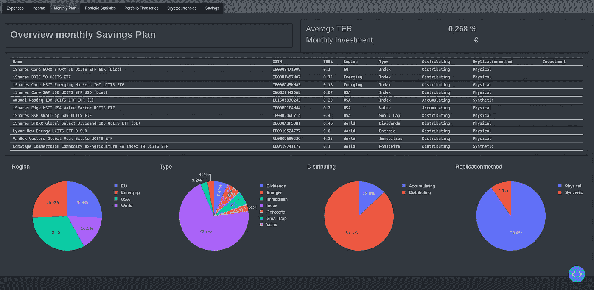

# 我在创建我的第一个数据科学仪表板时学到的 5 个教训

> 原文：<https://medium.com/codex/5-lessons-i-learnt-while-creating-my-first-data-science-dashboard-7e3e6be33e06?source=collection_archive---------11----------------------->


卢克·切瑟在 [Unsplash](https://unsplash.com?utm_source=medium&utm_medium=referral) 上的照片

最近，我厌倦了围绕多个 Excel 或 CSV 文件、不同的笔记本、python 脚本和 Excel 摘要来组织我所有的个人财务分析和文档。

因此，我决定在一个中心位置进行所有的数据处理、聚合和可视化，并构建一个单一的仪表板，所有需要的信息都以简单易用的方式显示出来。

了解 python 已经有一段时间了，我立刻想到了这个构建仪表板的框架，每个人都在谈论:

> Plotly Dash 是一个用于构建网络应用的 python 框架。

它在 Flask、Plotly.js 和 React.js 之上提供了一个很好的抽象层，因此构建数据科学仪表板非常简单，您只需一个下午就可以学会！

[](/analytics-vidhya/intro-to-dashboarding-with-dash-for-python-b62c071b4641) [## Python 的 Dashboarding 简介

### 数据科学家最重要的技能之一是能够有效地将项目结果传达给…

medium.com](/analytics-vidhya/intro-to-dashboarding-with-dash-for-python-b62c071b4641) 

因此，我好奇地开始建立一个 GIT 存储库，用 Dash 创建一个基本的应用程序布局，并继续加载数据、应用转换等等。你知道这些东西。很快，我开始在我的应用程序中添加多个选项卡，可视化数据框并绘制它们。

我将在下一篇文章中向你展示我的财务仪表板，敬请关注！

现在，这听起来很简单，但是你可能想知道这一切有什么问题？！

很快我就拥有了一个非常混乱的库，从一个函数到另一个函数复制粘贴代码片段，并且对我的代码没有任何了解。

这就是问题所在，你应该停止工作，喘口气，喝杯咖啡，开始从更有条理的角度来看待你的问题。

你必须问自己:

*   我到底想在我的仪表板上显示什么？
*   不同的内容元素应该放在哪里？
*   对于每个内容元素，我需要对我的数据应用哪些处理步骤？

这已经是我在用 Plotly Dash 创建我的第一个仪表板时学到的五课中的第一课了。

# *1。考虑端到端&相应地构建你的项目*


*照片由* [*凯莉·西克玛*](https://unsplash.com/@kellysikkema?utm_source=medium&utm_medium=referral)*[*Unsplash*](https://unsplash.com?utm_source=medium&utm_medium=referral)*

*数据科学控制面板由几项需要执行的任务组成，它们是:*

*   *加载和预处理您的数据，以便可以很容易地可视化*
*   *定义仪表板的基础布局*
*   *创建仪表板的基本元素，这些元素可以是交互式的*
*   *可视化您的数据*

*所有这些不同的部分应该清楚地分开，这样它们就可以很容易地被重用，并定义一个清晰易懂的代码结构。*

*提示:为了理解我将在下一段中提出的结构，您可以查看这个 [**仪表板**](https://github.com/christophpernul/dashboard-blueprint) **的蓝图。***

*[](https://github.com/christophpernul/dashboard-blueprint) [## christophpernul/仪表板-蓝图

### 此时您不能执行该操作。您已使用另一个标签页或窗口登录。您已在另一个选项卡中注销，或者…

github.com](https://github.com/christophpernul/dashboard-blueprint)* 

*我在项目中设置的文件结构如下所示:*

```
*- app.py
- main_app.py
- app_elements.py
- app_callbacks.py
- data_lib.py
- plotting_lib.py*
```

*在这里，我们将所有不同的任务分离到它自己的 python 文件中。但是，有一个歧义，就是将 app 定义分成了`app.py`和`main_app.py`，让我们来看看原因:*

***主 _ 应用. py***

*顾名思义:这是应用程序的主要部分。在这个文件中，定义并设置了应用程序的底层结构。这也是需要执行的文件，以便在您的浏览器中呈现仪表板。当您查看仪表板蓝图时，您可能会遇到这一行:*

```
*from app import app*
```

*这里，我们从 app.py 文件导入 app 对象:*

***app.py***

*这是 Dash 应用程序被实例化的位置。我们的目标是将应用程序元素或回调函数(用于同步应用程序中的多个元素)的定义从主应用程序中分离出来，因此我们需要分离这个定义，并在需要的地方导入应用程序对象。*

*另请参见第四次学习，在那里我会更详细地解释回调的定义。*

# **2。为时尚主题&卡片*使用引导模块*

*如果你也是黑暗模式的忠实粉丝，那么你一定会喜欢这个！*

*我在寻找一种方法来轻松地使用黑暗主题，而不必自己过多地修补 CSS 样式(当然你也可以用 Dash)。*

**

*使用自举模块，你可以选择许多不同的主题。我使用石板主题，因为我真的很喜欢黑暗模式。*

*引导模块以一种简单的方式为您提供了这种功能。您只需要 pip-install 并导入它，然后在您的应用程序实例化中使用几个主题之一作为外部样式表:*

```
*import dash
import dash_bootstrap_components as dbcapp = dash.Dash(__name__,
                external_stylesheets=[dbc.themes.SLATE]
               )*
```

*看看所有令人惊叹的主题[在这里，](https://dash-bootstrap-components.opensource.faculty.ai/docs/themes/)石板主题是你仪表盘的一个黑暗模式。*

# **3。如何将元素与引导行和引导列对齐**

*bootstrap 模块还为您提供了一种在屏幕上对齐元素的简单方法。它的工作方式基本上类似于在 Microsoft PowerPoint 中创建表格:*

*您只需从定义一行开始，然后根据需要用任意多的列填充它。然后，您可以将所有元素放入其中一列，并通过指定它们的宽度来相应地对齐它们:*

```
*import dash_html_components as htmlleft_element = dbc.Col(html.H1("Title"), 
                       width=4
                       )
right_element = dbc.Col(html.H1("Put your element here!"), 
                        width=8
                       )main_part = dbc.Row([left_element, right_element])*
```

*为了更好地理解如何处理行和列，以及如何更好地对齐它们，请查看此处的文档[或查看来自](https://dash-bootstrap-components.opensource.faculty.ai/docs/components/layout/) [Eric Kleppen](https://medium.com/u/1e2ea32699c9?source=post_page-----7e3e6be33e06--------------------------------) 的这篇[精彩文章](/swlh/dashboards-in-python-for-beginners-using-dash-responsive-mobile-dashboards-with-bootstrap-css-2a0d05a53cf6)，它对我帮助很大！谢谢你。*

*[](/swlh/dashboards-in-python-for-beginners-using-dash-responsive-mobile-dashboards-with-bootstrap-css-2a0d05a53cf6) [## Python 中的仪表盘，适合使用 Dash 的初学者——带有引导 CSS 的响应式移动仪表盘…

### 使用 Python 构建移动就绪的仪表盘和应用程序！Dash 和 Bootstrap CSS 组件使其易于制作…

medium.com](/swlh/dashboards-in-python-for-beginners-using-dash-responsive-mobile-dashboards-with-bootstrap-css-2a0d05a53cf6) 

如果需要在现有元素下添加元素，只需添加另一个包含两列的行，并将它们放入单个 div 元素中:

```
footer_part = dbc.Row([left_element, right_element])
full_page = html.Div([main_part, footer_part])
```

因此，将元素放入仪表板中的任何地方都非常容易，而且 bootstrap 库最大的优点是它的响应能力也非常强！

# *4。如何在更大的应用程序中使用回调*

> 回调是允许你同步元素的函数。

例如，您可以有一个下拉元素，其中的选择用于根据从下拉列表中选择的项目显示另一个元素中的内容(例如，不同类型的图形或图形中的过滤数据)。


下拉元素的选择在右边呈现不同的图形(这里是极客的贝塞尔函数)。

为了获得这个功能，`app`对象的回调方法`@app.callback()`需要被用作呈现目标元素的函数的装饰器。因此 app 对象需要在定义回调的文件中可用。

当然，最简单的方法是只有一个主文件，在这里应用程序被实例化，所有的元素和回调都被定义。然而，对于较大的应用程序，你可以想象，这将导致很多混乱。因此，我们将所有部分分成单独的文件，如本文的第一部分所示。

> 然后，我们可以简单地在每个文件中导入`app`对象，并在`app_callbacks.py`文件中使用它来定义应用程序的所有回调。

# *5。重用你的代码！*

我知道，这一开始听起来很傻，但是我发现自己经常一遍又一遍地写类似的代码。我创建了一个多选项卡应用程序，在完成第一个选项卡(包含显示标题、KPI、图表等多个元素)后，我开始为第二个选项卡的元素编写类似的代码。

如果您的仪表板包含许多不同的元素并且只有几个选项卡，这没什么，但是随着它变得越来越大，您应该考虑为您的元素定义蓝图，例如:

*   页面标题元素
*   KPI 元素:两列元素，包含标题和 KPI(值)，例如平均费用
*   下拉元素
*   图形元素

每个元素定义都是函数，接受您的输入(页面标题或图形对象)并对其应用样式，将其放入正确的布局，然后输出 HTML 元素。

最后，您甚至可以定义一次基本布局，并以您的所有元素作为输入来调用这个布局函数。您可以在所有页面中重复使用它，并拥有统一的布局。

# 拿走

那么，这篇文章的主要观点是什么呢？

我总结如下:

> 从最终布局开始逆向工程(甚至可以在纸上画一张草图)，选择一个简单明了的文件结构，尽可能多地重用你的代码。

感谢阅读这篇文章！让我知道你对它的想法，留下一个掌声👏或者评论💬关于您如何构建仪表板！*