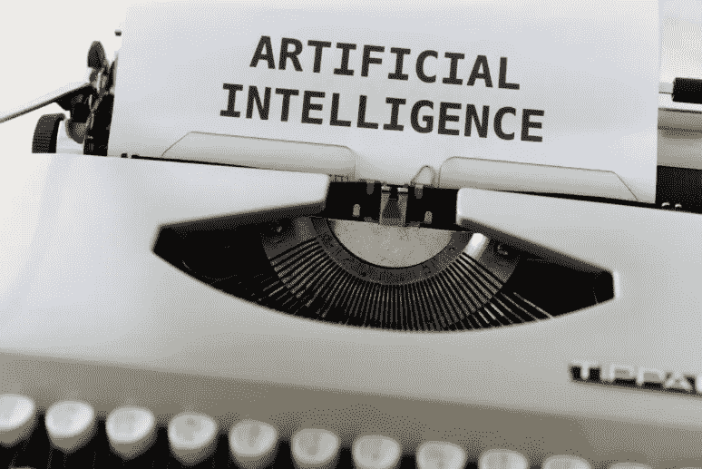

# 人工智能将改变你生活的 5 大方式

> 原文：<https://medium.com/codex/5-major-ways-artificial-intelligence-is-about-to-change-your-life-3bb17cc3e47e?source=collection_archive---------7----------------------->

## "是的，我想预约机器人医生."

马库斯·温克勒拍摄的照片

G 不管好坏，人工智能无处不在。人工智能的实现在相当长的一段时间里一直处于上升趋势，可以追溯到早期的哲学家，并于 1956 年正式成立。作为人类，我们与人工智能在一个…