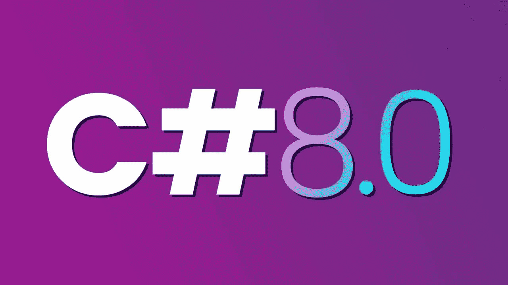

# 用 C# 8.0 大幅缩短代码的 5 种方法

> 原文：<https://medium.com/codex/5-methods-that-drastically-shorten-drastically-your-code-in-c-8-0-e7bc1ca1b480?source=collection_archive---------1----------------------->

## [法典](http://medium.com/codex)

## 用这 5 个技巧节省时间并提高你的发展

[C # 8 新特性](https://www.google.com/url?sa=i&url=https%3A%2F%2Fwww.youtube.com%2Fwatch%3Fv%3DL2BvrXnaOy0&psig=AOvVaw3ZYfHOyEKtAZmY6Epl0bLH&ust=1616187866230000&source=images&cd=vfe&ved=0CA0QjhxqFwoTCMDsgI_fuu8CFQAAAAAdAAAAABAE)(版权所有 [CodingTech](https://www.youtube.com/channel/UCtxCXg-UvSnTKPOzLH4wJaQ)

C#8.0 包含了微软官方发布的额外特性，可以简化代码。为了正确使用它们，我将演示五种方法来大幅缩短您的代码，并将它们与以前的语言结构进行比较…