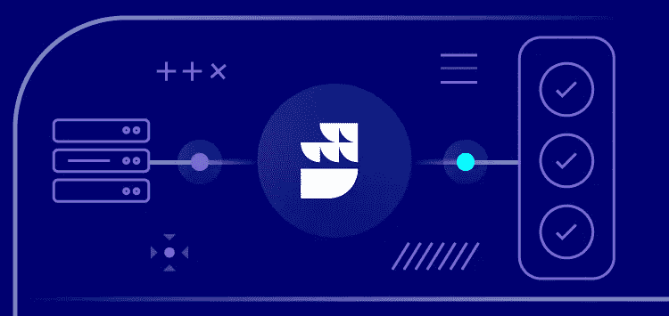
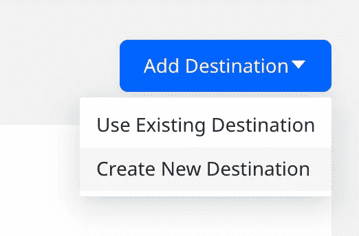
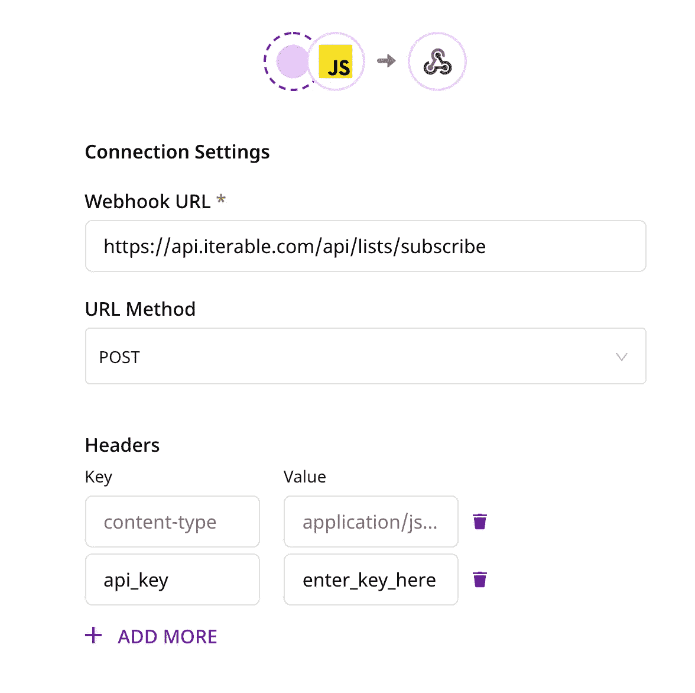
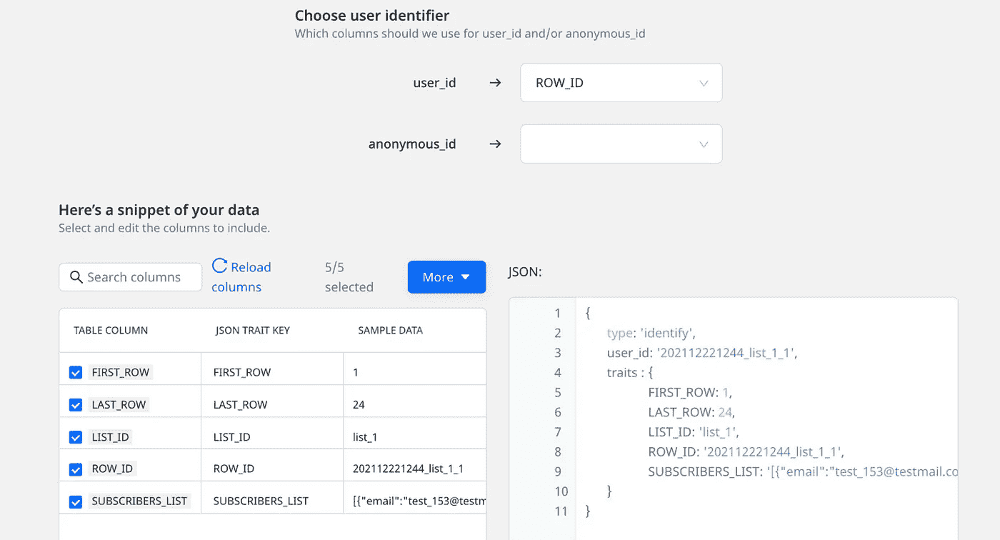
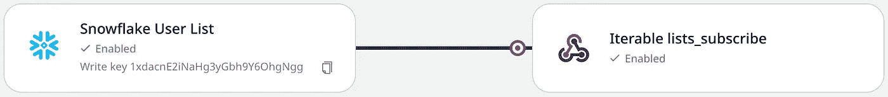

# 从雪花到可迭代，每天 500 万用户

> 原文：<https://medium.com/codex/5-million-users-a-day-from-snowflake-to-iterable-f6ee2d185ceb?source=collection_archive---------3----------------------->



当您使用 [warehouse first](https://rudderstack.com/blog/why-your-data-warehouse-should-be-the-foundation-of-your-cdp) 方法设置您的数据堆栈时，RudderStack 的多功能特性允许您克服某些曾经过于昂贵或过于困难的障碍。这种灵活性在我们最近帮助一家客户解决其中一个难题时得到了充分展示。

# 情况:批量订阅注册

我们的一个客户有一个业务用例，每天一次从 Snowflake 向 [Iterable](https://iterable.com/) 发送 500 万用户，用于客户参与活动。如果你认为这是反向 ETL 的一个明显例子，那你就对了。使用 RudderStack 的[反向 ETL 工具](https://rudderstack.com/docs/warehouse-actions/)，该客户可以从雪花表中提取 500 万用户，然后将他们激活到 Iterable 中，这样他们就可以被触发接收电子邮件。就这么简单！

# 问题是:速度限制和处理时间

博客并没有到此结束，所以你可能会猜到事情没那么简单。有几个障碍使得这个看似简单的集成变得困难。

1.  他们通过 RudderStack 访问的可迭代端点是事件/跟踪端点。这个特殊的终点有一个年速率限制，在大约 500 万/天的速率下，几个星期后就会耗尽。
2.  一个大约 500 万行的反向 ETL 作业需要相当长的时间来处理，可能需要 10 到 15 个小时。每天重复这些会变得非常消耗精力。

# 解决方案:webhook、转换和反向 ETL

我们从第一个障碍开始。事件/跟踪端点使用起来并不理想。客户发现 Iterable 有另一个端点列表/订阅，您可以一次为多个用户订阅一个列表，这可以触发向他们发送电子邮件。这很好地满足了客户的需求，并且有一个更宽松的费率限制。

RudderStack 不支持 Iterable 目标中的此端点。幸运的是，我们可以使用强大的[自定义 webhook 目的地](https://rudderstack.com/docs/destinations/webhooks/)并将其指向 lists/subscribe 端点。通过使用用户转换，我们可以将有效载荷转换成 Iterable 所需的格式。我们现在越过了第一个障碍！

对于第二个障碍，我们仍然必须处理每天运行大约 500 万行反向 ETL 作业的性能问题。因为这个新的端点可以接收用户列表，而不是一次只接收一个用户，所以我们将重点转移到如何在数据仓库中批量处理用户列表，以**将反向 ETL 作业大小减少 500 倍**。

# 技术深度挖掘:在仓库中

这是魔法开始的地方。因为 RudderStack 的反向 ETL 工具能够从雪花视图中提取数据，所以我们编写了一个查询来创建一个视图。该查询从 500 万行用户表中提取用户，并创建一个视图，其中 500 个用户被分批放入一行。现在，不是有 500 万行来运行反向 ETL 作业，而是只有 1 万行。下面的示例显示了该查询如何获取多行数据并将其转换为一行。

```
create or replace view "DB_NAME"."SCHEMA_NAME"."VIEW_NAME" as (select list_id,'[' ||listagg( distinct '{"email":"' ||  email|| '", "userId": "' ||  ID|| '", "dataFields": ' ||  content|| '}', ',')within group (order by 1)|| ']'as subscribers_list,min(row_id) as first_row,max(row_id) as last_row,TO_CHAR(current_date, 'YYYYMMDD') ||to_Char(current_time(), 'HHMI') ||'_' || list_id ||'_' || batch as row_idfrom (select ROW_NUMBER() OVER (order by list_id, 1) as row_id,truncate ((row_id/500)) + 1 as batch,email as email, list_id,to_varchar(object_data) as contentfrom DB_NAME.SCHEMA_NAME.USER_TABLE_NAMEwhere list_id is not nullorder by row_id) bGroup by batch, list_idorder by 1, first_row)
```

**用户表**

idemailobject _ data list _ id 1 nkd 9 a 3 dummy @ email . com { " country ":" USA "，" sport ":" basketball " } 110 fmvd 7 e sample @ email . com { " country ":" Japan "，" sport ":" baseball " } 18 dhcu 6 sk not @ email . com { " country ":" England "，" sport": "soccer" }1

**新视图(使用上面的查询后)**

list _ id subscribers _ list first _ row last _ row row _ id1 " { " userId ":" 1 nkd 9 a 3 "，" email": "dummy@email.com "，" dataFields": { "country": "USA "，" sport": "basketball" } }，{ "userId": "10fmvd7e "，" email": "sample@email.com "，" dataFields": { "country": "Japan "，" sport": "baseball" }，{ "userId": "8dhcu6sk "，" email": "not@email.com

更深入地研究视图查询，有几件事情需要指出。

*   这个查询中完成大部分工作的部分是 listagg()函数。这将编译 Iterable API 端点的所有必要信息，并以字符串格式将其存储为 JSON 数组。当我们运行反向 ETL 时，我们可以使用 RudderStack 中的用户转换将它转换回 JSON 对象数组(本博客末尾的例子)。
*   `truncate ((row_id/500)) + 1`该行负责创建批次的大小限制。这里的 500 代表一行可以包含的最大用户数。因此，如果您有一个 1300 个用户的用户列表，该查询将创建一个包含 2 行的视图，每一行包含 500 个用户，然后第三行只包含 300 个用户。
*   该查询还将根据用户的 list_id 对用户进行批处理。只有具有相似 list_id 的用户才会在一行中进行编译。这允许我们每天为`list/subscribe endpoint`处理多个列表。

# 技术深潜:在舵栈中

随着仓库中繁重工作的完成，我们只需要在 RudderStack 中创建一个源和目的地。

我们创建了一个[雪花源](https://rudderstack.com/docs/warehouse-actions/snowflake/)，选择我们想要的权限，然后选择同步频率。创建源之后，我们导航到创建的雪花源并点击“创建新的目的地”。



然后，我们创建了 Webhook 目的地，填写了正确的端点，并包含了正确的授权头。



单击“Next”后，我们通过选择模式和表来选择要对哪个表执行反向 ETL。然后，我们选择惟一的 ROW_ID 作为“user_id ”,并选择引入所有的表列。



最后，我们创建了一个用户转换，这样这些有效负载就可以被格式化为 Iterable。

下面，您可以看到这些有效载荷是如何从反向 ETL 进入 RudderStack 的。

```
{"type": "identify","traits": {"LIST_ID": 1,"LAST_ROW": 3,"FIRST_ROW": 1,"SUBSCRIBERS_LIST": "[{ \"userId\":\"1nkd9a3\",\"email\":\"dummy@email.com\",\"dataFields\":{ \"country\":\"USA\",\"sport\":\"basketball\"}}, { \"userId\":\"10fmvd7e\",\"email\":\"sample@email.com\",\"dataFields\":{ \"country\":\"Japan\",\"sport\":\"baseball\"}}, { \"userId\":\"8dhcu6sk\",\"email\":\"not@email.com\",\"dataFields\":{ \"country\":\"England\",\"sport\":\"soccer\"}}]"},"userId": "202112221242_1_1","channel": "sources","context": {"sources": {"job_id": "21HbSd8lPbwhdakjfdhakjfhdakj/Syncher","task_id": "QRY_USER_LIST","version": "v1.7.2","batch_id": "2afdsa10f-a7d7-471f-96c8-68dsad291cc","job_run_id": "c6dtccxasadsadng","task_run_id": "c6defeafeaef3no0"}},"recordId": "30","rudderId": "d47abfd7-37b3-43fa-81a7-bced4a91a2c3","messageId": "f80a4436-a6a5-4b46-9e8c-ac3a6edb67ff"}
```

下面的用户转换将有效负载转换成适合于`lists/subscribe`端点的格式。

```
*export* *function* transformEvent(event, metadata) {event.type = 'track'event.listId = event.traits.LIST_IDevent.subscribers = JSON.parse (event.traits.SUBSCRIBERS_LIST)event.preferUserId = true // Refer to Iterable Docs*delete* event.traits*delete* event.userId*delete* event.channel*delete* event.rudderId*delete* event.messageId*delete* event.context*delete* event.recordId*return* event;}
```

这是转换后的有效载荷的样子。

```
[{"type": "track","listId": 1,"subscribers": [{"userId": "1nkd9a3","email": "dummy@email.com","dataFields": {"country": "USA","sport": "basketball"}},{"userId": "10fmvd7e","email": "sample@email.com","dataFields": {"country": "Japan","sport": "baseball"}},{"userId": "8dhcu6sk","email": "not@email.com","dataFields": {"country": "England","sport": "soccer"}}],"preferUserId": true}]
```



# 结论

现在，来自仓库表 user-list 的 500 万用户被成功地从仓库中提取出来，通过 RudderStack 进行转换，然后发送到 Iterable，因此所有用户都可以收到正确的电子邮件。这个简化的过程现在可以日复一日地重复，并且不需要几个小时就可以完成。

# 视窗网际网路名称服务

*   将反向 ETL 中的记录数量从 500 万减少到仅仅 1 万条
*   体积的减少将处理时间从几个小时减少到 30 分钟
*   数量的减少解除了对达到目的地设定的 api 极限的担忧
*   RudderStack 的 Webhook 目的地使我们能够将事件发送到更合适的端点
*   用户转换很容易确保我们的有效负载与 Iterable 对数据的需求完全匹配

*本博客最初发表于:* [*https://rudder stack . com/blog/500 万用户-天从雪花到可迭代/*](https://rudderstack.com/blog/5-million-users-day-from-snowflake-to-iterable/)