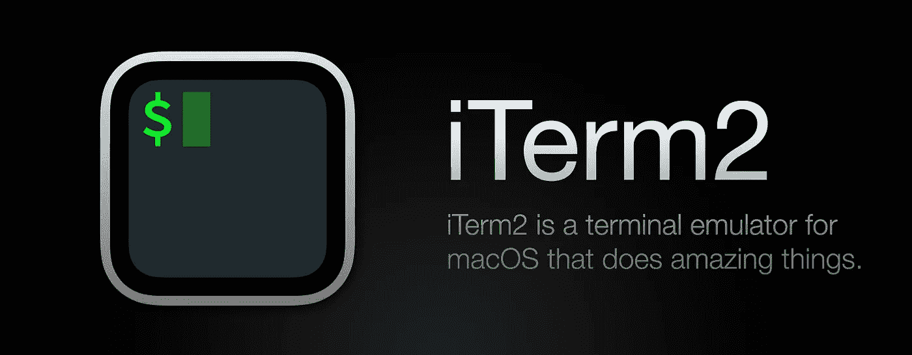
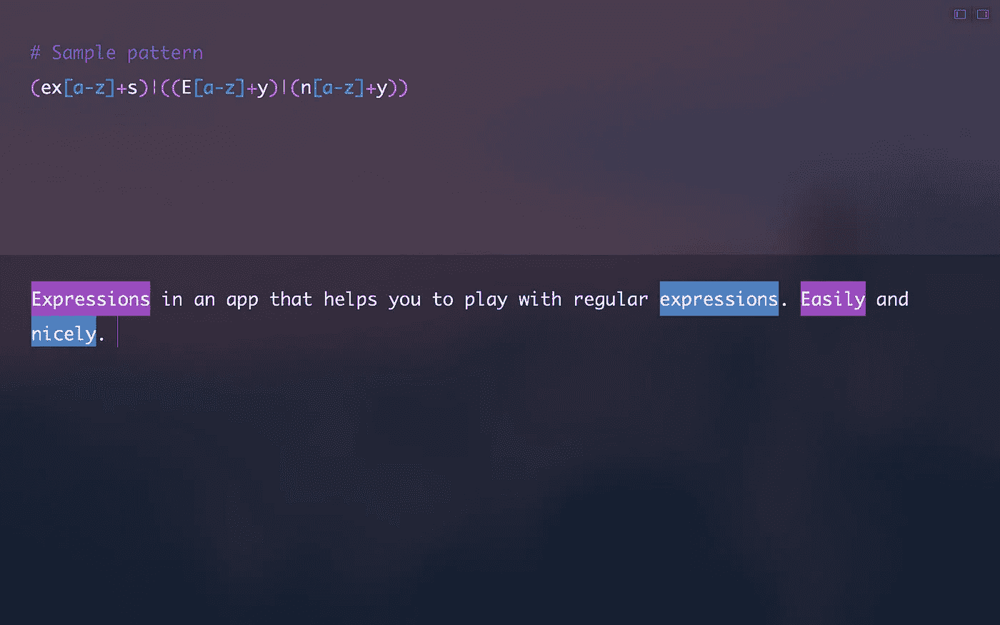
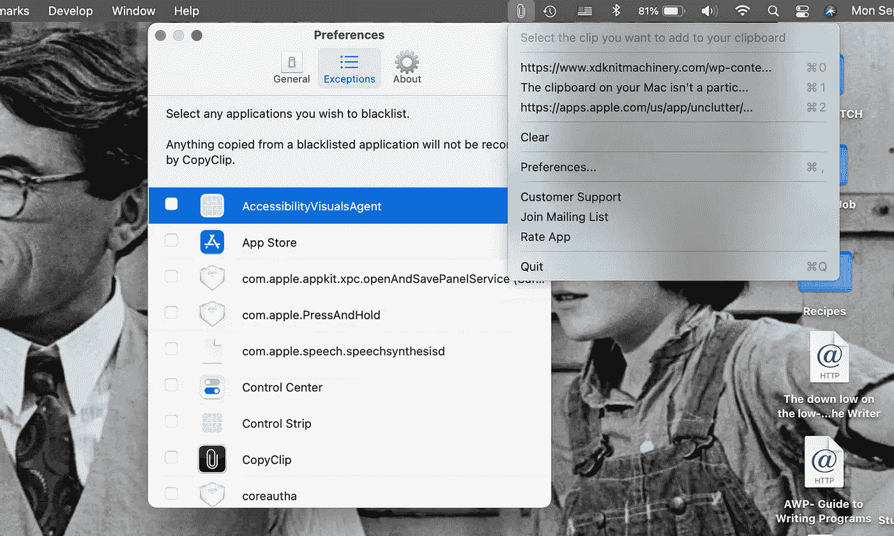

# 5 2022 年必须拥有面向开发者的 macOS 工具

> 原文：<https://medium.com/codex/5-must-have-tools-on-macos-for-developers-in-2022-f2c652e41f3d?source=collection_archive---------0----------------------->

## 是的，我每天都用

在开发者中，macOS 是一个非常标准的操作系统。这部分是因为 MAC 电脑总体来说功能强大、效率高，尤其是采用 M1 芯片的新款电脑，还有一部分是因为你可能觉得 Linux 之类的东西太乏味，不合你的口味。我是不是听到了一些 Windows 用户的失望？没事的。我同情你！


由于其强大的功能和高效率，MacBooks 通常被认为是软件工程的典范

你可能开始使用 MacOS 的另一个原因是，作为用户，你会有一种“皇室”感。事实上，这是大多数苹果产品的最大卖点之一。此外，许多公司，无论是大公司还是初创公司，都向开发者提供 MacBooks，这可能是你使用 MacBooks 的另一个原因。

在这篇文章中，我们来谈谈 2022 年如果你是一名开发者，你必须在 Mac 上拥有的一些最有价值的工具或应用程序。

# 1.自制软件—软件安装管理器


[Homebrew](https://brew.sh) 是一个包管理器，帮助你从命令行安装软件工具和开发者框架。它是免费的、开源的，众所周知，它可以很容易地下载和安装 UNIX 工具、终端实用程序，甚至图形应用程序，从源代码编译所有这些。

例如，你可以用家酿软件在一行中安装 iTerm2

```
brew install --cask iterm2
```

现在，为什么要安装 iterm2？好吧，接下来让我们看看。

# 2.iTerm2 —高级终端



[iTerm2](https://iterm2.com) 是终端的替代品，也是 iTerm 的继任者。它可以在 macOS 10.14 或更高版本的 MAC 上运行。iTerm2 将终端带入现代，具有你从未想过的你一直想要的功能。

iTerm 帮助您更有效地管理工作流程。它有许多功能，其中最显著的是分割面板、热键、搜索、自动完成、粘贴历史、通知、多语言支持等。

# 3.Postman —构建、管理、测试 API


[Postman](https://www.postman.com) 是一个构建和使用 API 的 API 平台。Postman 简化了 API 生命周期的每个步骤，并简化了协作，因此您可以更快地创建更好的 API。

通过 Postman，您可以使用 OpenAPI、RAML、GraphQL 或 SOAP 格式设计您的 API 规范。您还可以使用支持降价的特性或 OpenAPI 文件来记录您的 API。其他特性包括 API 测试、模拟服务器、监控 API 的健康状况等。

喜欢这个博客吗？如果您是开发人员，这可能也会让您感兴趣。在这篇[博客](/nerd-for-tech/10-free-must-use-tools-for-developers-you-probably-have-never-of-ac6a78e87766)中，我将谈论 **10 款你可能从未见过的**开发人员必备的免费工具…

# 4.表达式—主正则表达式



需要编写和测试正则表达式？

[表达式](https://www.apptorium.com/expressions)是在 Mac 上掌握正则表达式的一个方便而复杂的工具。无论你是开发人员、数据分析师、营销人员，还是表情迷，你都会发现这款应用绝对能满足你的需求。

它将为您节省大量测试和编写代码或报告的时间，即使您是这个领域的新手。现在，您可以在简约、轻松的工作环境中执行强大的搜索并调试您的表达式。

# 5.复制剪辑—管理剪贴板历史



开发人员、设计人员和作者都后悔或害怕意外替换最后复制的文本。它就像一只虫子一样盘踞在我们的脑后。奇怪的是，macOS 默认没有剪贴板历史管理器。

CopyClip 是最简单有效的 Mac 剪贴板管理器。这个应用程序从你的菜单栏中谨慎地运行，存储你过去复制或剪切的所有内容，允许你快速找到你一直在寻找的文本片段。

# 结论

这些是你作为开发者可以在 macOS 上使用的一些最有用的应用。当然，我跳过了一些显而易见的应用程序，如 VS Code、Atom、Xcode、Bitbucket 等。它们同样很有帮助，你一定已经接触过其中的大部分了。


如果您有任何问题或建议，请随时联系我。你可以在这些社交媒体平台上关注我——[LinkedIn](https://www.linkedin.com/in/ab-satyaprakash/)， [YouTube](https://www.youtube.com/channel/UCJ6D0HS8c9Il-eX5lGbAyGg) ， [Twitter](https://twitter.com/AbSatyaprakash) ， [Instagram](https://www.instagram.com/absatyaprakash/) 了解更多更新内容！

**一如既往！黑客快乐！😇**

[加入我的电子邮件列表，获得更多精彩的教程和编程博客](https://absatyaprakash01.medium.com/subscribe) ❤️