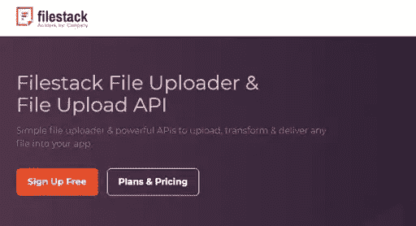
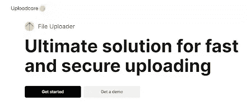
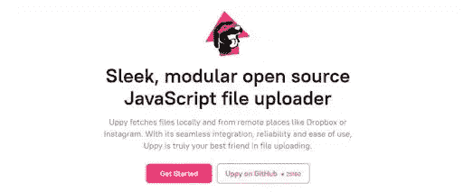

# 5 个必须知道的 JavaScript 文件上传 API 方法

> 原文：<https://medium.com/codex/5-must-know-javascript-file-upload-api-methods-47806d64f70e?source=collection_archive---------12----------------------->

在本文中，我们将带您了解比较几个文件上传 API 选项的过程，并让您轻松选择最适合您需求的选项。除此之外，我们将讨论每个文件上传 API 解决方案的优点和缺点，以及它们的成本和任何其他相关的细节。

# 什么是文件上传 API？

为了将文件上传到远程服务器，这个组件，也称为工具或实用程序，可以由软件开发公司添加到您的程序中。

想象一下，它是一个智能手机或互联网应用程序，要求您提交您的 KYC 证书，并提供照片压缩等操作以及模糊和锐化等滤镜的应用。文件上传实用程序是一款操作直观的软件，在管理与计算机用户相关的文件中包含的信息时，它提供了最高级别的保护和安全。

阅读更多:[了解 API 集成及其对您业务的好处](https://www.botreetechnologies.com/blog/understanding-api-integration-and-its-benefits-to-your-business/)

# 文件上传 API 的主要特性

*   简单易用——你的应用程序的用户应该很容易适应你决定加入的任何上传 API 或插件。
*   将多个数据源与用户的设备集成，如 Whatsapp、iCloud 和 Google Drive，以及从相机拍摄和上传照片。
*   安全文件上传
*   支持跨平台集成

# 5 个最佳文件上传 API 解决方案

*   **文件堆栈**

*   对于您的当代应用程序，获取 Filestack [文件上传器](https://www.filestack.com/)和 API。您可以使用这个工具分发任何文件并将其转换成一个[应用程序](https://dzone.com/articles/top-15-web-applications-built-on-python)。
*   从源中找到用户内容，编辑照片或视频，然后发布它们都可以通过使用用户友好且功能强大的 API 来完成。Filestack 被许多[软件开发服务](https://www.botreetechnologies.com/blog/what-services-does-a-software-development-firm-provide/)认为是文件上传的最佳开发者解决方案之一，它提供了快速简单的上传、与 iPhone 或 Android 手机的交互以及 URL 摄取。
*   检查你的网站上任何与商业相关的内容是否恰当。存储在网络上的视频、文件和图像可以在下载到您的应用程序之前进行更改和优化。制作可包含多媒体、照片、文本和音频的适应性强的文件。它将由 Filestack CDN 提供支持；它将被优化；它将是安全的；它会被快速发送。
*   Filestack 嵌入式查看器使得在程序中显示您的信息变得简单。一个奇妙的用户界面与超过 20 个合并源也是可用的。因为有了[内容摄取网络(CIN)](https://blog.filestack.com/product-updates/filestack-launches-content-ingestion-network/) ，这里的上传要安全可靠 100 倍。
*   为了安全的内容传输，Filestack 还可以处理您的私人文件。如果您使用 Filestack，就不需要担心 API 集成升级。此外，你将获得一个[软件开发](https://botreetechnologies.medium.com/6-stages-for-software-development-procedure-you-need-to-know-5a7699e59b99)工具包和[框架](https://dev.to/botreetechnologies/top-7-java-frameworks-for-building-custom-web-applications-2jef)，它们将在每个阶段帮助你。
*   允许您的客户在上传文件或照片之前对其进行编辑，让他们添加漂亮的效果和滤镜。无论文件类型如何，Filestack 都会在上传文件之前对每个文件进行恶意软件和病毒扫描。由于 Filestack 的恶意软件检测功能可以分析每个文件，包括 pdf 和视频文件，因此每次上传文档都是安全的。
*   **上传关怀**

*   使用 RESTful 文件管理特性和组织良好、记录良好的响应代码构建您的流。许多定制应用程序开发人员使用它来生成 JPEG 缩略图、pdf，并通过 [Uploadcare](https://uploadcare.com/) 将文件转换为大约 12 种不同的文档格式，Uploadcare 还会通知您触发活动和文件上传。
*   利用用户友好的 URL API 来即时增强、校正和更改照片。为了给你的业务提供有用的自动化，Uploadcare 不断研究 [ML(机器学习)](https://www.botreetechnologies.com/machine-learning-solutions)活动的潜力。
*   利用 30 种不同的程序，包括压缩选择、颜色调整和几何操作。通过 Uploadcare 中的图像转换为您的文件提供免费存储，而不是缓存。
*   **鱼塘**

*   FilePond 是一个 JavaScript 实用程序，它使您能够从任何位置上传任何文档，并提供一个美妙的、易于使用的用户体验。
*   为了加快文件下载速度，FilePond 优化了图像。因为它的库是用普通的 JavaScript 创建的，所以它可以在任何地方使用。找到使您能够使用首选框架的接口列表，包括 JQuery、Svelte、JavaScript、 [React](https://www.botreetechnologies.com/react-native-development) 和 Angular。
*   FilePond 能够执行多种任务，包括多个文件上传和配置文件图像选择。您还可以将 Pintura 图像编辑器与 FilePond 集成，允许您在上传文件之前对其进行编辑。批注、编辑、修饰、应用滤镜效果、微调图像颜色、设置纵横比选项、旋转、调整大小、翻转和再次旋转都是一些编辑功能。
*   FilePond 通过获取文件、目录、blobs、本地 URL、数据 URL、远程 URL 和 URL 来帮助[定制应用程序开发公司](https://www.botreetechnologies.com/custom-application-development)的开发人员。此外，它支持各种文件源，包括拖放、API、复制粘贴和系统选择。
*   **UPPY**

*   [Uppy](https://uppy.io/) 是一款时尚、开源、模块化的 JavaScript 文件上传器，可以在本地下载文件，也可以从 Instagram 或 Dropbox 等其他地方下载文件。Uppy 是可靠的，它提供了一个基于插件的轻量级架构。
*   使用 open tus 标准的可恢复文件上传使得上传大文件成为可能。允许 Uppy 服务器通过 Companion 处理繁重的工作，以便您可以从 Dropbox、Instagram、Google Drive 和网络摄像头中选择文件，同时节省数据和电力。
*   即使您不小心导航到了另一个页面或浏览器崩溃，您也可以使用 Golden Retriever 简单地检索您的文件。
*   **Transloadit**
*   Transloadit 是一个易于使用的 API，可以处理应用程序中的任何文件，改善文件管理。Transloadit 允许您发送、修改和接收任何文件，而无需管理或控制基础结构。
*   在崩溃或 Wi-Fi 不良后，Transloadit 的可恢复选项提供了一种灵活的方法来继续上传。你可以在浏览器中调整图片大小和修剪图片，还可以从你的电脑、Dropbox 或 pals 中选择文件。
*   一家企业软件开发公司发现 Transloadit 很容易与数据计划和设备一起使用。这是一个现代的程序文件上传程序，它是开源的，可以保护你的数据免受病毒的侵害。它还优化并存储您的 S3 存储桶中的数据。
*   Transloadit 释放了服务器和开发资源，消除了对额外扩展、复杂技术栈和编码麻烦的需求。其 61 项功能的组合有可能使您的工作流程自动化。此外，它提供了一个声明性的 JSON 语言，这使得你的上传难以理解。
*   除了在世界各国都有业务并有增长的能力之外，Transloadit 还是一项非常容易获得的服务。除此之外，我们将始终竭尽全力满足您对相关服务的可访问性的要求。有了这个工具的支持，以前具有挑战性的工作，如文档处理、图像编辑、视频和音频编码以及音频编码，现在变得更加可行。

# 结论

当你在为你的应用程序或网站寻找最好的文件上传者时，你应该确保选择一个[软件开发解决方案](https://www.botreetechnologies.com/blog/steps-to-define-software-development-process/)提供商，他可以推荐一个可靠的、易于使用的、充满惊人功能的解决方案，使上传文件的过程对你的应用程序或网站的用户来说是一个愉快的过程。

您可以从我在本文之前的段落中提到的文件上传程序中选择一个优秀的文件上传程序。你的决定应该基于你认为最重要的方面。
*原载于 2022 年 11 月 9 日***。**