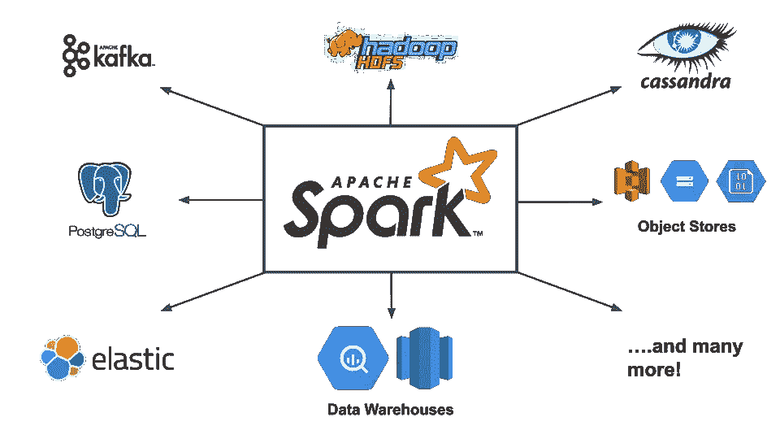
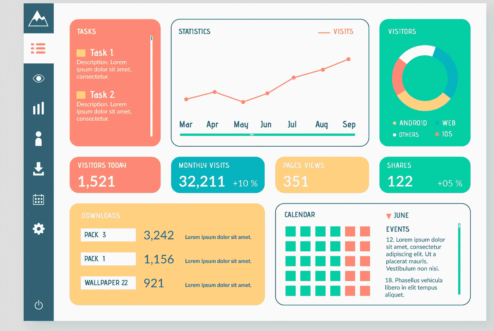
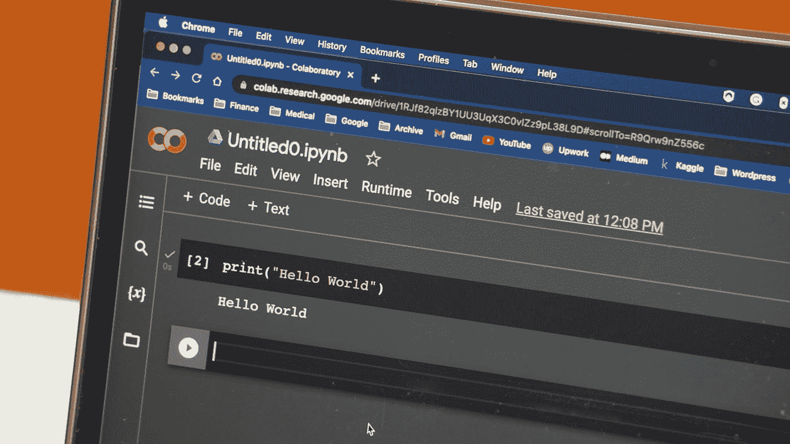
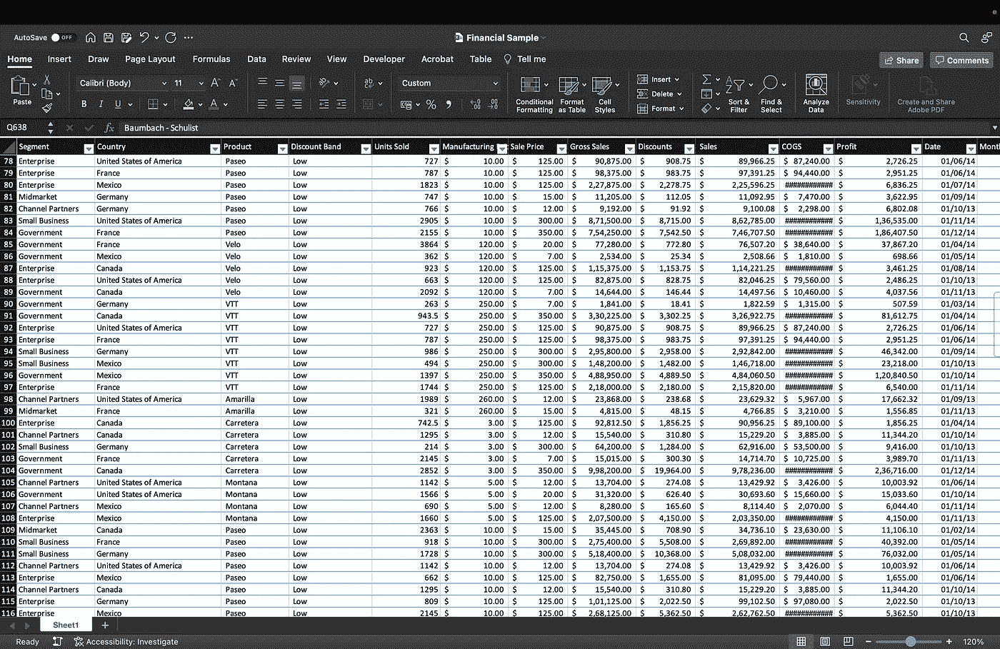

# 5 个强大的数据科学工具，2022 年你必须学会。

> 原文：<https://medium.com/codex/5-must-learn-tools-for-data-science-and-analytics-9719c2cd9e69?source=collection_archive---------0----------------------->

***本帖将涵盖数据科学家或分析师最重要和必须知道的 5 种工具。这些工具对于数据科学生态系统至关重要。每个数据专业人员都应该确保他们熟悉这些工具。***

照片由[艾萨克·史密斯](https://unsplash.com/@isaacmsmith?utm_source=medium&utm_medium=referral)在 [Unsplash](https://unsplash.com?utm_source=medium&utm_medium=referral) 拍摄

# 数据科学工具和意义。

数据科学正变得越来越重要，公司雇佣数据科学家来帮助管理他们的数据并做出更好的决策。数据科学变得更加容易获取。在线课程和指南让任何人都更容易学习成为数据科学家所需的技能。数据科学家或分析师使用大量专业的数据科学工具来完成工作。这些工具非常重要，是有助于数据科学工作流的关键技能。

# 5.阿帕奇火花。

摘自[https://www.datamechanics.co/apache-spark](https://www.datamechanics.co/apache-spark)

[Apache Spark](https://spark.apache.org/) 是一个全能的分析引擎。它是一个开源的分布式处理框架，可以用来处理大数据，并使其实时工作。Apache Spark 是数据科学的一个很好的工具。它允许我们在几秒钟内完成复杂的数据分析任务。只需最少的编程。

Spark 框架也是可伸缩的。您可以在一组机器上运行它，甚至可以在您公司的所有机器上运行它。对于那些希望在其业务中实施数据科学和分析的人来说，这是一个很好的选择。它经常被比作 Hadoop，但是 Spark 要快得多，可扩展性也更好。

Spark 可以批量处理数据，这意味着它可以一次处理大量数据。它还有一个直观的编程模型，使得开发人员可以很容易地使用**。**它以提供极快的集群计算而闻名。Spark 使用各种数据源，包括 Cassandra、HFS、HBase 和 S3，并且可以轻松携带大型数据集。

## **优点:**

*   Spark 是用 Scala、Java、Python 和 R 编写的，所以它可以用于任何类型的数据处理。
*   Apache Spark 是一个免费的开源工具。
*   它相对容易上手，因为它有可用于数据处理的库和工具。

## **缺点:**

*   需要技术技能和知识。
*   不像列表中的其他工具那么容易学习，而且学习曲线很陡。
*   一个资源饥渴的工具，需要大量的处理能力。

# 4.MySQL 和 PostgreSQL

关系数据库的数据库模式图。

PostgreSQL&[MySQL](https://www.mysql.com/)是两个流行的开源关系数据库管理系统，以其速度、可靠性和特性而闻名。结构化查询语言(SQL)用于在这些数据库中执行查询和更改、合并、创建、删除或操作数据。

MySQL 是最流行的数据库管理系统。MySQL 是一个开源的、跨平台的关系数据库管理系统。它被许多公司和组织使用，如脸书，雅虎，还有维基百科。另一方面，PostgreSQL 是一个非常强大和复杂的数据库管理系统。PostgreSQL 是一个非常强大的数据库管理系统，被许多公司和组织使用，如苹果，贝宝和网飞。

[MySQL work bench](https://www.mysql.com/products/workbench/)&[pg admin](https://www.pgadmin.org/)分别是 MySQL 和 PostgreSQL 基于 GUI 的工具。这些工具的界面旨在方便用户创建、编辑和管理数据库和表。MySQL Workbench 或 pgAdmin 用于管理数据库、导入和导出数据、运行查询和脚本，以及管理模式和关系。

## **优点:**

*   非常易于使用，用户界面可以在不同的操作系统中使用，包括 Windows、Linux 和 macOS。
*   可以用来存储和管理大量的数据。
*   SQL 是一种功能性的、易于学习的语言，语法简单。

## **缺点:**

*   更高级的查询和功能需要技术知识。
*   当存在大量具有各种关系的表格形式的数据时，管理起来可能会变得复杂。

# 3.Tableau 和 Power BI

图片由 [freepik](http://freepik.com) 提供。

[Tableau](https://www.tableau.com/) 和 [Power BI](https://powerbi.microsoft.com/en-au/) 是数据分析、可视化和报告工具。它们是市场领先的商业智能工具，用于以易于理解的格式分析、总结和可视化数据。

这两种工具都易于使用，并且具有友好的图形用户界面。拖放功能可用于创建漂亮的报告和令人惊叹的仪表板。

它们可以连接到各种数据源，并可以可视化大型数据库中的实时变化和波动。Tableau 和 Power BI 有一些主要区别，但主要执行类似的功能。易用性甚至允许最终用户自己编写报告，而无需依赖任何专业人员。

## **优点:**

*   可用于构建实时、交互式报告和仪表板。
*   可以连接到各种各样的数据源。
*   提供免费版本— Power Desktop 和 Tableau Public。

## **缺点:**

*   这两个工具的免费版本都有一些限制。
*   不太灵活，应用非常具体和有限。
*   这两种工具都有一个昂贵的付费版本，如果在企业范围内实现，成本也很高。

# 2.Python 或 R 编程

照片由[扎克·格雷夫斯](https://unsplash.com/@zgraves?utm_source=medium&utm_medium=referral)在 [Unsplash](https://unsplash.com?utm_source=medium&utm_medium=referral) 拍摄

[Python](https://www.python.org/) 和 [R](https://www.r-project.org/about.html) 是两种开源编程语言，是数据科学领域使用的顶级编程语言之一。虽然 Python 和 R 之间的区别是一个完全不同的话题，但两者都很棒，并广泛用于数据科学。

Python 是数据科学家和开发人员都使用的开源编程语言。它是一种非常灵活的语言，能够为许多不同的应用程序执行多种功能。它用于执行各种任务，包括数据分析、Web 开发、自动化、机器学习和人工智能。Python 因其简单的语法、可读性、可维护性和可移植性而广受欢迎，这也是它在该领域的初学者中广受欢迎的原因。

r 编程语言是一种科学语言，主要用于数据科学。Python 是万能的，而 R 语言是数据科学的大师。大多数程序员认为它的语法更难，但是非程序员可能会发现 R 语法更简单。

Python 和 R 都有一个庞大的数据科学包库。他们有单独的库，用于数据可视化、数据处理、数据工程、ETL、机器学习、深度学习、高级分析、数学函数等。

像 ANZ、谷歌和火狐这样的大公司将 R 用于数据科学。同时，YouTube、网飞和脸书等公司也在使用 Python。

## **优点:**

*   Python & R 有一个可扩展的免费库集合，用于数据科学和可视化。
*   可以执行大数据分析，对他们可以处理的数据量没有限制。
*   Python 和 R 都是开源和免费使用的数据科学工具。

## **缺点:**

*   需要技术知识和专业技能。
*   比列表中的其他数据科学工具更难使用。
*   如果没有合适的人员和技能，实施起来会更加困难，而且成本可能会更高。

# 1.微软优越试算表

Microsoft Excel —用户界面

[Microsoft Excel](https://www.microsoft.com/en-in/microsoft-365/excel) 是数据专业人员使用的最强大的数据科学工具之一，用于执行多项数据科学和分析任务。Excel 是处理少量数据的最流行和最容易使用的工具。它可以在一张表上处理多达 16，380 列，最大行数刚刚超过一百万。

尽管它是基本的，高级功能有限，但它是数据科学的基础和最重要的工具之一。它主要用于基本分析、数据争论和报告。

Excel 是一个全面的电子表格应用程序，侧重于数据分析。它可以用来组织和总结数据，并跟踪信息。它是数据科学工具包中的一个基本工具，在任何专业工作中都起着至关重要的作用。无论您是数据科学家、分析师、工程师还是产品经理，Excel 都将在您的日常工作流程中发挥重要作用。

它可以借助内置的 excel 语言执行高级功能。Excel 公式可以执行高级任务，如条件格式、条件语句、查找、字符串操作和其他一些自动化操作。Excel 还可以用来构建复杂的报告和仪表板。

## **优点:**

*   被各行各业的专业人士广泛使用。
*   非常容易使用
*   非常灵活，有很多有用的功能，几乎适用于任何应用程序。
*   大量第三方插件和集成，适合任何工作流程

## **缺点:**

*   Excel 不是免费的，而且很贵。
*   不擅长处理大数据。

# 学习数据科学并保持最新状态。

我希望你喜欢我列出的 5 个最好的数据科学工具。数据科学在不断变化，我们需要确保拥有最新的工具和创新。

## **这里列出了一些好书，可以帮助你开始使用这些数据科学工具:**

*   **Apache Spark 初学者指南**——[Apache Spark 24 小时，Sams 自学](https://amzn.to/3SSxGyk)。
*   **初学者学习 SQL 的绝佳资源—** [SQL for Data Analytics:借助 SQL 的强大功能，执行快速高效的数据分析。](https://amzn.to/3RxC05c)
*   **学习 Power BI 的最佳书籍—** [微软 Power BI 快速入门指南:通过数据建模、可视化、数字故事讲述等方式让您的数据栩栩如生。](https://amzn.to/3dZxjU1)
*   **Tableau 最佳入门指南** — [Learning Tableau 2020:创建有效的数据可视化，构建交互式可视化分析，转变您的组织，第 4 版。](https://amzn.to/3Rxbg4w)
*   **我最喜欢的数据科学 PYTHON 初学者指南**——[数据科学从零开始 2/用 Python 编写基本原理。](https://amzn.to/3rrANBE)
*   **学习 R for Data Science 的综合入门指南—**[Data Science 简介:使用 R 的数据分析和预测算法](https://amzn.to/3EaLKiy)
*   **我快速学习 Excel 的第一推荐—**[30 分钟 Excel 基础(第二版):微软 Excel 和谷歌工作表初学者指南](https://amzn.to/3yb2oLa)

***希望这篇文章能帮助你在数据科学之旅中有一个良好的开端。感谢您的阅读！！*😃 👍。**