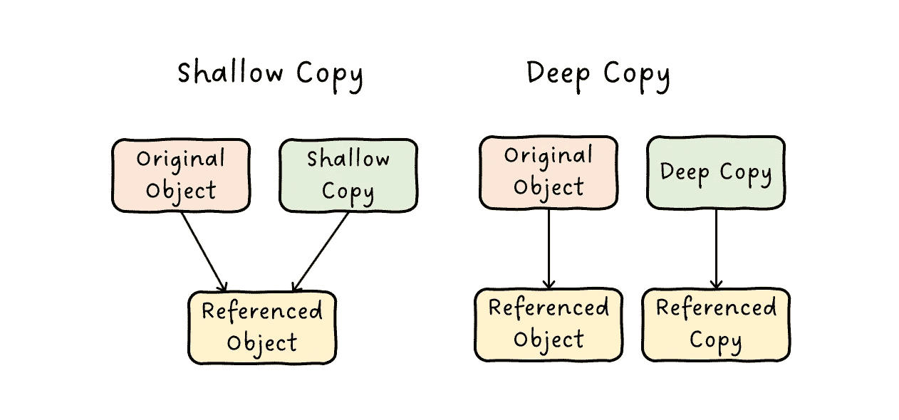

# 令初学者困惑的 5 种 Python 操作

> 原文：<https://medium.com/codex/5-python-operations-that-confuse-beginners-92fafd51351c?source=collection_archive---------12----------------------->

本文总结了一些非常相似的 Python 操作，这些操作很容易混淆，尤其是对于初学者。

作者图片

[Lambda 参数:定义期间有界 vs 运行时](#3b98)
[随机选择有/无替换](#a6d1)
[复制:浅 vs 深](#e613)
[等价 vs 相等](#4fa9)
[搜索子串](#6a1a)