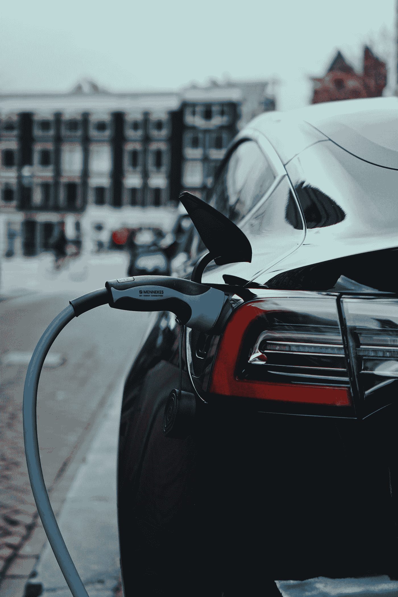
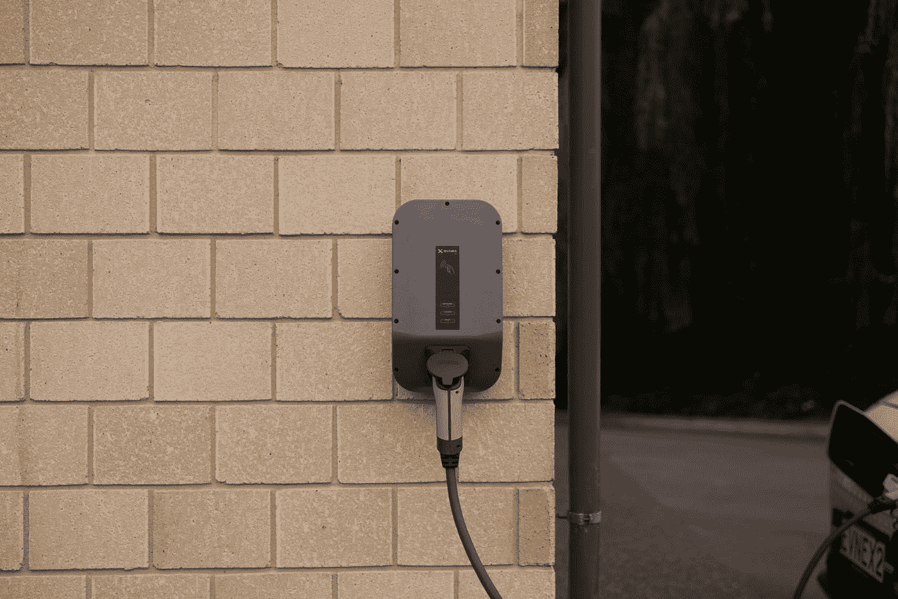
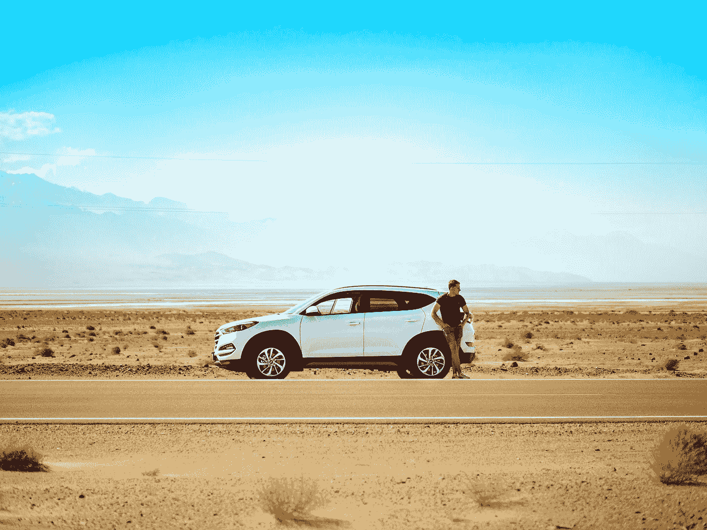

# 不买电动汽车的 5 个理由

> 原文：<https://medium.com/codex/5-reasons-not-to-buy-an-electric-car-2da605ade925?source=collection_archive---------2----------------------->

珍贵的马杜布克在 [Unsplash](https://unsplash.com?utm_source=medium&utm_medium=referral) 上拍摄的照片

为什么化石燃料汽车对环境有害？无论这看起来多么简单，我们都不能对其复杂性视而不见。

# 第一章:创造一切

照片由[莱尼·屈尼](https://unsplash.com/@lennykuhne?utm_source=medium&utm_medium=referral)在 [Unsplash](https://unsplash.com?utm_source=medium&utm_medium=referral) 拍摄

根据 [**麻省理工学院能源倡议**](https://energy.mit.edu) 所做的一项研究，一辆电动汽车的电池和燃料生产比一辆配备 ICU(内燃机)的汽车产生更多的排放。但是这两者中哪一个是最大的排放者呢？电池，还是燃料生产？

电动汽车使用可充电锂离子电池运行，有点类似于 iPhone 中的电池。这些电池的制造是能源密集型的，是当今电动汽车碳排放的最大元凶之一。

# 第二章:问题的根源

“我们如何生产电力来经济地驱动这些车辆？”在比较化石燃料汽车和电动汽车的使用时经常出现。这是因为，如果不使用风力涡轮机、太阳能电池板等，你仍然会造成气候变化的破坏性影响。

> 据估计，仅在中国，每年就有 670，000 人因使用煤而过早死亡——world-nuclear.org

# 第 3 章:缺乏充电点

[Ed Harvey](https://unsplash.com/@edharvey?utm_source=medium&utm_medium=referral) 在 [Unsplash](https://unsplash.com?utm_source=medium&utm_medium=referral) 上拍摄的照片

CMA ( [竞争和市场管理局](https://www.gov.uk/government/organisations/competition-and-markets-authority))最近预测，到 2030 年，英国将需要 250，000 个充电点，而目前只有 25，000 个。换句话说，为了满足这一要求，每天必须制造 85 个充电器！然而，这不是唯一需要考虑的因素…

正如我们所看到的，这些充电点的分布非常不平衡，较大的城市/城镇获得了大多数充电器，而更多的农村地区则部署较慢(或根本没有)。这主要归功于地方当局。

这是什么意思？—除非你住在相对较大的城市/城镇，否则你可能很难找到充电点。这与化石燃料汽车形成对比，无论在什么地方，你几乎都能找到加油站。

# 第四章:成本

亚历山大·密尔斯在 [Unsplash](https://unsplash.com?utm_source=medium&utm_medium=referral) 上拍摄的照片

而电动汽车的“燃料”成本相对较低。前期费用并不友好。例如，特斯拉 Model 3 的性能高达 43，865。尽管价格不菲，但大多数电动汽车并不保值。这是因为它们越来越受欢迎

也就是说，更高端的品牌(如特斯拉、奔驰等)往往能保留约 65%的价值。但这只有在你愿意进行初始投资的情况下才有可能。

# **第五章:短程**

照片由[杰米街](https://unsplash.com/@jamie452?utm_source=medium&utm_medium=referral)上的 [Unsplash](https://unsplash.com?utm_source=medium&utm_medium=referral)

汽油动力汽车加满一箱油可以行驶大约 300 英里(482 公里)，而大多数电动汽车一次充电只能行驶大约 120 英里。多了 2.5 倍的里程！

可悲的是，这没有任何改善的迹象。

> “对于主流车辆，我们可能会看到事情稳定在大约 250 至 300 英里(400 至 480 公里)的范围内。”
> 
> - Chris Harto，交通和能源高级政策分析师

# 结论

最近向公众推出电动汽车意味着我们还没有完全探索这项技术。如果没有足够的努力让充电站更容易接近，让更多的公众买得起这些汽车，等等，我认为我们应该耐心等待，直到进一步的研究。