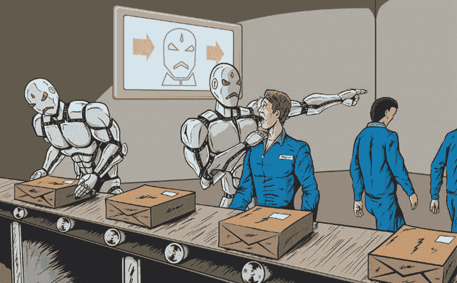

# 人工智能长期不可持续的 5 个原因

> 原文：<https://medium.com/codex/5-reasons-why-ai-is-not-sustainable-in-the-long-term-75495e2bf9c?source=collection_archive---------22----------------------->

人工智能总是受到大众矛盾的接受。用 Stephen Hawkings 爵士的话来说，“**人工智能要么是发生在人类身上最好的事情，要么是最坏的事情**”。虽然一些人认为人工智能将在人类发展中发挥重要作用，相反，一些人仍然认为人工智能以如此快的速度发展对人类来说是灾难性的。在这篇文章中，我将阐述为什么人工智能不能长期持续的原因。

1 **对人类的依赖**——在分析当前人工智能受欢迎程度的上升时，似乎社会正在走向自动化的未来，但实际上，这个世界还没有达到我们可以完全依赖任何自动化机器的地步。在流行文化中，人工智能完全从人类手中接管控制权的想法已经通过电影和文章灌输到社会中，承认人工智能对于人类生存的必要性。世界经济论坛的一份报告预测，到 2025 年，8500 万个工作岗位将被根据人工智能原理工作的机器取代。在未来，机器可能会在一些主要工作中取代人类，但残酷的事实是，我们完全被机器控制还需要很长时间。人工智能机器仍将非常依赖人类，特别是在自主学习和执行复杂任务时。最近围绕聊天机器人的炒作是因为它们在回答问题方面的高度多功能性，以及它们如何在未来的大多数客户销售服务中替代人类。尽管聊天机器人的回答能力令人印象深刻，但它们只能在特定的结构下工作，并且需要人类对它们进行人工训练。他们的工作能力被限制在一定的范围内，并且大多数组织更喜欢为特殊情况保留人力，因为大多数这种情况需要反应能力和耐心的完美结合，这只能由人或由人精确训练的自动化机器提供。

2 **学习能力—** 尽管人工智能机器在执行重复性的任务时非常有用，但它们的学习能力不同于人类，这在关于人工智能接管人类的辩论中证明了它们的劣势。一方面，人类的智慧基于过去的经验，这些经验允许我们理解复杂的概念，并通过试凑法从错误中学习。另一方面，人工智能仅仅基于数据集、历史数据和特定指令。人类可以利用他们的认知技能来适应任何环境，而对于自动化机器来说，他们可能需要数年才能为新的应用领域学习一套完全不同的功能。AI 机器不懂因果的概念。简而言之，他们不理解他们正在努力的原因及其后果，而是他们盲目地遵循给予他们的指示，而人类则精确地判断他们行动的原因及其后果。人类可以在真实世界的情况下做出决定，但自动化机器的决策能力是基于他们接受训练的数据。他们可以从数据中学习，也可以通过持续的训练来学习，但他们永远无法实现人类特有的思维过程。尽管事实上人工智能机器在某些方面可以超越人类，但要匹配人类的潜力，它们还有很长的路要走。

3 **决策** —决策通常是人类的一个幌子。我们通常根据我们行为的后果和做出决定的环境来表达我们的决定。与此相反，机器分析一组特定的规则来做出决定并得出结论。当涉及到人工智能机器的决策时，有一些利弊。从有利的一面来看，有些情况下，由于情绪爆发或压力屈服，决策能力下降，人类无法做出正确的决定。自动化机器通过做出正确的决定来帮助我们处理这种情况。机器的决策方面也有一些缺点。如上所述，机器可以帮助人类在复杂的情况下做出决定，但有时这些决定可能会证明对相关方不利，因为人工智能控制的机器缺乏情感，完全根据给它们的指令做出决定。他们可能会收到涉及对某人造成损害的指令，或者在某些情况下，决策超出了提供给他们的数据的范围，这可能会导致有害的决策。人类的决策能力是从童年开始随着成长而发展的，但机器必须像孩子一样接受训练，这也有一定的限度。虽然人类的思维能力没有限制，但机器的思维能力却受到训练的高度限制。

4 **威胁未来—** 尽管如今大多数人工智能技术都被用于美好的事业，但关键是人工智能可能会导致恶性的未来。在当今时代，人类的关键问题是，是开始一场全球人工智能军备竞赛，还是阻止它开始。当全世界都在疯狂地加强他们的火炮时，许多国家正在转向武器自动化。与核武器不同，自动化武器并不昂贵，而且可以造成类似规模的破坏。人工智能机器人将是执行暗杀和大规模杀戮等行动的最佳选择。如果这些武器得到正常操作，那么这些武器进入黑市只是时间问题，恐怖分子很容易从黑市获得这些武器。人工智能武器可以导致其他国家强行收购发展中国家，因为人工智能机器人可以毫不犹豫地消灭一个种族群体，有时人类由于情绪和精神状态而无法做到这一点。人类今天的关键问题是，是开始一场全球人工智能军备竞赛，还是阻止它开始。如果任何主要军事力量推进人工智能武器的发展，全球军备竞赛几乎是不可避免的，这一技术轨迹的终点是显而易见的，自主武器将成为明天毁灭的原因。

许多研究人员将人工智能视为世界的未来，但不可否认的事实是，人工智能机器有许多模糊之处。我们永远无法确定人工智能机器的未来。它们可以是良性的或恶性的，破坏性的或建设性的，慷慨的或自私的，无益的或善良的。虽然人类可以在一段时间内发展他们的思维，但机器的思维依赖于人类，不能在有限的范围内发展。自动化机器的工作主要是为了奖励，这意味着完成分配给它们的任务，但有时这些奖励可能被误导或可能导致伤害某人，这使我们相信自动化机器很容易受到影响。尽管机器适合解决复杂的任务，并以超人的速度工作，但人类在解决机器无法完成的任务方面总是有优势。人类可以分析情况，根据情况进行思考，记住它的影响，并采取相应的行动，而机器虽然在某些任务中可以超越人类，但永远不可能取代他们。

总而言之，我只想得出结论，尽管人工智能从人类手中接管一些主要工作是未来的前景，但人工智能机器永远无法取代人类的同情和理解。它们可以让我们接近梦想的实现，但永远无法引领我们实现梦想。自动化机器的未来还有很长的路要走，如果使用不当，它们永远不会成为人类问题的长期解决方案。

**如有任何帮助或建议，请随时联系—**

[T3【https://www.linkedin.com/in/shantanu-singh-verma-9901b1220】T5](https://www.linkedin.com/in/shantanu-singh-verma-9901b1220)

如果你喜欢这篇文章，请给它一个赞，并在评论区告诉我你对这个话题的想法和反馈。谢谢你阅读它。