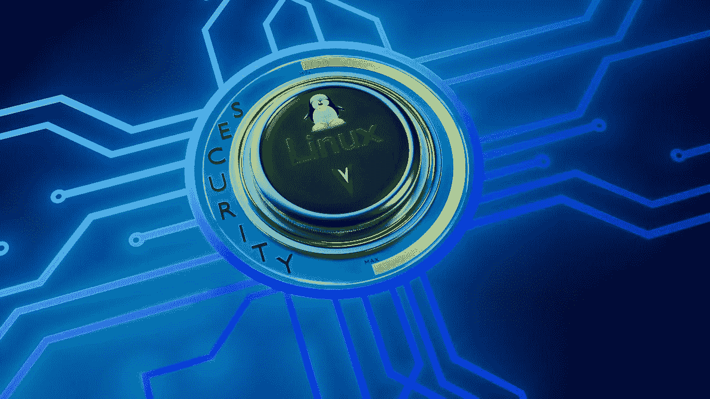
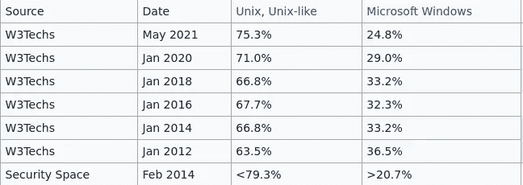
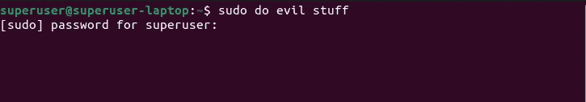
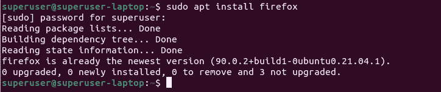
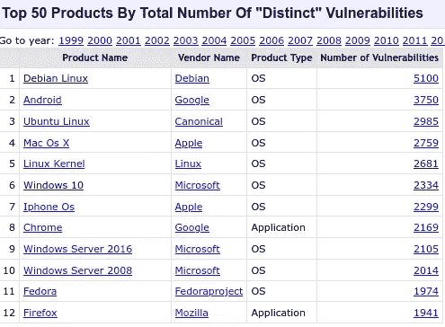
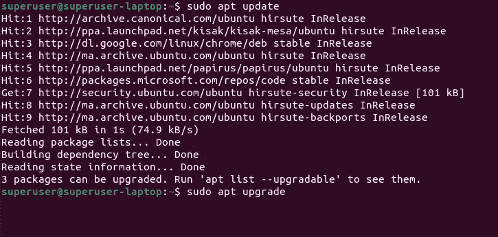
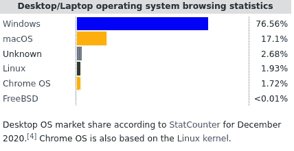

# Linux 比 Windows 更安全的 5 个原因

> 原文：<https://medium.com/codex/5-reasons-why-linux-is-more-secure-than-windows-1d036c3d3324?source=collection_archive---------2----------------------->

当你听到 Linux 这个词的时候，你首先想到的可能是一个充满命令的终端。对于运行 Linux 的服务器来说，这可能是真的，但不是全部。

现在，越来越多的人使用 Linux 作为他们的操作系统，尽管市场份额没有 Windows 大，但许多新的 Linux 用户选择它是因为它的安全性和稳定性。

在本文中，我将尝试向**展示为什么 Linux 通常比 Windows** 更安全的主要原因，以及为什么如果可以的话，您可能应该切换到 Linux。

## 数字

服务器操作系统的使用份额(来源[维基百科](https://en.wikipedia.org/wiki/Usage_share_of_operating_systems#Public_servers_on_the_Internet)

说到安全性，服务器是最受关注的。互联网上的服务器存储和传输重要数据，它们承受不起被破坏的后果。

上图我们可以看到越来越多的服务器使用 Unix 操作系统，以 Linux 为主。你可能会惊讶于**微软使用 Linux 来运行它的云**和其他服务。

> 但是请记住，虽然安全性在这种市场差异中发挥了作用，**还有其他原因**比如 Linux 通常是免费和开源的，并且比 windows 稳定得多。

# 那么为什么 Linux 比 Windows 更安全呢？

*   [*用户权限*](#f57a)
*   [*软件安装*](#b16b)
*   [*开源*](#e453)
*   [*更新*](#78e5)
*   [*通过默默无闻获得安全*](#11a4)

## 用户权限

每当启动系统范围的操作时，Linux 都会要求输入管理员密码

当你安装 Windows 时，它会创建一个管理员帐户，并使用神奇的“以管理员身份运行”选项给你完全的访问权限，让你可以对操作系统做任何你想做的事情。

另一方面，Linux 在默认情况下不允许这样的权限，它会允许你自由使用你的主目录，但每当你想做一个系统级的操作时你需要提供 root 密码。

现在就这一点来说，**如果配置得当，Windows 可以像 Linux 一样安全**，但是几十年来，Windows 默认安装处理用户权限的方式是错误的，也是有风险的。

在 Windows 中，用户可以作为管理员轻松地运行程序，而在 Linux 中，每当您想这样做时，您都必须输入 root 密码，这样您就可以注意到脚本或程序何时试图在系统范围内执行某些操作。

## 软件安装

用户可以安装他们需要的任何软件，而不用浏览网页

要在 Windows 上安装软件，用户一般会上网，搜索一个 *EXE* 或 *MSI 文件，*下载并安装。**这是一个巨大的安全风险**，因为你永远不知道这个消息来源是否可信。

另一方面，Linux 使用一种叫做包管理器的东西。简而言之，包管理器负责从称为存储库的可靠来源下载您需要的程序。

存储库通常由社区管理，包需要很长的过程才能被验证和接受。它们也使用户更容易操作，因为不需要在互联网上搜索，也不需要查找下载文件，你所要做的就是输入一个简单的命令。

Linux 上也有许多 GUI 应用程序，它们就像是软件包管理器的一个界面，允许用户以一种对初学者更友好的方式浏览和安装软件。

微软试图通过引入 Windows 商店来解决这个问题，但是我们都知道没有人使用它，因为 Windows 用户现在已经习惯了错误的方式。此外，Windows 应用商店运行缓慢，并且不包含大多数应用程序。

## 开放源码

来源: [CVE 详情](https://www.cvedetails.com/top-50-products.php)

Linux 是一个开源操作系统，这意味着任何人都可以查看和修改它的源代码，如果你愿意，你甚至可以创建你自己的 Linux 发行版并将其商业化，没有人会阻止你。

起初，您可能认为这是一个安全风险，因为坏人可以查看代码。但在这种情况下，好处大于风险。更重要的是，**全世界的开发人员和研究人员几乎每天都会发现漏洞和利用**并向 Linux 源代码发送补丁，随着时间的推移，这使得它越来越安全。

> 开放平台在历史上经历了很多审查，但是从安全角度来看，拥有一个开源平台有很多优势。— [桑德尔·皮帅](https://en.wikipedia.org/wiki/Sundar_Pichai)

相比之下，Windows 是微软拥有的专有软件，无论微软雇佣多少有才华的开发人员，**寻找漏洞永远不会像在 Linux 中那样快，因为它背后有一个大的社区。**

此外，与 Windows 不同， **Linux 发行版推广开源软件**。所以你会在 Linux 上找到的大多数应用程序都是开源的，并且受益于同样的东西。

## 更新

用户只需使用两个命令就可以更新所有系统和软件包

对于 windows，自动更新仅适用于系统和少数其他 Microsoft 软件。通常，软件开发人员负责实现更新，有些人根本不实现。

**这使得用户的系统上有过时的应用程序**。这是最大的安全风险之一，因为它使系统充满了容易被利用的漏洞。

相反，Linux 使得获取更新和安全补丁变得很容易，不仅对系统如此，对应用程序也是如此，只需使用一两个命令。这都要感谢包装经理。

*注意:人们喜欢 Linux 的另一个原因是，在 99%的时间里，你都不需要重启电脑，即使你更新了系统。*

## 通过模糊获得安全感

来源:[维基百科](https://en.wikipedia.org/wiki/Usage_share_of_operating_systems#Public_servers_on_the_Internet)

尽管 Linux 运行着世界上大多数的服务器，但与 Windows 相比，它的桌面用户基数很低，只有 2%。

虽然存在针对 Linux 的恶意软件和病毒，但它们通常针对 web 服务器和网络设备，而不是 Linux 桌面设备。

另一方面，Windows 拥有约 76%的庞大桌面用户群，**这使得它不仅是真正的"*黑客*，**"的有利可图的目标，也是使用许多可用工具来利用 Windows 的"*脚本小子*"和"*黑客*"的有利可图的目标。

# 最后的话

尽管如此，**用户行为最终才是最重要的**。如果由一个考虑到安全措施的好用户来操作，Windows 可以像 Linux 一样安全。

在我看来，Linux 击败 Windows 最大的一点是**它让你很难搞砸**，因为它默认为你提供了很好的安全选项，并促使你做正确的事情。

微软可以从 Linux 的做法中学到很多。作为世界上最常用的桌面操作系统的开发者，他们应该实现更好的安全默认选项来应对当今的风险。