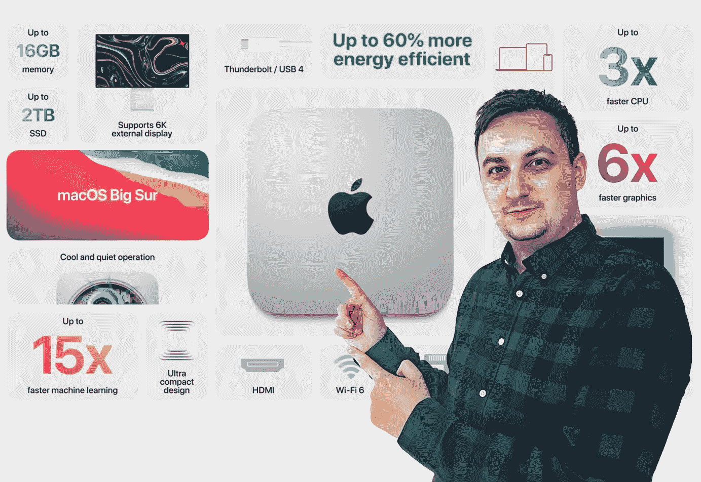

# 在苹果的世界里，Mac mini 是一款出色的入门级电脑的 5 个理由

> 原文：<https://medium.com/codex/5-reasons-why-mac-mini-is-a-great-entry-level-computer-in-the-world-of-apple-cf9521001ef0?source=collection_archive---------3----------------------->

## 我自己用它作为我的日常司机

图片由作者提供

近年来，苹果专注于在其 MAC 电脑中完全从英特尔处理器转向苹果的硅芯片。这一重大举措始于 2020 年，当时苹果推出了首批三款采用 M1 芯片的电脑，即 MacBook Air、13 英寸 MacBook Pro 和 Mac…