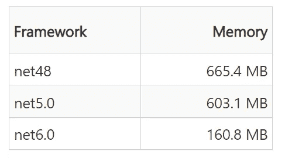

# 的 5 条规则。网络服务优化

> 原文：<https://medium.com/codex/5-rules-for-net-service-optimizations-cf45e5517e08?source=collection_archive---------2----------------------->


约书亚·厄尔在 [Unsplash](https://unsplash.com?utm_source=medium&utm_medium=referral) 上的照片

不管你在哪个框架上工作，也不管你服务的目的是什么，我们作为工程师总是在寻找优化的机会。它可以是重构一个方法以使其更短，改变架构以节省内存，使用利用 CPU 消耗的新功能或其他方式。

在这篇文章中，我将提出五条规则，帮助我们将应用程序或服务提升到一个新的水平。例如。NET，但它们也与其他框架相关。

## 始终监控。

当我们在产品中监控我们的服务时，我们也应该监控开发周期中的性能。现在，ide 有高效的内置工具，可以显示应用程序运行期间的内存和 CPU 消耗。我们应该时刻关注这些——寻找异常和尖峰。这将有助于我们找到可以优化的领域，并量化我们的任何回归或改进。


Visual Studio 2022 诊断工具

我发现一个对这项任务非常有用的工具是 JetBrains [DotMemory](https://www.jetbrains.com/dotmemory/) ，它运行 EXE 文件并在它们的生命周期中监控它们的内存使用情况。DotMemory 还可以在特定时间拍摄快照，并在选定的时间点给出更好的内存利用率建议(字符串复制功能非常棒)。


JetBrains 点记忆工具

## 使用最新版本。

我们生活在一个时代，开发者工具是行业中最热门的领域之一，成千上万有才华的工程师努力工作，让我们的生活更轻松，让我们的应用更快。为什么不从中受益呢？

将框架更新到最新版本，几乎免费享受性能改进(对于某些版本，可能会有小的突破性变化)。从安全角度来说，也建议使用最新的框架版本，因为它通常包含漏洞缓解措施。

例如，在下面的博客中，你可以看到。Net 6 相比之前的版本有显著的改进:[ASP.NET Core 6 的性能提升](https://devblogs.microsoft.com/dotnet/performance-improvements-in-aspnet-core-6/)。文章中真正吸引我眼球的是不同框架上的安全 WebSocket 连接(WSS)的内存使用情况。



从 net5.0 到 net6.0 几乎减少了 4 倍的内存！

## 懂 GC。

垃圾收集器(GC)可以是我们最好的朋友，也可以是最坏的敌人，这取决于我们的观点。


齐比克在 [Unsplash](https://unsplash.com?utm_source=medium&utm_medium=referral) 上的照片

在公共语言运行时(CLR)中，GC 充当自动内存管理器。GC 管理应用程序的内存分配和释放。对于使用托管代码的开发人员来说，这意味着不需要编写执行内存管理任务的代码。自动内存管理可以消除常见的问题，例如内存泄漏或对已经释放的对象的内存访问。

英寸 Net 中，应用程序内存被分成几个独立的块:

*   3 种类型的层代(Gen0、Gen1、Gen2)，用于保存小对象。
*   大对象堆(LOH)，它保存大于 85K 字节的对象。

的。Net GC 算法基于几个考虑因素:

*   压缩部分托管堆的内存比压缩整个托管堆的内存更快。
*   较新的对象生存期较短，较旧的对象生存期较长。
*   较新的对象倾向于彼此相关，并由应用程序在大约相同的时间访问。

到目前为止，GC 听起来很棒！但是权力越大，责任越大。GC 操作会消耗 CPU 资源，所以当 GC 运行时，它会阻塞或减慢您的服务。

为了改进服务中的 GC 过程，建议阅读并了解潜在的改进和特性(比如服务器的 GC 模式)。我推荐微软的这个很棒的文档:[https://docs . Microsoft . com/en-us/dot net/standard/garbage-collection/](https://docs.microsoft.com/en-us/dotnet/standard/garbage-collection/)。确保理解它是如何工作的——这将对你帮助最大。

## 避免反射。

反射提供了获取信息和访问类型和对象成员的能力。比如调用构造函数、设置属性值、添加事件处理程序等。

```
// Reflection example
using System.Reflection;

int i = 42;
Type type = i.GetType();
FieldInfo[] fields = type.GetFields();
foreach (var field in fields)
{
    Console.WriteLine(field.Name);
}
```

使用反射来获取有关类型和成员的信息是不受限制的。我们总是可以使用反射来执行以下任务:

*   枚举类型和成员并检查它们的元数据。
*   枚举和检查程序集和模块。

虽然反射是一个强大的工具，可以帮助编写复杂的代码，但它也有许多缺点:

*   人们常说，平均而言，反射比通过访问器获取数据慢大约 1000 倍。
*   反射可能存在安全风险。一些问题在更新的。Net 版本。还记得“使用最新版本”一节吗？😊
*   对于糟糕的设计来说，反射可能是一种“代码味道”。。Net 是面向对象(OO)语言是有原因的。当开发人员使用反射时，他们破坏了面向对象方法。它可以表明做错了什么。

## 神圣的琴弦。

琴弦很棒，很有用，也很漂亮。它们在任何代码库中都非常常见，但也很棘手。在大多数编程语言中，包括 C#，字符串是一个对象 char 对象的集合。这就是为什么一个字符串将被保存在堆上，而它的指针将位于。

值得一提的是，字符串是不可变的。它回答说，任何字符串连接都会导致新的字符串分配。这将导致更长的运行时间、更多的内存分配和额外的 GC 工作。

如果可能，请尽量避免使用以下语法:

```
var str1 = "Hello";
var str2 = "World";
var newStr = str1 + ' ' + str2;
```

并遵循以下内容:

```
var str1 = "Hello";
var str2 = "World";
var strBuilder = new StringBuilder(str1);
strBuilder.Append(' ');
strBuilder.Append(str2);
var newStr = strBuilder.ToString();
```

至于字符串内插，总是倾向于选择`$`——一个特殊字符将字符串文字标识为内插的字符串，而不是连接。字符串插值在较新版本中进行了优化。Net 版本，而且，在我看来，它也更具可读性。

我们的字符串也可以用于节省内存。在常用的字符串上使用`const`将使编译器只保留对象的一个副本，并在每次使用时引用它。在内存密集型系统中，创建原子化字符串会很有用。它将缓存字符串，同时检查具有重复数据的大数据结构。如上所述，DotMemory 有一个字符串复制特性，可以帮助处理服务中的字符串。

我们的服务表现总有需要改进的地方。请记住这一点，并寻找下一个将推动针的增强。像我们一样，我们的服务应该永远比昨天更好。

感谢您的阅读。