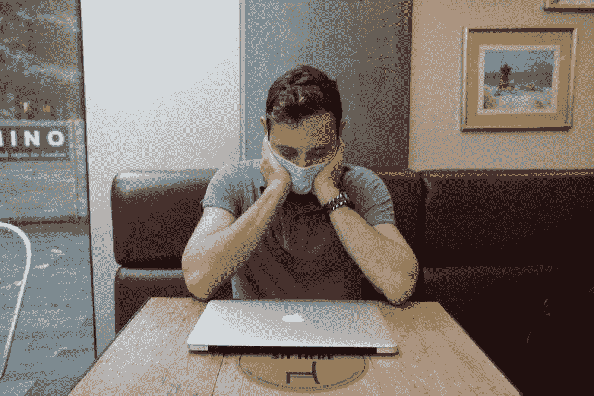

# 你在压力下编码的 5 个迹象

> 原文：<https://medium.com/codex/5-signs-youre-coding-under-stress-cf4aeb654ea8?source=collection_archive---------4----------------------->

## 让开发商退出的危险信号是什么？

托尼·科拉扎

**跳槽的主要原因是什么？******。**研究表明，而且我们可以证实。**

***戒烟还有哪些因素？是什么让一个人从快乐地编写代码到头也不回地离开？***