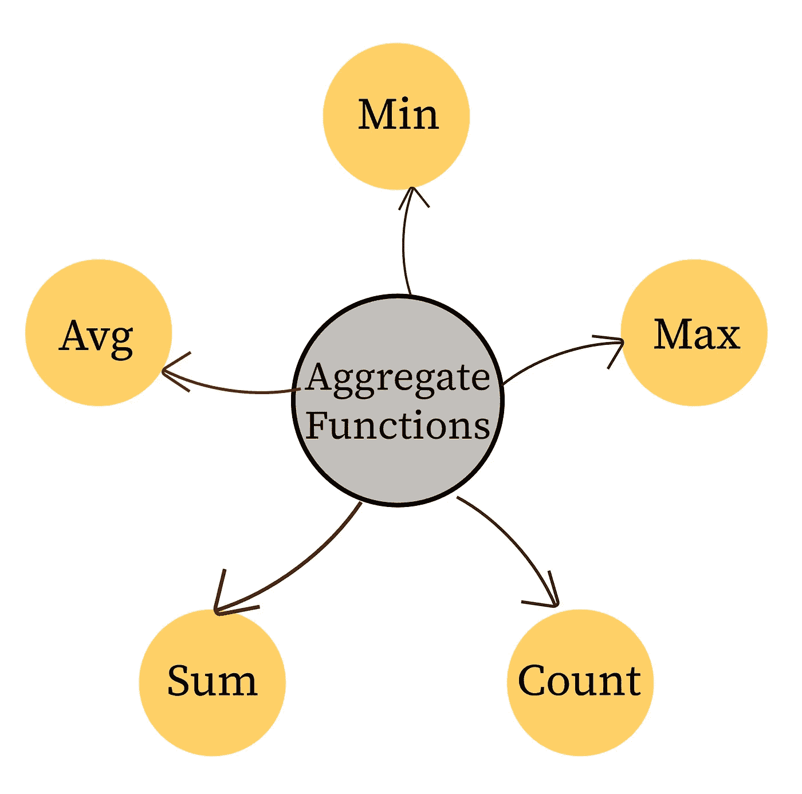
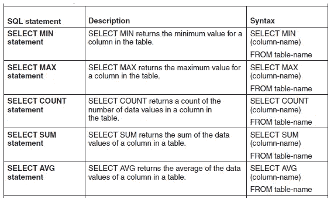
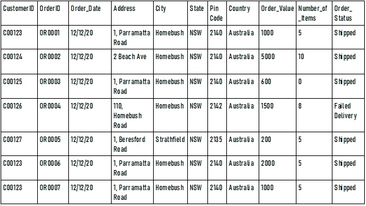

# 从数据剖析和分析开始的 5 个简单 SQL 函数

> 原文：<https://medium.com/codex/5-simple-sql-functions-to-start-with-data-analysis-and-profiling-d63b03ff585c?source=collection_archive---------7----------------------->



用于数据分析的五个 SQL 聚合函数

# 数据分析和 SQL

*您是第一次接触数据分析、SQL 数据分析或 SQL 函数吗？您是一名有抱负的数据分析师，但不知道从哪里开始使用 SQL 吗？* ***那么这篇文章绝对适合你！***

你认为人工智能(AI)和机器学习(ML)是从数据中获取洞察力的唯一途径吗？对于复杂的非结构化数据集，AI 和 ML 可能是建议的技术，但是对于结构化数据集，可以使用一些简单的 SQL 函数来获得非常有价值的初步见解。

***数据剖析是理解你的数据和衡量数据质量的第一步*** 。理解源数据的一种常见方法是针对存储在关系数据库表中的数据编写 SQL 查询。可以使用相对简单的 SQL 查询来分析数据，以模拟列分析的一些方面，如基数、最小值、最大值和平均统计数据(Mahanti 2015， [Mahanti 2019](https://www.amazon.com/Data-Quality-Dimensions-Measurement-Management/dp/0873899776/ref=sr_1_5?crid=ZQIKKVQCDIZU&keywords=Rupa+Mahanti&qid=1643093413&sprefix=rupa+mahanti%2Caps%2C642&sr=8-5) )。

为了使用 SQL 进行数据分析，可以使用 SELECT 语句从关系数据库的表中提取或读取数据。SQL 语句不区分大小写( [Mahanti 2019](https://www.amazon.com/Data-Quality-Dimensions-Measurement-Management/dp/0873899776/ref=sr_1_5?crid=ZQIKKVQCDIZU&keywords=Rupa+Mahanti&qid=1643093413&sprefix=rupa+mahanti%2Caps%2C642&sr=8-5) )。

# SQL 语句—语法

SQL SELECT 语句的一般形式如下:

```
SELECT Column names
FROM Table name
<WHERE Condition
ORDER BY Column names>
```

WHERE 条件和 ORDER BY 列名是可选的。

WHERE 子句筛选满足特定条件的行，后跟返回 true 或 false 值的一个或一组条件。

ORDER BY 子句允许按一列或多列排序。默认的排序顺序是升序，即从低到高或从 A 到 z。关键字 DESC 表示降序，即逆序。如果不使用 ORDER BY 子句，则不会以特定的顺序返回记录。

# **用于分析表的 SQL 语句和函数**

下表列出了使用 5 个 SQL 函数(也称为聚合函数)的 SQL 语句:



# 数据分析业务场景和示例 SQL 查询

业务场景:假设您希望获得一些见解或评估您的单个客户订单数据或表 1 所示的客户订单表的质量。



表 1:客户订单表

比方说，你想知道到目前为止的订单数量。假设每个客户订单对应一条记录，COUNT 函数可用于此目的。

```
Select count(OrderID)
from Customer_Order
```

上述查询将返回值 7。

比如说，你想知道所下订单的最小和最大价值。

```
Select max(Order_Value)
from Customer_Order
```

上述查询将返回值 5000，这是最大订单值。

```
Select min(Order_Value)
from Customer_Order
```

上述查询将返回值 200，这是最小订单值。

比如说，你想知道每份订单的最小和最大数量。您可以对项目数字段使用最小值和最大值函数，如下所示

```
Select min(Number_of_items)
from Customer_Order
```

上述查询将返回值 0，这是表中订单的最小项目数。但是一个有效的订单不能有 0 个项目，这意味着有一个问题需要调查

```
Select max(Number_of_items)
from Customer_Order
```

上述查询将返回值 10，这是表中订单的最大商品数量。

如果您想知道总订单值，那么 Order_Value 上的 SUM 函数将提供结果 11300，同样的查询如下所示

```
Select sum(Order_Value)
from Customer_Order
```

# **总结思路**

对于初学者来说，数据、分析、数据库和数据质量的世界可能会让人不知所措。这篇短文提供了 5 个简单的 SQL 函数，可以让您快速分析关系数据库中的表，提供一些基本的统计数据，让您快速理解数据！

请告诉我这篇文章是否有帮助，以及您还想阅读哪些关于 SQL 和数据分析的内容。下一篇关于 SQL 的文章将重点列出一些可以免费学习/练习 SQL 的网站！

要了解更多有关数据质量、数据分析的信息，包括如何测量数据质量维度、实施数据质量管理方法、数据质量战略以及在实施数据密集型项目时要考虑的数据质量方面，请阅读 [*《数据质量:维度、测量、战略、管理和治理*](https://www.amazon.com/Data-Quality-Dimensions-Measurement-Management/dp/0873899776) (ASQ 质量出版社，2019)。这篇文章很大程度上借鉴了那本书的研究成果。

**参考文献**
马汉提、鲁帕。 [*数据质量:维度、度量、策略、管理和治理*。](https://asq.org/quality-press/display-item?item=H1552) ASQ 质量出版社，2019 年，第 526 页。

马汉提，如法。[“数据概要分析项目的选择和实现:关键考虑事项。”](https://web.b.ebscohost.com/abstract?direct=true&profile=ehost&scope=site&authtype=crawler&jrnl=15220540&AN=111019569&h=mKmOlClhdifXwlEBwflSvEp4Pa3cvDGrVytk88sY92MwZ0Fp4LVTFGdshFC3N%2bZyUrs0nxhvzpMUWAJTW9g85g%3d%3d&crl=c&resultNs=AdminWebAuth&resultLocal=ErrCrlNotAuth&crlhashurl=login.aspx%3fdirect%3dtrue%26profile%3dehost%26scope%3dsite%26authtype%3dcrawler%26jrnl%3d15220540%26AN%3d111019569) *软件质量专业，2015* 第 17 卷第 4 期，第 44–52 页。