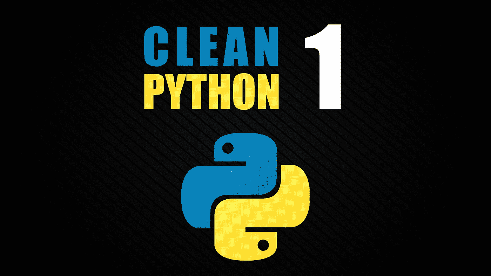

# 编写干净的 Python 代码(并节省时间)的 5 个简单技巧🧽🧺

> 原文：<https://medium.com/codex/5-simple-tips-to-writing-clean-python-code-and-save-time-f57970ca53ae?source=collection_archive---------1----------------------->

来源:我:)

如何编写干净的 Python 代码？遵循这个简单的五步过程将确保你的代码工作正常，易于阅读，并充分利用 Python 所提供的功能。准备好学习如何编写干净的 Python 代码了吗？我们开始吧！所有这些技巧都是受最初的 [**Javascript 版本**](https://github.com/ryanmcdermott/clean-code-javascript) 的启发，由[**Ryanmcdermott**](https://github.com/ryanmcdermott)**创建，但适用于 Python 并具有更多扩展…**