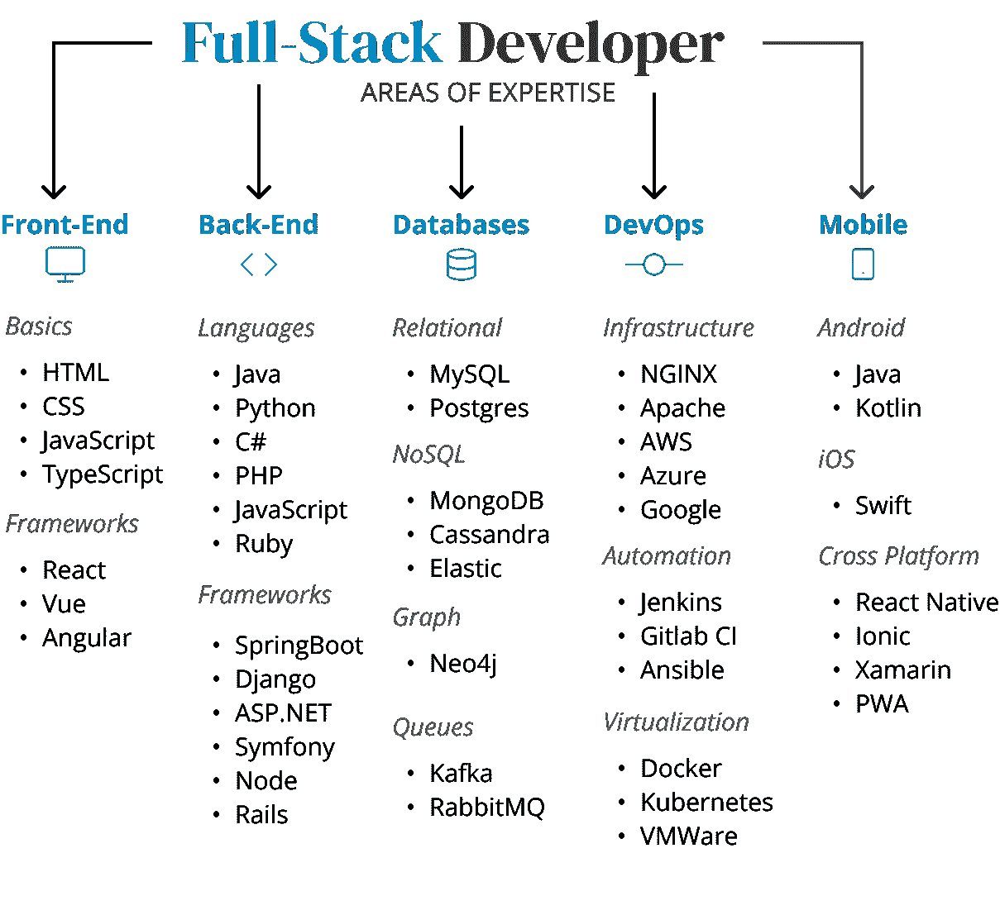

# 从前端到全栈 5 步

> 原文：<https://medium.com/codex/5-steps-from-front-end-to-full-stack-3d7d61eda779?source=collection_archive---------2----------------------->

来自 [Unsplash](https://unsplash.com/photos/wxWulfjN-G0) 的背景图片。由作者使用来自[多像素](https://www.manypixels.co/gallery)的免费图片编辑

## 如何拥抱后端的实用指南

## 动机

您是否曾经面试过或与拥有三年前端经验、现在希望全力以赴的人交谈过？
市场很艰难，相信我。
我见过许多人走上不同的道路，从 DevOps Kubernetes 证书到云无服务器编程，但不知何故，大多数人都没有成为全栈开发人员。仅仅因为他们专注于流行词。

这就是为什么我决定分享我的个人道路，让专注于前端的开发人员成为真正的全栈开发人员，可以在各种行业内从事全栈项目。

## 什么是全栈开发者？

一个 fullstack 开发者对前端、后端、数据库、DevOps 和移动开发有很好的理解和专业知识。现在没有人要求你知道一切。你绝对可以有你的重点。但是成为 fullstack 意味着你了解每个领域的一些技术，并且知道所有的东西是如何协同工作的。软件架构需要成为一个专业领域。
以下是全栈技术的概述:

由作者使用 figma 设计

## 1.选择一种编程语言和框架

因为您来自前端，所以我假设您了解 JavaScript)
那就完美了！在过去，你不能用它做任何服务器端的编码，但幸运的是现在有了 Node！从个人经验来看，我建议学习另一种编程语言来解决各种各样的思维和技术问题，但是你绝对可以使用 JavaScript 来构建后端。框架要重要得多。最后，一旦你熟悉了这种语言，你使用的语言很可能会保持不变。
然而，框架可以有很大不同，即使核心概念是相似的。

对于 JavaScript 爱好者来说， [Express](https://expressjs.com/) 是一个很好的框架。这是一个基于节点的 web 应用程序框架，非常受欢迎，尤其是在创业领域。
如果你对一门新语言持开放态度，你应该选择 *Python* 和 [Django](https://www.djangoproject.com/) 。
如果你喜欢*Java*——如果你知道 [SpringBoot](https://spring.io/projects/spring-boot) ，市场会感谢你的。
也可以搭配 *PHP* 和 [Symfony](https://symfony.com/) 。还有一些人对着[铁轨](https://rubyonrails.org/)上的*红宝石*发誓。

挑一个坚持下去！我建议选择你以前工作过的，你的项目将要需要的或者你的朋友和同事已经熟悉的。

***PS*** *:这将* ***而非*** *决定你作为开发者的整个未来；)*

## 2.寻找关于数据结构和算法的教程

数据结构和算法。就我个人而言，这是我在大学里选择的最无聊的课程。但本质上这很重要，因为这是优秀的后端开发人员和真正伟大的后端开发人员的区别。在大多数前端应用程序中，你不需要考虑太多有效的算法，因为你主要是为 UI / UX 迭代和操作数据。但是复杂的计算是在服务器端进行的。因此，你的编程语言中后端算法的效率和有效性决定了你的使用水平和领域。

现在，没有人期望您知道所有的内容——因为大多数开发人员都是从 stackoverflow 复制粘贴的:P pssssht！但是理解这些概念是很重要的，要很好地理解存在什么问题以及它们通常是如何解决的。

一些公司在他们的面试中发布编程测试，所以你最好通过了解这些方法和在 [leetcode](https://leetcode.com/) 上练习来准备。

 [## 算法，第一部分

### 这门课程涵盖了每个严肃的程序员需要知道的关于算法和数据的基本信息…

www.coursera.org](https://www.coursera.org/learn/algorithms-part1)  [## 数据结构和算法

### 掌握算法编程技术。通过学习，推进您的软件工程或数据科学职业生涯…

www.coursera.org](https://www.coursera.org/specializations/data-structures-algorithms) 

## 3.了解数据库的基础知识

现在数据库是存储我们数据的工具。在前端，您可能会使用 cookies、应用程序商店(redux 或类似的东西)，但它通常以 graphql 和 API 请求结束。现在，模型层非常重要，并且根据您使用的数据库技术而有所不同。关系？文档？Postgresql vs. MongoDB？不同的产品、如何构建和查询的方法以及不同的优势和使用案例。

了解这些很重要，根据您选择的框架，您需要了解设置和配置。

我个人建议从 MongoDB 开始。
[MongoDB 大学](https://university.mongodb.com/)有很棒的课程，会帮助你快速起步。

[这里的](https://www.udemy.com/course/sql-and-postgresql/)也是关于 Postgresql 的一门很棒的课程。

## 4.建立自己的博客！

请，无论你做什么…边做边学！没有实践，编程中的理论是完全无用的。你需要亲自动手，开始发展你自己所学的一切。我发现学习所有这些东西的最好项目是你的个人网站&博客。

这对你来说会很有趣，你可以展示一些东西，并且对维持技术有长期的好处。你将需要一个后端框架，一个存储帖子的数据库，也许更多。此外，您将能够扩展应用程序越来越多的功能。评论？标签？这个可以规模化很多！

## 5.设置部署和托管

走向 fullstack 的最后一步是开始你自己的部署和托管。获得一台服务器，并在其上托管您自己的应用程序。
设置 NGINX，Apache 或者任何你喜欢的 web 服务器，都可以上云！
如果你不想自己设置主机，你就错过了服务器配置和路由问题。这是了解全栈世界的一部分。
你可以使用的一个主机是[a2 主机](https://www.a2hosting.com/)。如果你仍然不喜欢这样做——去找免费的 vercel 和 host。

## 您博客的待办事项列表

你需要一个初始的**待办事项列表**？给你:

1.  *在 GoDaddy.com*[注册域名](https://www.godaddy.com/)**→前往:yourname.com**
2.  **使用前端* [*博客模板*](https://tailwind-nextjs-starter-blog.vercel.app/) *或者用* [*figma*](https://figma.com) 设计自己的*
3.  **在本地设置后端和数据库，并准备好 IDE**
4.  **为用户创建模型并发布**
5.  **为帖子开发 REST API 控制器**
6.  **使用 REST API 显示博客中的文章**
7.  **设置一个简单的用户界面来管理你的文章并添加认证**
8.  **为自己找一个主机并部署你的应用**
9.  **在 GoDaddy 上设置 DNS 以指向您的服务器**
10.  **发布你的网站，给你的朋友看！**

## *摘要*

*我希望这篇文章能帮助你找到一条通往全栈角色的道路。
全栈开发人员通常更灵活地为不同的客户工作，因为他们能够在多个领域工作。您不仅能够将您的知识应用到各个领域，而且您将对前端及其在整个解决方案中的作用有更好的认识。祝你好运，享受旅程！*