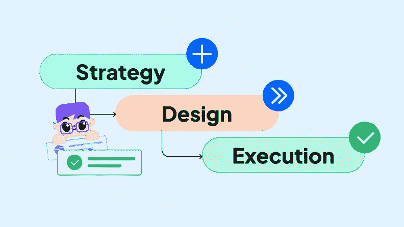
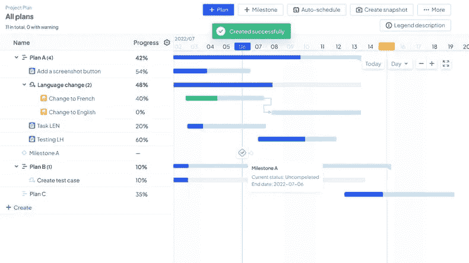
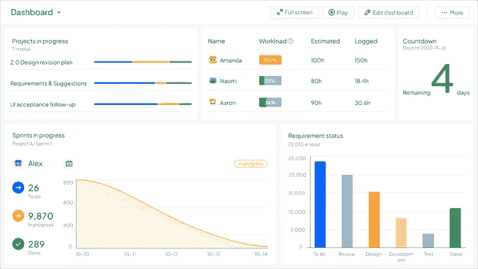

# 处理意外项目变更的 5 个步骤

> 原文：<https://medium.com/codex/5-steps-to-handle-unexpected-project-changes-d656168d86a1?source=collection_archive---------19----------------------->

与制定详细的项目计划相比，**项目管理**中最具挑战性的部分之一是处理**意外情况**。在项目进展过程中，未能有效管理变更将导致不可预见的风险。然而，变化是不可避免的。最重要的不是问题本身，而是如何处理。

[**项目变更管理**](https://ones.com/products/project) 由审查变更请求、批准变更、更新项目计划、实施、监控和记录变更的全过程组成。最重要的步骤之一是对变更请求进行影响分析，这可以通过结构化的过程进行分析。

**影响分析**的要点在以下 5 个步骤中定义。

# 第一步。确定变化的原因

第一，是否有明确具体的理由:

*   为什么提出这一变更请求？
*   改变可以避免吗？
*   变更对项目、流程或产品有益吗？

此外，应检查**变更日志**以查看是否有过多的变更。确认变更后，还必须结合其他变更评估变更的优先级。

# 第二步。分析变更对三重约束的影响

*   **范围**

确认变更对整个**项目范围**的影响，并根据变更的细节，确定需要添加、删除或变更的产品特性。此外，调整产品分解结构(PBS)和工作分解结构(WBS)。改变资源分配，调整资源分解结构(RBS)。

*   **成本**

这种改变会导致成本增加吗？如果是这样，谁来支付这些增加的费用？

分析变更的成本影响，确定成本管理计划和整体财务计划的任何变更。该分析还应**强调项目和组织的财务收益**，以及**变更**的积极影响，如改进的规划、更好的绩效、更低的风险、更好的未来机会以及利益相关者更高的满意度等。

*   **时间**

估计实施变更所需的时间，评估变更对里程碑和关键路径的影响，并相应地修改计划和里程碑。

# 第三步。设置相关性

项目活动彼此紧密交织在一起。应确定依赖于变更及其环境的任务。任何必须在变更前完成的任务都需要确定优先级。同样重要的是**确定资源依赖性**并确定如何**最好地分配资源**。最后，还必须确定其他外部依赖因素，如**市场条件**和**法律法规**。

# 第四步。分析风险

对与变更相关的所有风险进行**定性和定量分析**。

# 第五步。确认对项目管理系统的影响

确认并列出所有需要对项目过程描述或项目决策结构进行的变更，并**修改沟通、质量、风险和整个项目的管理计划**。

上述所有分析结果都可以记录到 [**中，形成详细报告**](https://ones.com/) 供**变更控制委员会**使用。一旦变更请求被批准，就可以根据先前确定的计划进行变更。在执行变更期间，应监控状态和风险。

# 结论

复习中要排除干扰因素，重点关注高频变化，分析原因性质。

除了有效地促进持续改进和结束流程，评审还允许团队就变更原因和相应的解决方案达成共识，提高团队在**变更管理**和执行方面的能力。

*原载于 2022 年 10 月 27 日 https://blog.ones.com**的* [*。*](https://blog.ones.com/change-management-in-project-management)