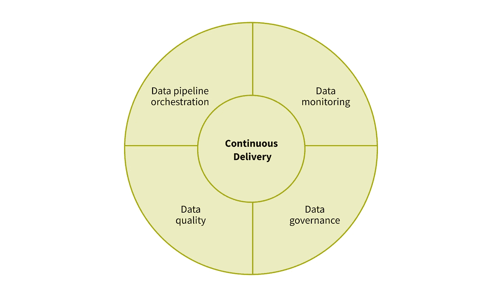
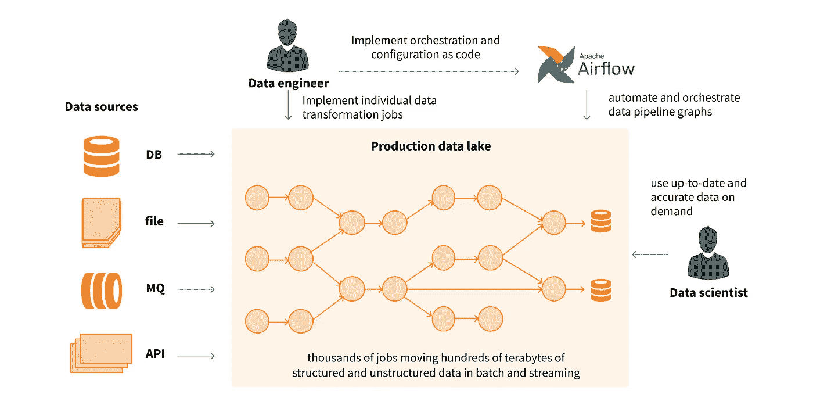
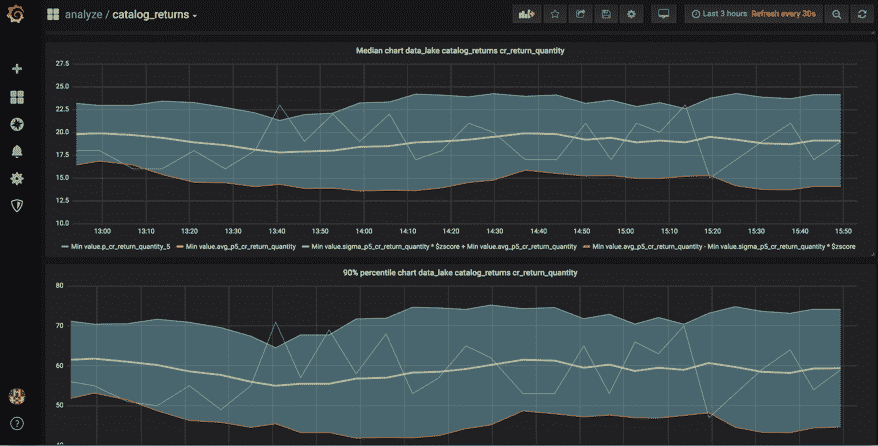
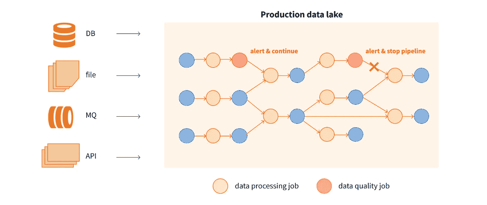
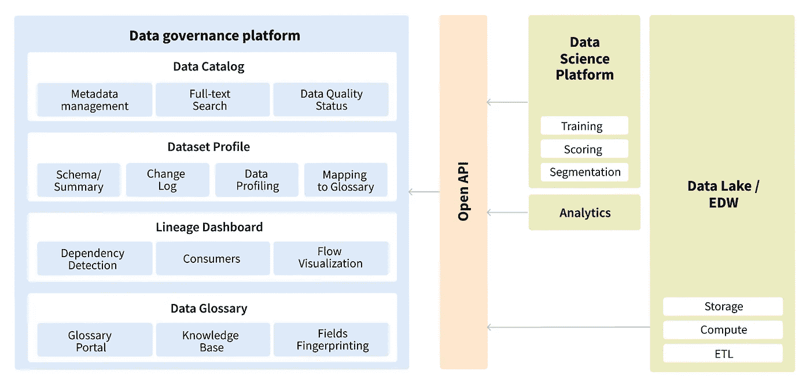
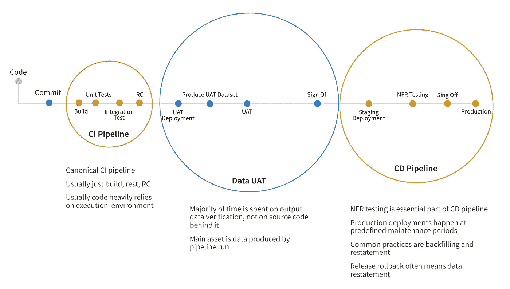

# 实施成功数据运营实践的 5 个步骤

> 原文：<https://medium.com/codex/5-steps-to-implementing-a-successful-dataops-practice-f553effd7367?source=collection_archive---------6----------------------->

文章最初发表在 [Grid Dynamics 博客](https://blog.griddynamics.com/?utm_source=medium&utm_medium=referral&utm_campaign=5_Steps_to_Implementing_a_Successful_DataOps_Practice)

## 由[马克斯·马丁诺夫](https://blog.griddynamics.com/author/max-martynov/) & [德米特里·梅真斯基](https://blog.griddynamics.com/author/dmitry-mezhensky/)

在最初兴奋地认为数据湖将帮助公司最大化其数据的效用之后，许多公司对其大数据努力的回报迅速减少感到失望。虽然将大量数据放入湖中很容易，但将这些数据转化为见解并从中实现价值却是一项非常困难的任务。

这些问题中的许多都与数据质量差、业务和技术之间缺乏一致性、缺乏协作以及缺少适当的工具有关。当软件开发面临类似的挑战时，敏捷和 DevOps 技术帮助解决了这个问题。

在数据领域，行业发明了术语 [DataOps](https://www.gartner.com/en/documents/3970916/introducing-dataops-into-your-data-management-discipline) ，它采用敏捷和 DevOps 原则，并将它们应用于数据工程、科学和分析。我们不打算在这篇文章中关注数据操作技术，因为有许多关于这个主题的好文章。相反，我们将重点关注促进数据运营实施的技术支持因素。

[在之前的文章](https://blog.griddynamics.com/from-data-lake-to-analytical-data-platform/)中，我们写道数据湖不足以满足企业数据分析需求，公司需要构建功能全面的分析数据平台。在本文中，我们将探索分析数据平台的功能，该平台有助于数据运营方法，并帮助公司更快、更高效地从数据中获取价值。

# 数据编排

现代分析数据平台包含数千个数据转换作业，并以批处理和实时流的方式移动数百 TB 的数据。复杂数据管道的手动管理是一项极其耗时且容易出错的活动，会导致数据陈旧和生产力下降。

自动化数据编排的目标是将调度数据工程作业的工作从数据工程和支持团队的肩上卸下来，并使用工具将其自动化。开源数据编排工具的一个很好的例子是 Apache Airflow，它有很多好处:

*   能够编排复杂的相互依赖的数据管道。
*   管理数百个流量的可扩展性。
*   通过 LDAP/AD 集成、Kerberos 身份验证支持、基于角色的访问和多租户实现强大的安全性和受控访问。
*   支持各种管道触发器，包括基于时间的调度、数据依赖性传感器(如文件系统上文件的创建或更新)、数据库表中的变化以及管道间依赖性(包括上游作业的完成或失败)。
*   灵活的重试策略，具有可配置的恢复选项和 SLA 实施。
*   用于可视化数据管道依赖关系图的便捷图形界面。
*   基于可扩展 Python 的 DSL 作为主要配置语言。
*   丰富的可重用组件库。
*   嵌入式机密管理子系统。
*   将编排和作业配置作为代码存储在源代码版本系统中。
*   支持在开发人员的工作站上对管道进行本地测试。
*   灵活配置作业，实现高可用性和灾难恢复。
*   云友好，支持使用 Kubernetes 按需供应任务执行者。

# 数据监控

有些 DataOps 文章提到[统计过程控制](https://en.wikipedia.org/wiki/Statistical_process_control)，我们称之为数据监控。数据监控是数据质量的第一步和先导。数据监控背后的关键思想是随着时间的推移观察数据配置文件并捕捉潜在的异常。

在最简单的形式中，它可以通过收集数据集和单个数据列的各种指标来实现，例如:

*   一段时间内处理的记录数。
*   数字或日期列的值范围。
*   文本或二进制数据列中数据的大小。
*   null 值或空值的数量。

然后，对于每个指标，系统会计算一些常见的统计数据，例如:

*   平均值。
*   中值。
*   百分点。
*   标准差。

有了这些信息，我们可以观察新的数据项或数据集是否与系统过去观察到的有实质性的不同。数据分析和数据科学团队还可以使用收集的数据配置文件来了解更多关于数据的信息，从而快速验证一些假设。

简单的数据监控方法可以通过人工智能驱动的异常检测来增强。现代异常检测算法可以学习周期性数据模式，使用各种指标之间的相关性，并最大限度地减少误报警报的数量。要了解关于这种技术的更多信息，请阅读我们最近关于各种[实时异常检测](https://blog.griddynamics.com/unsupervised-real-time-anomaly-detection/)方法的文章。为了简化向现有分析数据平台添加异常检测，我们实现了一个加速器，您可以在[这篇文章](https://blog.griddynamics.com/add-anomaly-detection-to-your-data-with-grid-dynamics-accelerator/)或[联系我们](https://www.griddynamics.com/contact)中了解更多信息。

# 数据质量

虽然数据监控有助于数据工程师、分析师和科学家了解有关数据的更多详细信息，并在出现异常时获得警报，但数据质量功能将提高数据可信度或准确性的理念提升到了另一个层次。数据质量的主要目标是自动检测管道中的数据损坏，并防止其扩散。

数据质量使用三种主要技术来实现这一目标:

*   **业务规则** —业务规则可以被视为在生产数据管道中持续运行的测试，以检查数据是否符合预定义的要求。这是一种完全监督的方式，以确保数据的完整性和质量。它需要最大的努力，但也是最精确的。
*   **异常检测** —为数据监控而实施的异常检测可重复用于数据质量实施，并需要设置特定阈值来平衡精确度和召回率。
*   **与数据源的比较** —湖中的数据与数据源的比较通常适用于摄取的数据，最适合用于偶尔验证数据湖中的数据流入口的数据新鲜度。这种方法在生产中开销最大，需要直接访问记录系统数据库或 API。

如果一个团队已经使用了支持代码配置的自动化数据编排工具，比如 Apache Airflow，那么数据质量作业可以自动嵌入到数据处理作业之间或与之并行的所需步骤中。这进一步节省了监控数据管道的时间和精力。要了解更多关于数据质量的信息，请参考我们最近的文章。为了加快现有分析数据平台中数据质量的实现，我们实现了一个基于开源技术栈的加速器。该加速器采用云原生架构构建，适用于大多数类型的数据源。

# 数据治理

数据治理是一个无处不在的术语，它还包括人员和过程技术，但是，我们将关注它的技术和工具方面。数据治理工具的两个方面已经成为任何现代分析数据平台的必备工具，它们是数据目录和数据谱系。
数据目录和谱系使数据科学家、分析师和工程师能够快速找到所需的数据集，并了解它们是如何创建的。像 Apache Atlas、Collibra、Alation、Amazon Glue Catalog 或来自 Google Cloud 和 Azure 的数据目录这样的工具可以成为实现这一功能的良好起点。

添加数据目录、数据术语表和数据沿袭功能可提高分析团队的工作效率，并加快洞察速度。

# 连续交货

DevOps 的概念是 DataOps 方法背后的基石和灵感之一。虽然 DevOps 依赖于文化、技能和协作，但现代工具和轻量级但安全的持续集成和持续交付流程有助于在实施新的数据管道或数据分析用例时缩短上市时间。
与常规应用程序开发一样，数据的持续交付流程需要遵循[微服务最佳实践](https://blog.griddynamics.com/avoid-the-monolithic-release-process-when-migrating-to-microservices/)。这种最佳实践允许组织扩展，减少实现和部署新数据或 ML 管道的时间，并提高系统的整体质量和稳定性。
虽然与应用程序开发有许多相似之处，但数据的持续交付流程也有其自身的特点:

*   由于数据量很大，应该将注意力放在使用生成的数据进行单元测试和功能测试上。
*   由于生产环境的规模很大，为 CI/CD 管道的每次执行创建随需应变的环境通常是不切实际的。
*   数据编排工具需要用于生产中的安全发布和 A/B 测试。
*   需要更加重视数据质量和生产中的监测以及数据产出的测试。

传统工具，如 GitHub 或其他基于 Git 的版本控制系统、单元测试和静态代码验证工具、用于 CI/CD 的 Jenkins 和用于持续部署的 Harness.io，在数据工程领域找到了它们的主要用途。使用数据管道编排工具，允许像 Apache Airflow 这样的代码配置，可以进一步简化持续交付流程。

# 结论

DataOps 已经成为现代数据分析组织的重要方法。与传统软件开发中的敏捷和 DevOps 一样，DataOps 有助于更快地认识到价值，并以更可靠的方式实现业务目标。为了在数据运营方面取得成功，公司需要学习新技能，调整其文化、协作、流程，并利用一系列新的技术能力和工具来扩展其数据湖。

在 Grid Dynamics，我们已经帮助财富 1000 强公司采用了数据运营文化，建立了所需的流程，获得了必要的技能，并实现了所需的技术能力。为了帮助我们的客户更快地获得洞察力，我们为所有必要的功能创建了加速器，包括数据编排、数据监控、数据质量、异常检测和连续交付。要了解更多关于在企业范围内实现这些功能的案例研究，[请阅读我们的白皮书](https://blog.griddynamics.com/data-platform-orchestration-catalog-and-quality/)。要尝试我们的加速器，观看演示，并讨论如何搭载它们，请随时与[联系](https://www.griddynamics.com/contact?utm_source=medium&utm_medium=referral&utm_campaign=5_Steps_to_Implementing_a_Successful_DataOps_Practice)。