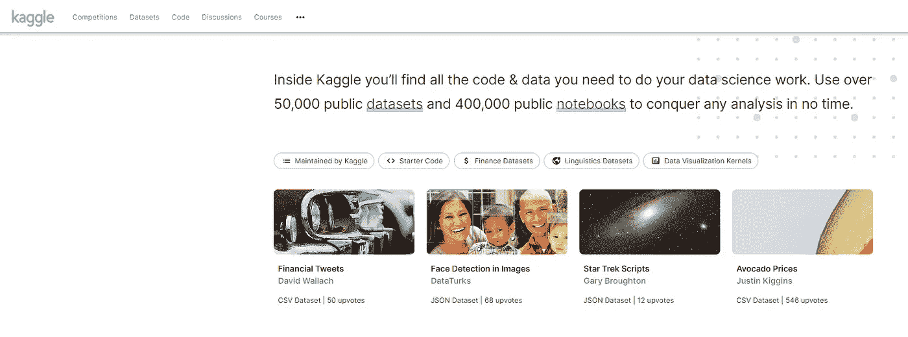
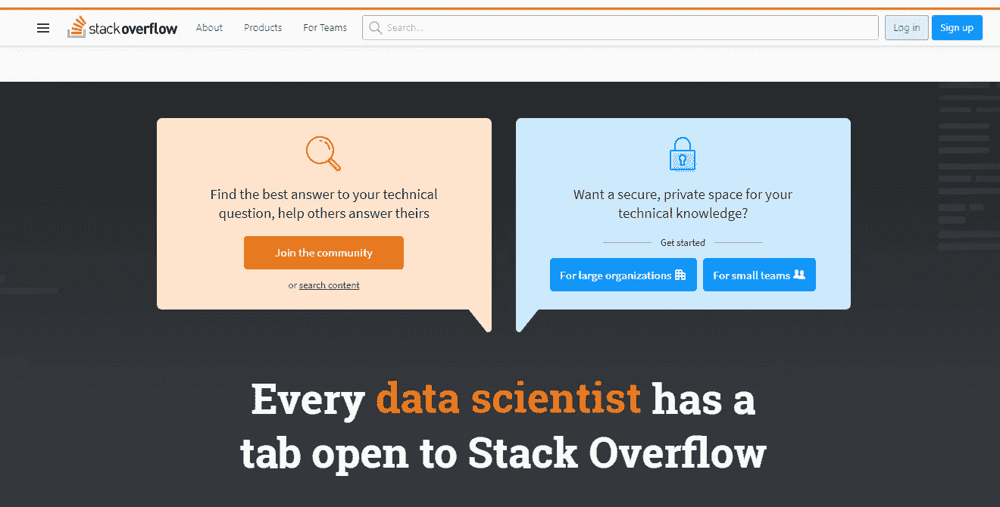
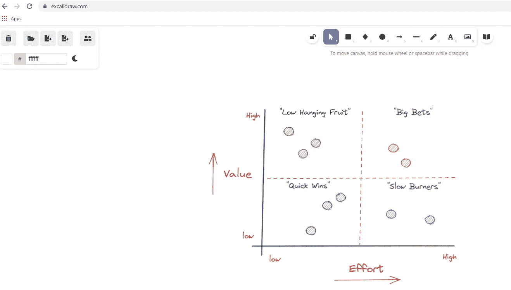
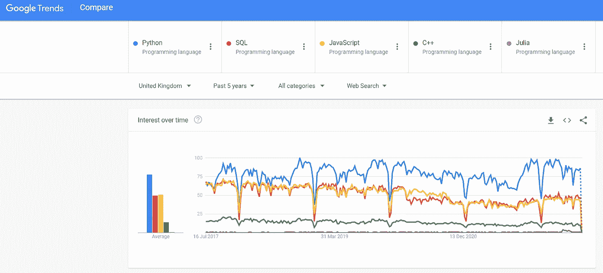
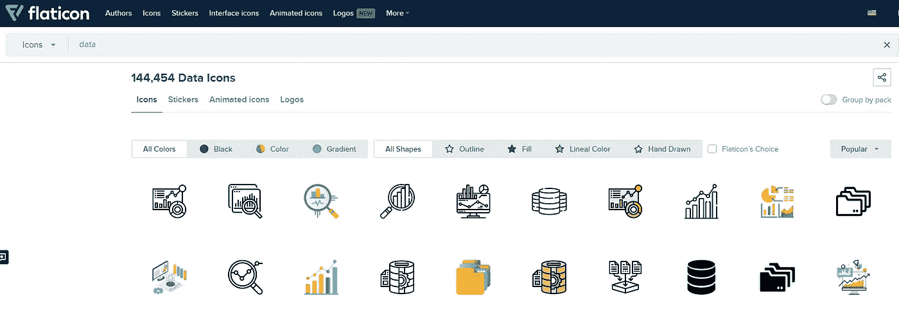

# 5 个对数据分析师非常有用的网站

> 原文：<https://medium.com/codex/5-super-useful-websites-for-data-analysts-e07629a93b74?source=collection_archive---------0----------------------->

在 [Unsplash](https://unsplash.com?utm_source=medium&utm_medium=referral) 上由 [Carlos Muza](https://unsplash.com/@kmuza?utm_source=medium&utm_medium=referral) 拍摄的照片

作为数据分析师，您本质上是业务与其技术/数据科学职能部门之间的桥梁(即使您是该职能部门的唯一人员！)做“数据翻译”需要你善于向业务用户呈现，善于分析数据。这里有一些网站在我过去几年的职业生涯中对我作为数据分析师有所帮助，我强烈建议你去看看:

# Kaggle.com

Kaggle 就像是自助餐厅的数据等价物，字面意思是*所有你能吃到的数据*。对于任何想要参加数据竞赛、寻找公共数据集(公共 API)、学习新的数据技能以及本质上成为数据科学社区的一部分的分析师来说，这都是一个非常棒的网站。当我想寻找新的数据集来探索和练习我的可视化/编码/excel/ETL 技能时，这是我的首选。令人印象深刻的是，谷歌在 2017 年收购了 Kaggle

我的公共数据集和 API 的来源

# Stackoverflow.com

被 Excel 卡住了？还是一段行不通的 Python 代码？需要调试支持或只是有人来检查您的 SQL 代码？好吧，栈溢出就是你的答案。把它想象成 Quora 或者 Reddit，用来编码问题和答案。对于我遇到的几乎所有 Python 或 SQL 问题，我都在堆栈溢出中找到了答案。此外，Stack Overflow 每年还发布一份开发者调查，其中包括每年对最流行的编程语言的见解。一定要去看看。

我的编码问题和答案网站

# Excalidraw.com

这是一个有趣的问题，你可能会想，等等，这不是一个数据网站吗？你是对的，因为它不是。Excalidraw 是一个非常漂亮的可视化设计器/白板工具(类似于 Microsoft Visio ),我用它来绘制数据流、技术堆栈、ETL 流、数据路线图、系统架构等等。这些绘图经常用于向业务用户进行演示，并且确实有助于使任何需要向非数据人员演示数据移动或技术计划的会议生动起来。它现在非常受欢迎，像 JP 摩根、网飞和脸书这样的公司现在都是这个工具的客户，并提供给内部员工使用。

我完全用 Excalidraw 绘制的商业图表

# 谷歌趋势(trends.google.com)

当我第一次发现谷歌趋势时，我被震惊了。我希望我能早点发现它，因为这个世界上最大的搜索引擎提供的搜索趋势结果和数据对我来说就像金粉一样。谷歌趋势是发现世界上任何趋势的权威网站。编码语言、时尚标签、游戏机大战、名人，凡是你能想到的，谷歌趋势都有数据。你可以比较任何地理区域或时间段的多达 5 个趋势，甚至还可以查看 YouTube 趋势。这是一个很好的网站，可以验证一个产品或想法是否真正流行。

趋势搜索过去 5 年中最流行的编程语言

# Flaticon.com

我最近发现的另一颗隐藏的宝石。大多数数据分析师在 Zoom、团队、WebEx 或 Hangout 电话上花费大量时间，频繁地展示数据发现和分析见解。为了美化这些演示，你需要视觉元素和图标。这就是 Flaticon 的用武之地，它有一个巨大的信息图表库，你可以下载并粘贴到你的演示文稿中。最重要的是，它的 95%都是免费的，只要你给设计者信任。我曾在一些高级商务会议上使用我在 Flaticon 上找到的图标。这是我寻找小包装插图的来源。

庞大的图形/图标库，几乎包含您想要的任何内容

更值得一提的是**Canva.com**虽然 Canva 更受图形设计和社交媒体内容设计的欢迎，但它作为一个平台有着无限的用途，可以用于设计任何东西，从 PDF 模板、电子邮件模板或商业图表。再次值得探索。

希望以上列表对你有用！直到今天，我仍然几乎每天都在使用这些网站，如果你觉得它们有用或者发现任何其他好的网站，我很乐意阅读你的评论。感谢阅读，请务必遵守！

【如果你觉得我的内容有用，请考虑订阅 Medium，支持像我这样的作者:[*【https://medium.com/@sghani77/membership】*](/@sghani77/membership)