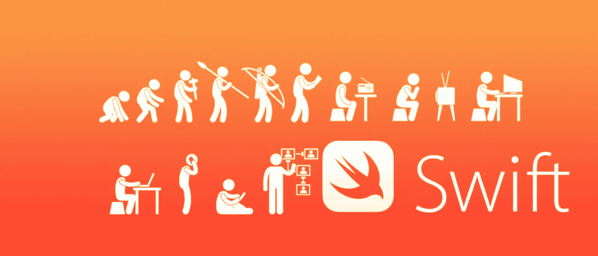

# 5 个 Swift 扩展，让您的生活更轻松

> 原文：<https://medium.com/codex/5-swift-extensions-that-will-make-your-life-easier-41ca42d60946?source=collection_archive---------0----------------------->

当我开始在 swift 中构建 iOS 应用程序时，我很难自己硬编码所有东西。我并不是说这种方法不好，但它非常耗时，尤其是在大型项目中。我列出了一些在软件开发过程中对我有帮助的扩展。

## [**NSLayoutHelper**分机](https://github.com/tryWabbit/Layout-Helper)