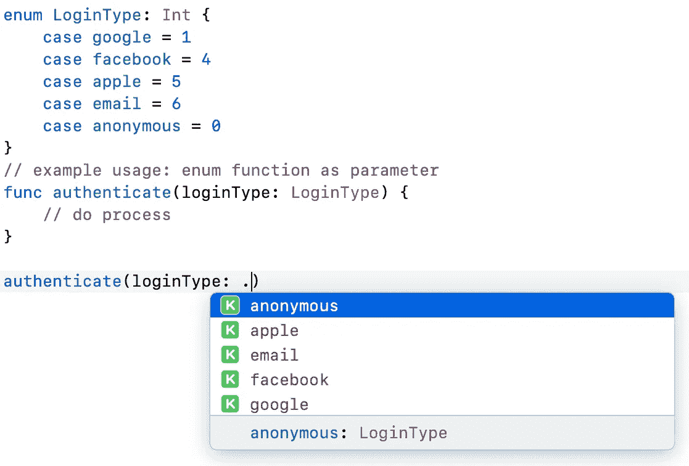

# 每个初学者都必须知道的 5 个 Swift 特性

> 原文：<https://medium.com/codex/5-swift-features-every-beginner-must-know-9bb101d051b8?source=collection_archive---------9----------------------->

## 了解 Swift extension、enum、map 等

作为初级开发人员工作并不意味着我们只是继续用我们所拥有的基础知识工作，并等待前辈的帮助。总是有提升我们技能的空间。

学习，学习，学习。

Swift 是一种强大的语言，提供了许多有用的特性。在本文中，我们将讨论 5 个有用的 Swift 功能，希望能提升我们在 iOS 开发方面的技能。

# **1。扩展**

Swift 允许我们通过扩展在现有类中添加更多功能，如`UIViewController, UIView, String, Date, Int`等。这也是非常有用的，尤其是当我们想要访问该类的另一个属性时。

在这个例子中，我们将为`Date`类添加新的函数，称为`isToday()`和`isYesterday()`

现在，我们将为`UIViewController`添加新的函数，一个简单的函数来弹出*uiviewcontroller*😅。

它可以广泛用于每个 UIViewController 类。是不是很牛逼？

# **2。枚举**

它不仅仅是普通的枚举。在 Swift 中，Enum 可以有一个已定义的类型，如 *Int、String、Double* 等。例如，如果我们的后端 API 需要 integer 来表示一个值，我们可以使用带有 Int 类型的 enum 来获得更易于自我解释的代码(这看起来太酷了)。

在 Xcode 中，当我们输入开始键入带有点(.)—见下面截图。

Enum 中另一个有用的特性是*关联值*。这里很好解释[。它是带有参数的枚举。真的吗？是的，我们可以定义要传递给所选选项的变量。](https://docs.swift.org/swift-book/LanguageGuide/Enumerations.html)

# **3。地图**

Map 是所有语言中都使用的一个通用函数，用于将数组(或任何集合类型)转换为另一个元素。下面是一些例子。

## **例 1**

用“二乘”将 Int 的数组转化为新数组。

通常我们做的是(老方法)，做一个数组循环，做乘法，然后加入新的数组。看看这两种方法的不同之处(试着粘贴到操场上，看看达到了同样的效果)。

哇，只用一行代码它就能做同样的事情！

解释:

所以我们所做的是`map()`函数将把数组中的所有元素转换成闭包`{ … }`中指定的预期结果，并将结果返回给`newArray2`。请注意，`$0`是数组中将要变换的当前对象。它可以是第一个论点。有关详细讨论，您可以参考此处的。

这是带闭包的 swift 函数的常见语法。

> `variable.functionName { // conditions or intended operation }`

## **例 2**

将一个对象数组转换成另一个元素。例如，我们有一组目标学生，我们只需要得到他们的分数。

很好，我们现在知道`map()`是如何工作的了。让我们转到下一个类似的功能。

# **4。过滤器**

如果你已经理解了`map()`，这对你来说可能很容易。它与`map()`非常相似，除了`filter()`用于根据闭包内的给定条件查找或返回匹配元素。

例如，我们试图过滤所有得分超过 50 的学生。

# **5。计算属性(只读)**

关于什么时候使用计算属性和函数有很多讨论。我们需要知道的是，当我们进行简单的运算或计算时，会用到 computed 属性。就是这样。在这篇文章中，我们将关注如何使用作为“获取”值(只读)和它不能被设置。所以这个值基本上取决于其他属性。

请参见下面的示例。具有宽度和高度的矩形结构。然后，我们将添加更多的计算属性。我们开始吧！

太好了，现在我们已经涵盖了我们将在 iOS 项目中经常使用的 Swift 的所有 5 个出色功能。尝试实现并改进您的代码。

# 下一步是什么？

尝试探索 Swift 提供的更多功能，如`flatMap()`、`compactMap()`、`count(where:)`等。

感谢您的阅读，不要忘记与您的朋友分享。非常欢迎反馈。

“学习，这是我们增长技能的方式”

# 参考

[https://docs . swift . org/swift-book/language guide/collection types . html](https://docs.swift.org/swift-book/LanguageGuide/CollectionTypes.html)

[https://docs . swift . org/swift-book/language guide/enumerations . html](https://docs.swift.org/swift-book/LanguageGuide/Enumerations.html)