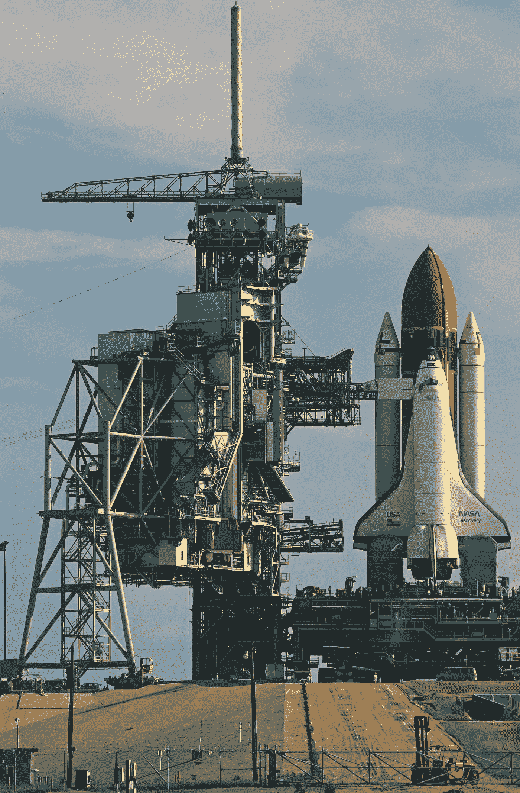

# 5 个发人深省的数据科学教训，来自美国国家航空航天局挑战者号坠毁事故，7 名宇航员在 73 秒内遇难

> 原文：<https://medium.com/codex/5-thought-provoking-data-science-lessons-from-the-tragic-nasa-challenger-crash-that-killed-7-8a17043dc43b?source=collection_archive---------8----------------------->

## 教育

## 第二课:正确是不够的，你必须令人信服

特伦斯·伯克在 [Unsplash](https://unsplash.com?utm_source=medium&utm_medium=referral) 上的照片

*如果构建了正确的散点图或数据表，没有人敢在如此寒冷的天气里让挑战者号冒险*