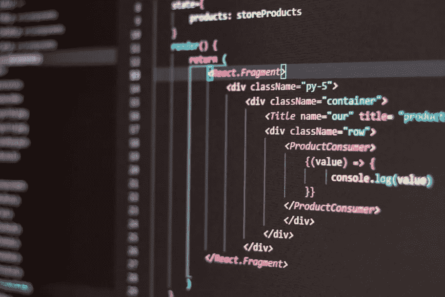

# 掌握 JavaScript 语法的 5 个技巧

> 原文：<https://medium.com/codex/5-tips-for-mastering-javascript-syntax-f9a239f14d2b?source=collection_archive---------19----------------------->

总之，如果你想从事 web 开发，学习 JavaScript 是一个很好的起点。它是一种简单易学的语言，而且用途广泛。你还在等什么？今天就开始学习吧！

**1。评论的好处**

学习编程语言时，使用注释是必不可少的。评论有助于使您的…