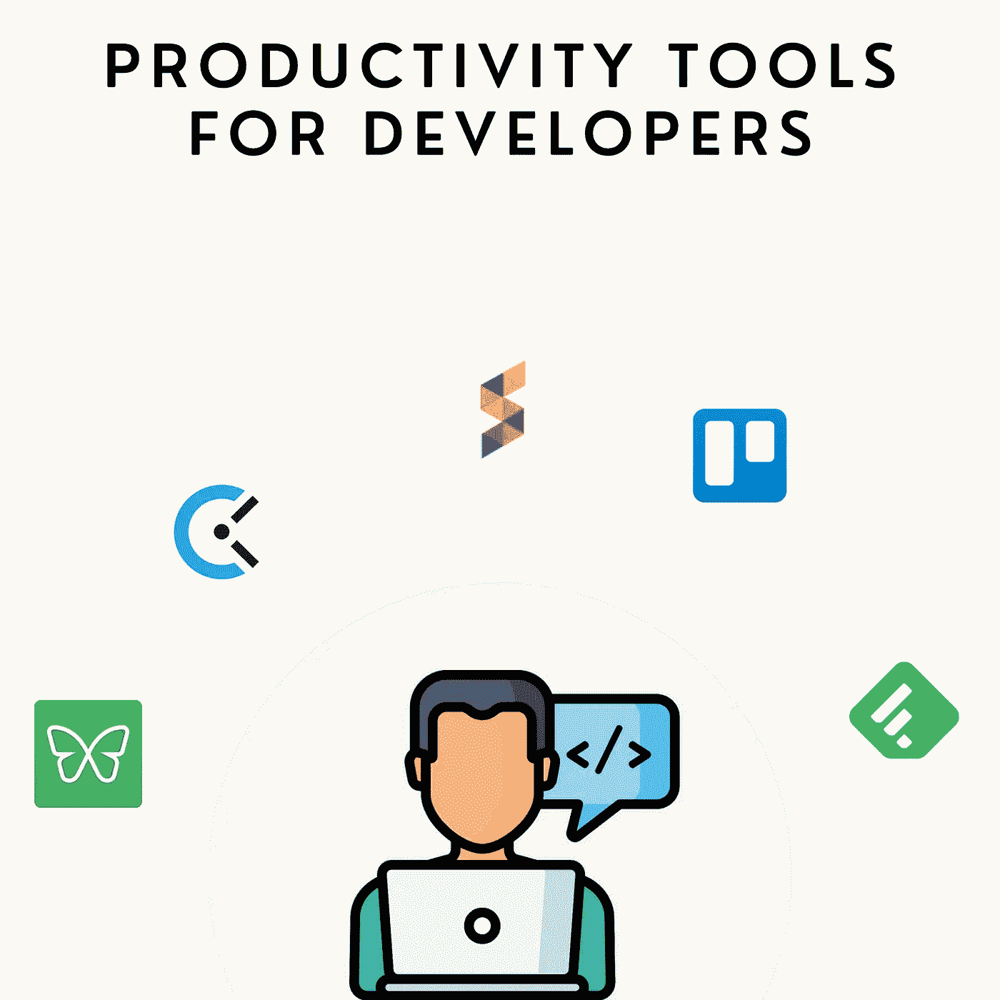

# 提高开发人员生产力的 5 个工具

> 原文：<https://medium.com/codex/5-tools-to-improve-productivity-as-a-developer-1716b666d99b?source=collection_archive---------1----------------------->

## 我每天都用它们

> “另一篇关于开发人员生产力工具的文章？多么有创意……”

是的，媒体上已经有很多关于这个话题的好文章了。但是请容忍我一分钟。

大多数文章都提供了编码工具。我同意，如果你是一名开发人员，这是你应该…