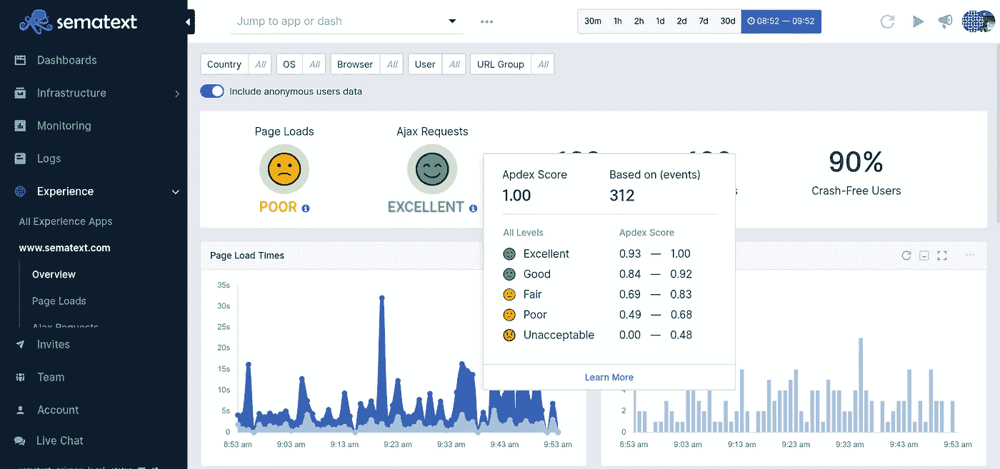
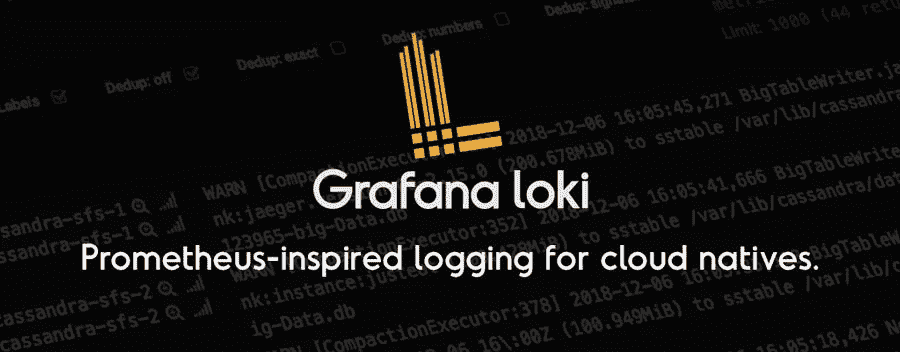
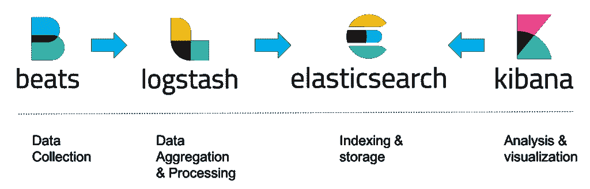

# 顶级 Kubernetes 日志监控工具

> 原文：<https://medium.com/codex/5-top-kubernetes-log-monitoring-tools-d8c0494deb30?source=collection_archive---------0----------------------->

来源:[开发到](https://dev.to/devdy/connect-with-your-kubernetes-cluster-manually-43jo)

Kubernetes 主导着容器编排市场，推动着企业向微服务的演进。微服务的每个实例都会生成大量日志事件，这些事件很快变得难以管理。但是更复杂的是，当问题发生时，服务和故障模式之间的复杂交互使得很难找到根本原因。潜在的问题使得 Kubernetes 日志管理工具变得非常重要。

企业总是试图找到合适的工具来满足他们的需求，并使监控、日志记录和故障分析高效而快速。

## 斑马馆

你可以优先考虑普罗米修斯或者麋鹿，但是斑马也可以优先考虑。

这家新的创业公司被列入 Gartner 的“2020 年值得关注的 25 家企业软件创业公司”。

说到最佳实践，Zebrium 最近还帮助 Sweetwater 将事件跟踪时间从 3 小时缩短到了几分钟。Zebrium 甚至可以发现以前未被发现的隐藏问题。这是一个出色的功能，因为它可以帮助在问题影响客户之前发现问题。

那么是什么让 Zebrium 在竞争中脱颖而出呢？Zebrium 使用人工智能来发现问题，并自动发现根本原因，而所有其他工具都依赖于用户手动添加规则。Zebrium 还可以用作独立的日志管理平台，或者与 ELK Stack 或其他日志管理器集成。

来源:[动物园](https://www.zebrium.com/)

**优点:**容易上手；只需复制/粘贴自定义 HELM 或 kubectl 命令；自动检测问题和根本原因，无需手动规则；可以用作独立的日志管理工具，也可以作为现有日志管理工具(如 ELK Stack)的机器学习附件。

**缺点:**免费计划限制为每天 500 MB，保留 3 天；支持 Kubernetes、Docker 和大多数常见平台，但不支持 Windows。

## 语义文本

日志管理和应用程序性能监控解决方案。Sematex 提供系统状态的全栈可见性。

Sematext 并不局限于 Kubernetes 日志，还可以监控和 Kubernetes(基于度量和日志)。收集的日志会根据几种已知的日志格式自动解析/结构化，用户还可以提供自定义的日志模式。它还公开了 Elasticsearch API，因此任何与 Elasticsearch 一起使用的工具，如 Filebeat 和带有 Sematex 的 Logstash，都可以用作 ELK 的变体或与原生 Sematext 生态系统一起使用。该工具有助于创建特定的规则来监控特定的情况并捕捉异常。借助 Sematex 全面的实时仪表板，客户可以控制和监控所有服务。

来源:[语义](https://sematext.com/)

**优点:**与其他 Sematext 云工具集成；可配置的覆盖，以防止日志被接受，从而控制成本；麋鹿的灵活性。

**缺点:** Sematext 小部件和 Kibana 不能在一个仪表板上混合使用；自定义解析需要在日志传送带上完成，Sematext 只在服务器端解析 Syslog 和 JSON 跟踪能力较弱，但计划进行改进。

## 洛基

Loki 是一个多租户、高可用的日志聚合工具，灵感来自 Prometheus。这个工具有助于收集日志，但是用户需要为它创建手动规则。洛基与格拉法纳、普罗米修斯和库伯内特一起工作。Loki 可以让内部流程更加高效。例如，它为 Paytm Insider 节省了 75%的日志和监控成本。Loki 不索引你的日志内容，只是为每个事件流索引一组标签，所以它非常高效。

**优点:**大生态系统；丰富的可视化；由于未编制索引的日志内容，提高了效率。

**缺点:**没有针对 Kubernetes 日志管理进行优化；许多关于架构规则的手工工作；缺少内容索引可能会限制搜索性能。

## 麋鹿栈

ELK 是最著名的日志管理开源工具，是 Elasticsearch、Logstash 和 Kibana 的缩写。每个组件处理日志记录过程的一个独特部分；Elasticsearch 是一个强大且可扩展的搜索系统，Logstash 聚合并处理日志，Kibana 提供了一个分析和可视化界面，帮助用户理解数据。它们共同为 Kubernetes 提供了一个全面的日志解决方案。然而，ELK 堆栈还有许多其他变体，例如 EFK 堆栈，它由 Elasticsearch、Fluentd 和 Kibana 组成。

许多大公司都使用 ELK，如 Adobe、T-Mobile 和 Walmart，因此可以证明其可生产性。因此，ELK 是一个可靠且经过验证的工具。但他带来了工作所需的复杂性和大量资源。

**优点:**麋鹿知名度高，社区大；非常广泛的平台支持；Kibana 中丰富的分析和可视化功能；需要对日志和手动定义的警报规则进行复杂的分析。

**缺点:**难以维持规模；需要大量的调优，尤其是对于大型环境；大量的资源需求；有些功能需要付费许可。

## 流体 d

Fluentd 是一个跨平台的开源数据收集器，它提供了一个统一的日志记录层，但它不是一个独立的日志管理器。作为一个相当受欢迎的工具，它拥有超过 5000 个客户，如 Atlassian、微软和亚马逊。看到这些大客户证明了它的可靠性和性能。此外，Fluentd 创建了一个统一的日志记录层，可以帮助更有效地使用数据，并在软件中快速迭代数据。它可以帮助你每秒处理 120，000 条记录。

**优点:**大型社区和插件生态系统；统一测井层；成熟的可靠性和性能。不到 10 分钟就能安装完毕。

**缺点:**难以配置；对转换数据的支持有限；不是完整的日志记录解决方案。

## 结论

您可能会问为什么 Prometheus 没有包括在列表中，因为本文主要关注日志监控工具，而 Prometheus 处理指标不支持日志记录。

所以，如果你不擅长手动搜索日志，或者不愿意建立和管理警报规则，可以尝试使用 Zebrium，它是基于机器学习算法的。这可能会节省大量时间，并摆脱创建大量规则的繁琐任务。

如果您正在寻找更主流的东西，并且知道要创建哪些规则，请尝试使用 Loki 或 Sematext，它们是高效工具的完美选择。

或者，如果您希望在公共云中使用日志监控，您可能希望使用您的云提供商提供的服务，如 AWS 的 CloudWatch，他们只在自己的云中为企业提供支持。

如果您的日志有多个或特定的来源，请尝试使用 Fluentd 及其统一日志记录层，但您仍然需要一个日志记录工具。