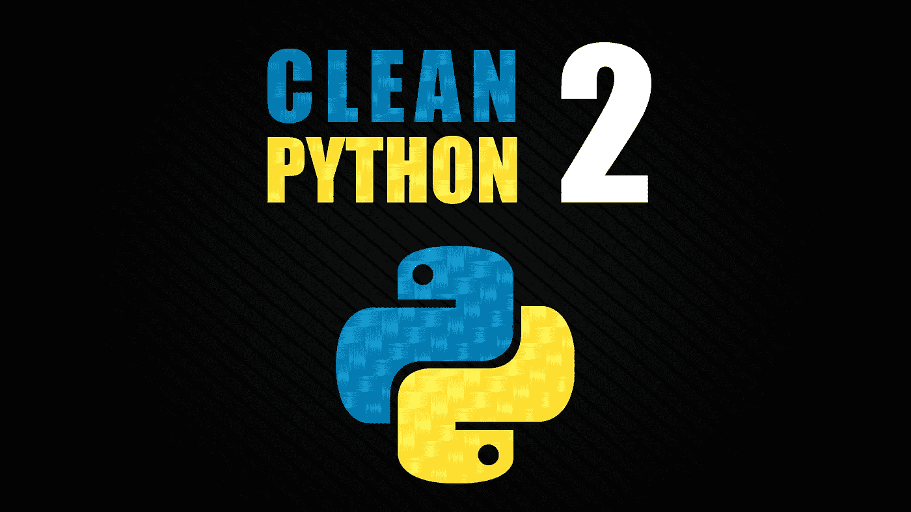

# 帮助你编写更简洁 Python 代码的 5 个技巧

> 原文：<https://medium.com/codex/5-tricks-that-will-help-you-write-cleaner-python-code-aec0b8f2a730?source=collection_archive---------4----------------------->

我们大多数开发人员关心我们写的东西和我们产生的代码，这最终意味着我们想要写干净的代码，我们感到自豪，并且在将来易于被其他人维护。虽然没有一种确定的方法来编写干净的代码，但是每个开发人员都应该遵循一些最佳实践，即使其他人并不总是遵循它们。在这篇文章中，我是…