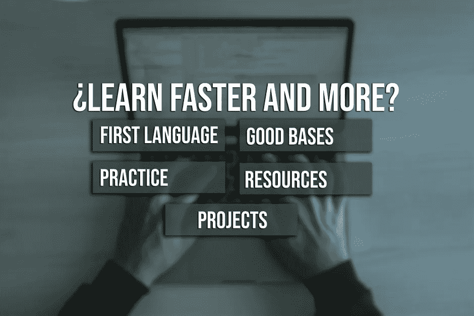

# 根据我自己的经验，学习更快编码的 5 个有用的技巧

> 原文：<https://medium.com/codex/5-useful-tips-to-learn-to-code-faster-based-on-my-own-experience-9208c8ff3898?source=collection_archive---------2----------------------->

## 如果你正在学习一门新的编程语言，你可以用这 5 个学习编码的小技巧来改进你的学习过程🚀💻。

最近，我找到了一份后端开发人员的工作。出于这个原因，我花了很多时间学习 JavaScript 和编码。在…期间