# 2021 年开发人员需要的 5 个 Visual Studio 代码扩展

> 原文：<https://medium.com/codex/5-visual-studio-code-extensions-developers-need-in-2021-6384102c6735?source=collection_archive---------18----------------------->

Visual Studio 代码是一个流行的 IDE，它使任何类型的开发人员后端或前端的工作变得更加容易。它是由微软开发的，可以在 **Windows** 、 **Mac** 和 **Linux** 上使用。为了使用 VS 代码最大化您的生产力，您需要下载这 5 个扩展。下载这 5 个扩展不仅会让你觉得自己是一个 **10x 开发者**，而且你会**成为**之一。我们开始吧！

# **如何加载 VS 代码中的扩展:**

打开 VS 代码编辑器后，你应该会在窗口左侧看到这个面板，然后点击彩色图标(扩展市场),如图所示。要在 VS 代码中安装任何扩展，只需要按下 install 按钮就可以使用当前的扩展。简单的

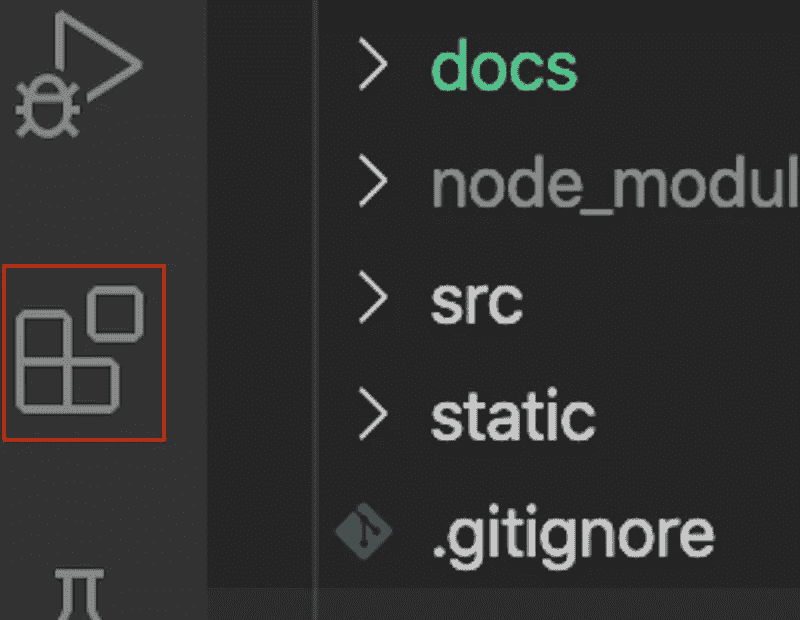

扩展标签

点击它之后，你可能会得到一个扩展列表，我们需要从中选择前五个可以提高你的开发效率的扩展。

# 1.ES7 React/Redux/graph QL/React-原生代码片段:

搜索“ES7 React/Redux/graph QL/React-Native Snippets”

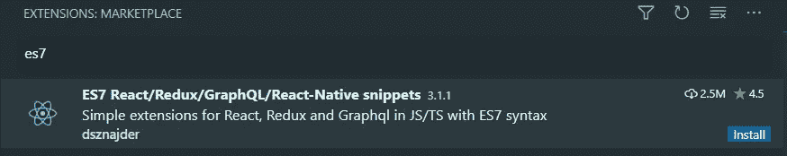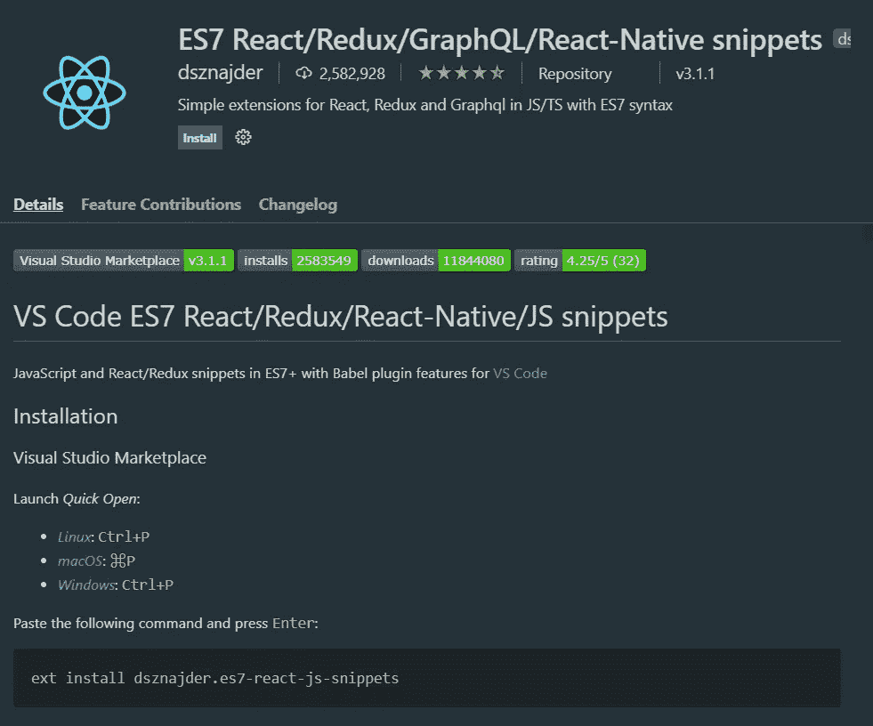

为了在 React 中创建一个功能组件，您只需键入 *rfce* ，它就会为您创建样板代码，甚至命名函数。但是，通过下载这个扩展，您可以使用其他一些代码片段。要查看它们，向下滚动，您可以看到这个扩展的其他片段。

# 2.实时分享:

Live share 是另一个可以安装在 VS 代码中的便利的扩展。这个扩展使用户能够在另一个人的计算机上编辑代码和运行命令。这也有助于疫情期间的结对编程。

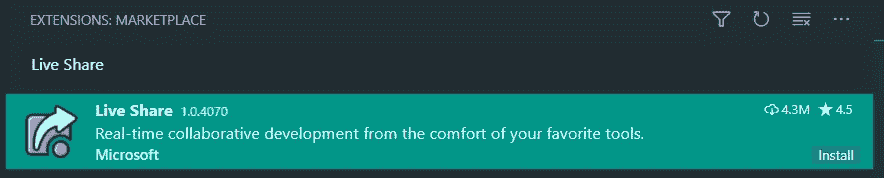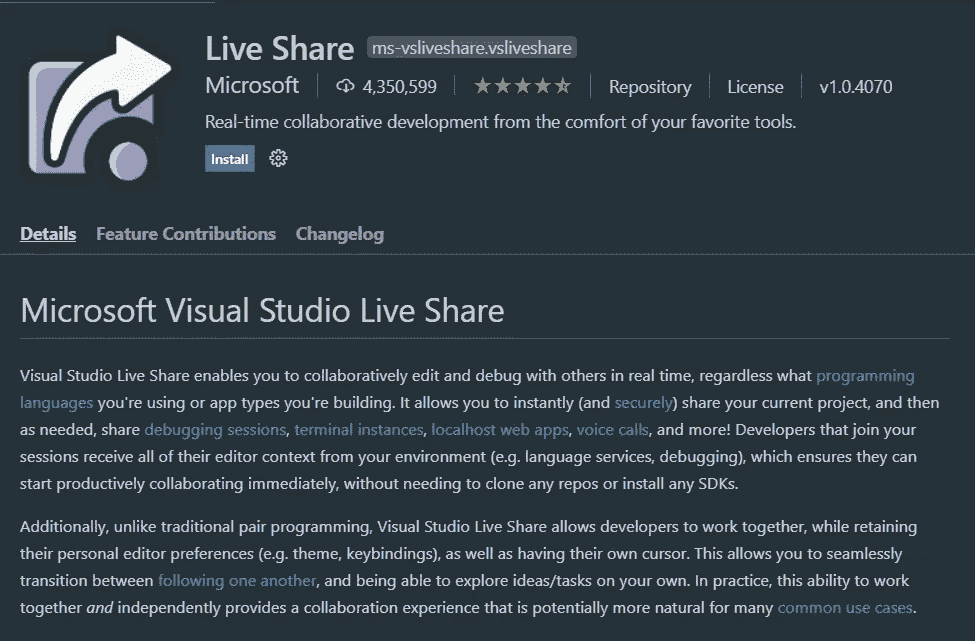

# 3.括号对着色程序:

括号对着色是用来帮助你调试你的代码。如果你在做一个大项目，这会给你很大帮助。相信我。你可以以后感谢我为你节省了这么多时间。它用某种颜色给括号对着色，如果相同类型的括号重复，它就是不同的颜色。查看下面的代码，看看它是如何工作的。

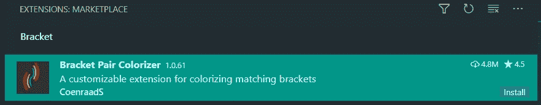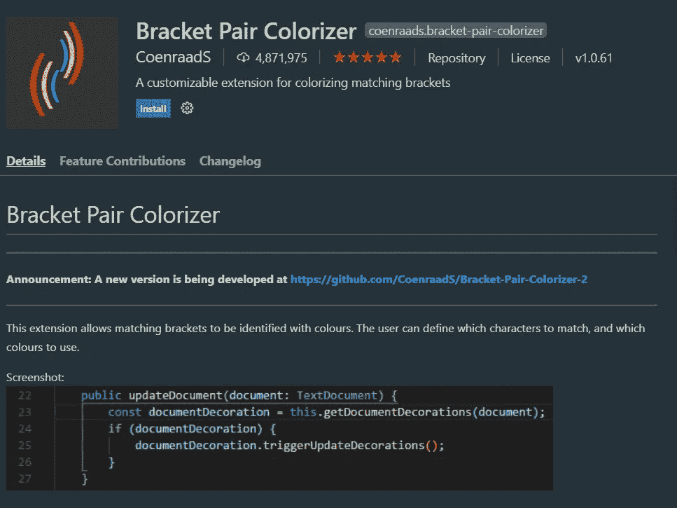

# 4.实时服务器:

当你用普通的 HTML 文件开发时，Live Server 允许你热重装。通常，当使用 HTML、CSS 和 JavaScript 时，你没有 ReactJS 所具有的热重载特性。虽然您可以很容易地手工编写这个特性，但是在您的静态项目中使用这个扩展要容易得多。它启动一个本地开发服务器，为静态和动态页面提供实时重新加载功能。

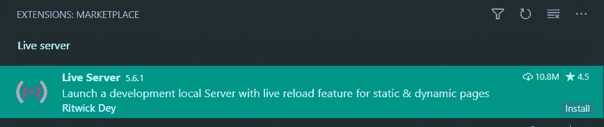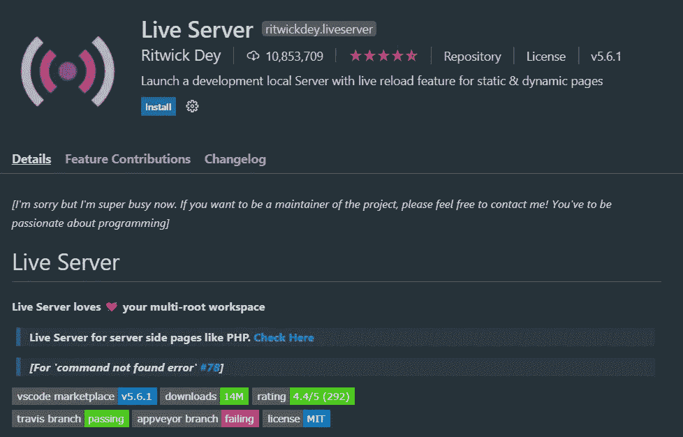

要安装它，输入“现场服务器”，它应该是由 Ritwick 戴伊。安装完成后，下面会有一个“上线”按钮。当你点击它，扩展将自动打开一个新的标签与网站在一个活的服务器上。注意，默认情况下，这将只显示静态页面。

# 5.更漂亮—代码格式化程序:

[更漂亮](https://prettier.io/)是一个固执己见的代码格式化程序。它通过解析您的代码并根据自己的规则(考虑到最大行长度，必要时换行)重新打印代码来强制执行一致的风格。

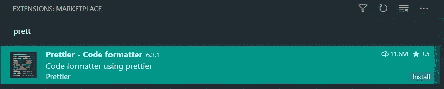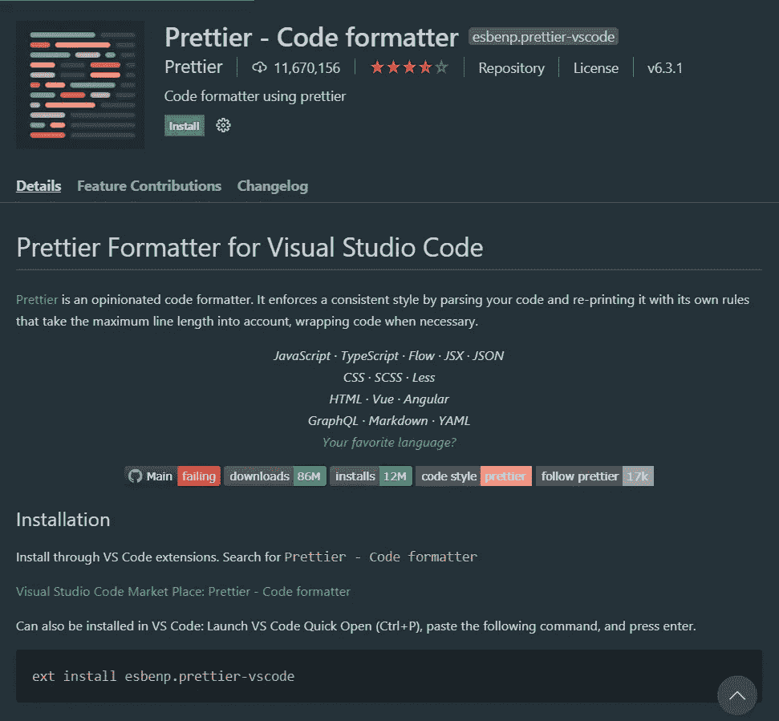

有更多的扩展可以帮助你开发代码，比如 Auto Close Tag、GitLens 等等。因此，如果你发现任何其他的扩展是超级有效的，对开发者有帮助的，不要忘记在评论中提到它！！！

# **谢谢你！！**

# 如果你觉得这篇文章很有用，那么就把它分享给你的编程社区，互相帮助！！