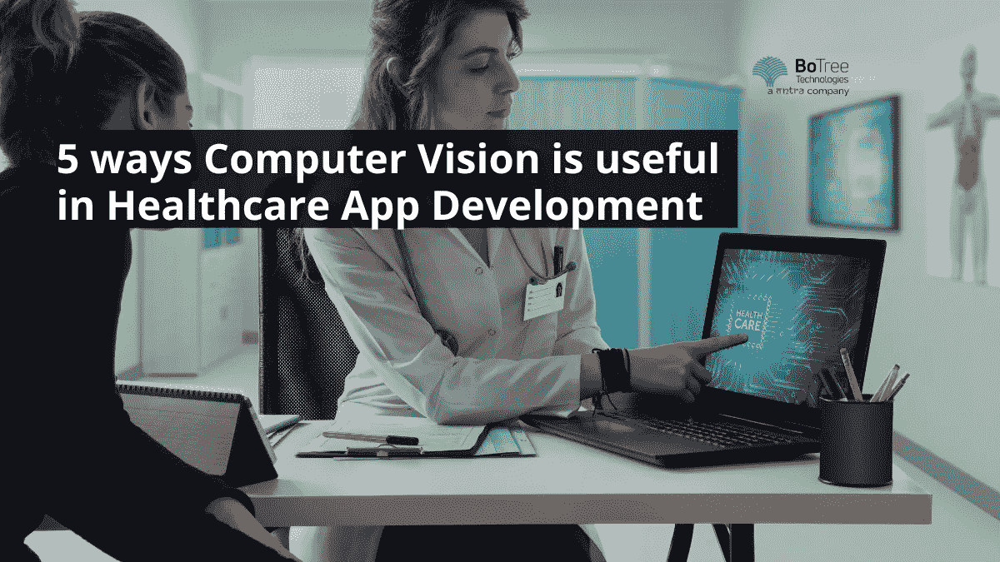
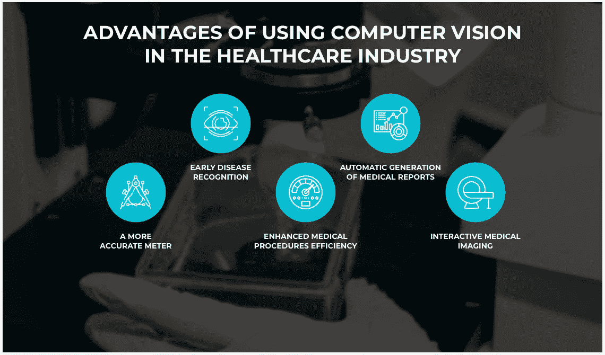

# 计算机视觉在医疗保健应用开发中的 5 种用途

> 原文：<https://medium.com/codex/5-ways-computer-vision-is-useful-in-healthcare-app-development-c9a1e071478f?source=collection_archive---------23----------------------->

[113.2 亿美元是 2021 年全球计算机视觉行业的市场规模](https://www.grandviewresearch.com/industry-analysis/computer-vision-market)。预计 2021 年至 2028 年 CAGR 为 7.3%。计算机视觉在[医疗保健应用开发解决方案](https://www.botreetechnologies.com/blog/how-healthtech-helps-to-build-cutting-edge-solutions-for-patients/)中具有惊人的优势，使其成为模式识别、诊断、成像等领域的主要技术。

[医疗保健](https://www.botreetechnologies.com/blog/how-code-signing-secures-the-entire-healthcare-ecosystem/)的计算机视觉市场预计将以 47.2%的 CAGR 增长，到 2023 年将达到 14.6 亿美元。它已经帮助医生更好地诊断病人，比以前更快地发现疾病，并在疾病早期提供治疗。

但是到底什么是计算机视觉呢？让我们来找出答案。

# 什么是计算机视觉？

计算机视觉是深度学习技术的一种形式，它利用算法来模仿人类视觉。然而，它比人类的视觉要快得多，也准确得多。通过常规训练，算法扫描图像并找到模式。他们对相似的对象进行分类、聚类、归类和整理，以理解模式。

今天，计算机视觉在模式识别方面的准确率接近 99%。这在医疗保健中非常有用。虽然医疗保健应用程序开发服务激增，但他们需要能够改善患者疗效的先进技术。

对医学模式和图像的分析有助于医生早期识别疾病。现在，计算机视觉和深度学习相结合，可以对患者的身体疾病进行深入分析。

(来源:[维尔马特](https://vilmate.com/blog/computer-vision-in-healthcare-applications/))

计算机视觉的最大优势之一是它可以识别可能在以后的生活中出现的疾病迹象。[医疗保健 web 应用开发](https://www.botreetechnologies.com/blog/python-in-healthcare-application/)始终采用计算机视觉来扫描人的生命体征，并在正确的时间找到正确的治疗方法。

> ***阅读更多:*** [***十大最流行的医疗保健应用实例***](https://www.botreetechnologies.com/blog/most-popular-healthcare-applications-examples/)

现在让我们看看计算机视觉如何在医疗保健中帮助医生和临床医生。

# 计算机视觉改变医疗保健的 5 大方式

计算机视觉处理大量的数据。医疗保健应用和解决方案收集足够的数据，以便计算机视觉可以做出准确的报告。从诊断癌症到识别遗传性疾病，它改变了疾病的成像和识别。

以下是计算机视觉在医疗保健中发挥作用的 5 种方式:

1.  **更好的图像分析:**

*   在疾病诊断方面，医学成像至关重要。然而，医生每天都要检查数百张图像。这变得令人厌倦和困扰。
*   计算机视觉，以及其他[移动健康应用开发解决方案](https://www.botreetechnologies.com/blog/programming-languages-used-for-medical-app-development/)，提供了更好的图像分析。它可以识别医生可能忽略的模式和细节。这项技术已经有了很大的改进，它可以从图像中识别几乎 99%的问题。
*   计算机视觉加快了分析图像的过程。在此期间，医生可以专注于为患者寻找最佳治疗方案。该技术分析图像并捕捉可能暗示即将到来的疾病的细节。

**2。准确的失血量测定:**

*   分娩死亡的最常见原因之一是产后出血。通过查看手术海绵和抽吸罐的图像，基于人工智能的计算机视觉可以检测到这个过程中的失血量。
*   [奥兰多健康温妮帕尔默妇婴医院](https://codete.com/blog/computer-vision-healthcare)利用这样的技术来识别分娩时的失血量。在计算机视觉实施之前，很难估计母亲到底失了多少血。
*   随着医院开始使用计算机视觉，它表明医生倾向于高估分娩过程中的失血量。现在，对他们来说，评估变得更容易，也更准确，从而以更好的方式对待女性。

**3。尽量减少误报:**

*   如今，专业医疗保健应用程序开发的重点是提供准确的医疗保健诊断。然而，误报比人们想象的更普遍。这导致昂贵的程序和治疗，往往导致人们把他们的预算漏洞。
*   一家集成计算机视觉的[医疗应用开发](https://www.botreetechnologies.com/blog/how-mhealth-apps-are-revolutionizing-healthcare/)公司创造了一些功能，以最大限度地减少误报。计算机视觉的内在品质是精确度高。因此，医生对一个人进行准确的诊断，并确定他们是否患有特定的疾病。
*   另一方面，也最大限度地减少了漏报。医生可能会错过医学成像过程中的一些细节。计算机视觉会检查最细微的细节，并识别诊断的每一个方面。

**4。心脏病诊断:**

*   在全球范围内，心脏病是人类死亡的主要原因之一。很多时候，它们没有被及时发现，或者医生没有做出治疗决定所需的信息。
*   计算机视觉有助于自动化心脏病理学，并提供血管成像。它检测心脏中的异常，并提供正在发生的情况的报告。该技术还可以可视化系统中的动脉和血流。
*   医生经常需要了解心脏核磁共振成像中的变量，计算机视觉可以在这方面提供帮助。它还提供了电子分割，为可能困扰患者的心脏病提供了更好的视图。

**5。癌症检测:**

*   最后，计算机视觉在医疗保健领域最重要、最广为人知的应用之一是癌症检测。今天，深度学习和计算机视觉在诊断癌症方面已经达到了医生级别的准确性。
*   任何构建深度学习解决方案的[软件开发公司](https://www.botreetechnologies.com/)都知道它在癌症检测中的重要性。例如，皮肤癌可能无法与其他皮肤病区分开来。然而，有了足够的数据和图像，计算机视觉可以在早期识别健康组织和癌变组织。
*   从肺癌到血癌，计算机视觉在检测这种致命疾病方面已经显示出巨大的成果。它可以从不健康的细胞中识别健康的细胞，并准备一份报告，并将癌症检测中人为错误的可能性降至最低。

> ***阅读更多:***[***2022 年十大移动医疗 App 发展趋势***](https://www.botreetechnologies.com/blog/top-mobile-healthcare-app-development-trends/)

# 结论

虽然图像和模式识别是计算机视觉的两个最优秀的用例，但它远不止于此。随着技术的进步，患者监护、远程健康监护、医疗培训以及更多此类用例也在不断发展。今天，世界各地的医生使用计算机视觉快速诊断患者，并在过程的早期制定治疗计划，从而带来更好的医疗保健结果和更高的拯救生命率。

无论你是在寻找一家[企业软件开发公司](https://www.botreetechnologies.com/software-development-company)还是最好的医疗保健应用开发公司，BoTree Technologies 都是。我们是利用计算机视觉、深度学习、NLP 和人工智能创建医疗保健解决方案的专家，以确保患者和医生获得最佳的医疗保健结果。

**您的免费咨询正在等待！** [**今天联系我们**](https://www.botreetechnologies.com/contact) **。**

*原载于 2022 年 7 月 19 日 https://www.botreetechnologies.com***。**