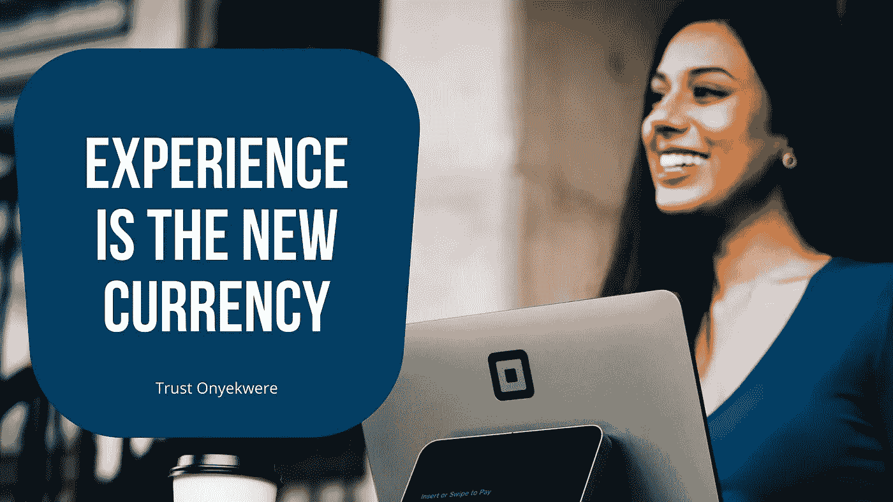
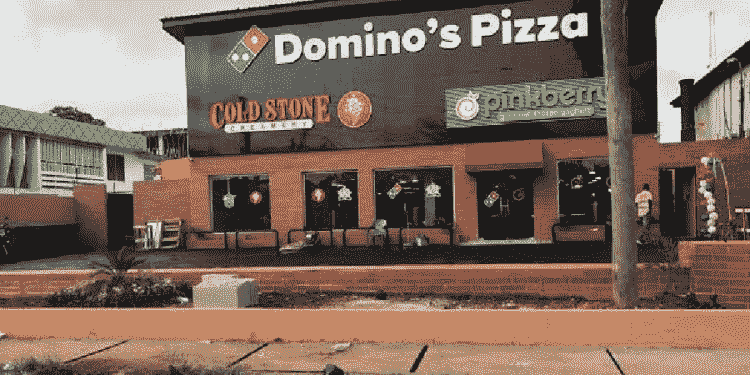
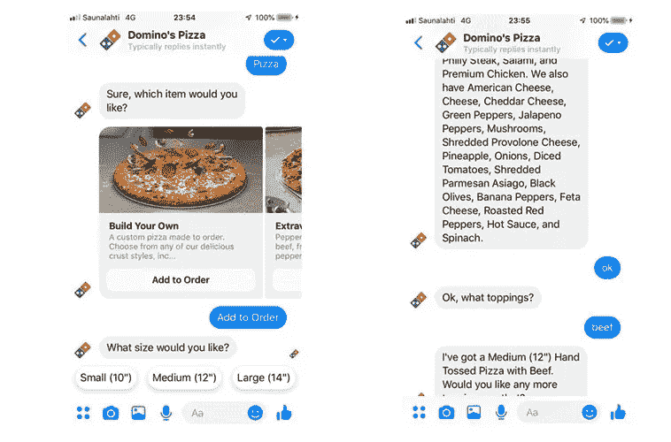
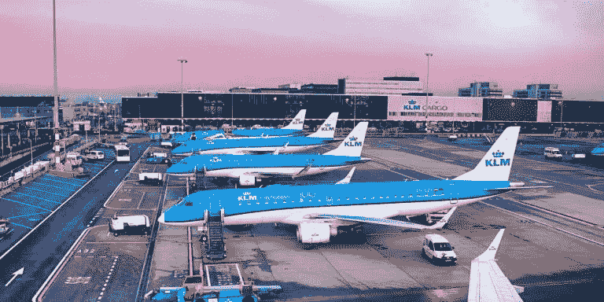

# 数字经济中掌握用户体验的 5 种方法(UX)

> 原文：<https://medium.com/codex/5-ways-to-master-user-experience-in-the-digital-economy-bd53e6b8265?source=collection_archive---------12----------------------->

每个现代企业都想脱颖而出，超越竞争对手。如果你是企业主、首席技术官或技术顾问，这篇文章将非常有助于推动你的公司在数字经济中取得成功。

在数字经济中，使您的产品和服务与众不同的第一个也是最有效的方法是提供更好的客户体验，彩虹的尽头有一桶金。

电视广告刚出来的时候，商家花了很多钱，很多人喜欢。然而，当数字广告出现时，许多电视广告被放弃了。

你知道 2017 年全球数字广告支出首次超过电视广告支出吗？你知道美国的在线销售额在 2017 年首次超过 4500 亿美元吗？这表明现代消费者要求更高，更有可能因为糟糕的客户服务而更换品牌。

这就是为什么大多数企业在做出产品或服务决策时会优先考虑他们的客户。

如何才能掌握用户体验？记住这些教训:

## 消除用户体验中的所有摩擦痕迹。

在当今的数字时代，无摩擦的体验至关重要。众所周知，今天的消费者拥有多种设备，注意力有限，并期待即时满足。如果你的体验繁琐且不直观，你将很难留住客户。

客户通常希望完成他们需要的工作，然后继续前进。如果你的产品让他们很难做到这一点，他们比以往有更多的选择。我们将讨论的许多关键课程都旨在减少用户体验中的摩擦。

## 去你的顾客在的地方，不要让他们来找你。

让我举一个多米诺比萨的例子，这家有 57 年历史的公司通过数字渠道提供卓越的客户服务，正在转型为数字领导者。

由阿马卡·奥比欧吉于[奈拉美西斯](https://nairametrics.com/2019/06/16/dominos-pizza-opens-its-100th-outlet-in-nigeria/)

过去一年，60%的销售额来自数字订购渠道。这种扩张是由一家名为 Dominos AnyWare 的公司开发的平台推动的。该平台使该公司能够快速将其服务与 Facebook Messenger、Google Home、Twitter、Apple Watch、Ford Sync 等流行平台相集成。

图片来源:【Kevit.com 

多米诺骨牌可以更好地锁定客户，通过让他们在自己喜欢的平台上与公司互动来吸引他们的注意力。该公司现在通过数字渠道创造了超过 10 亿美元的收入。

另一个例子是荷兰皇家航空公司。荷航认为，将客户吸引到他们的平台，如他们的网站和应用程序，将变得越来越困难和昂贵。

图片来源:[航空公司-非洲](https://airspace-africa.com/2021/12/02/klm-issues-apology-to-passengers-from-south-africa-after-schiphol-chaos/)

他们没有增加营销支出，而是采取了在客户已经使用的平台上提供功能的策略，如 Facebook Messenger、微信和 WhatsApp。乘客可以使用这些平台接收来自荷航的航班状态更新、预订确认、时间安排变更和登机牌。他们是首批这样做的人之一。

荷航正在扩大其数字化覆盖范围，并通过向受欢迎的外部平台提供关键信息，在客户需要的时间和地点提供信息，从而减少与客户的摩擦。

## 用人工智能提升用户体验

数据分析和机器学习，在最基本的情况下，可以实现更加个性化的体验。考虑一下 Slack workplace messenger 平台。客户有过多的选择，从微软到脸书的每个人都提供工作场所协作工具，更不用说电子邮件了。

Slack 使用机器学习来回答以下问题，以便使其产品更具吸引力:

人们如何与产品互动？他们花最多时间看哪些频道？他们通常首先回应谁？他们发布和阅读的主题是什么？他们忽视了什么？

Slack 已经开始关注它认为最重要的项目。随着时间的推移，Slack 打算发展成为其每个用户的成熟的数字参谋长。

## 考虑手头的任务，谨慎品牌脱媒。

在客户选择的平台上与他们见面的另一面是品牌混淆的挑战。考虑一下叫车服务，比如优步或 Lyft。

如今，使用这些服务最常见的方式是打开优步或 Lyft 应用程序，请求搭车。未来，Alexa 将负责指挥，例如“送我去机场”，然后与优步、Lyft 和其他各种交通方式进行沟通，以推荐或自动订购最佳选项。

在这种推荐经济中，曾经面向消费者的品牌可以转变为服务提供商，通过竞争或合作来最好地满足用户的需求和愿望。

## 创造不断改进的互联产品。

随着物联网的发展和日常产品的联网和连接，随着时间的推移，随着产品收集更多数据和升级，将有机会改进产品。也就是说，它们用得越多，它就变得越好。

以特斯拉为例。特斯拉汽车本质上是车轮上的计算机，该公司是第一个证明空中固件更新可行性的公司。特斯拉的自动驾驶安全功能随着汽车行驶里程的增加而提高。

通过遵循上面的每一个步骤，你将更好地满足和发展你的客户和用户群。