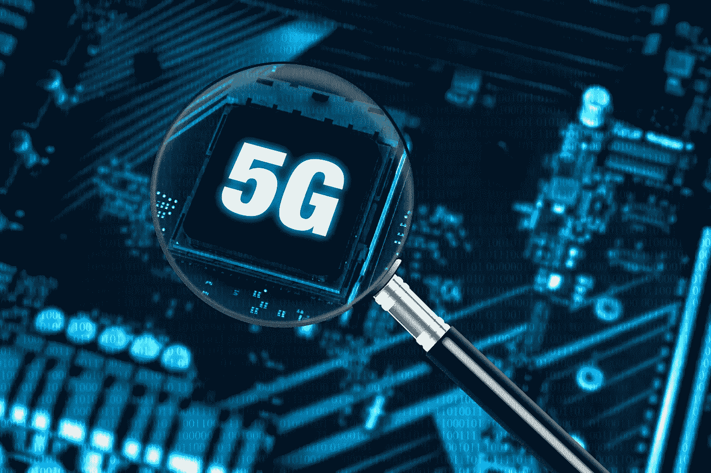

# 5G 正在让企业变得更加高效

> 原文：<https://medium.com/codex/5g-is-making-businesses-more-efficient-2d463f19efaa?source=collection_archive---------15----------------------->

## 企业的下一个前沿

5G 变革力量可以为企业提供增量利益和变革机遇。但是，在它能够完全带来好处之前，它需要其他工具性技术和关键组件。此外，5G 只有被支持其战略目标的生态系统包围，才能发挥其最大效益。以下是 5G 可以为企业带来的一些重要好处。—为整个组织创建无缝网络的能力。

# 5G 给企业带来的好处

技术一直是我们生活的重要组成部分。从我们 5 岁开始使用电脑到现在，技术一直在不断变化和发展。随之而来的是对更快、更有效的沟通和开展业务方式的需求日益增长。这就是 5G 的用武之地！5G 是一种新型无线技术，有望比 4G 更快、更高效。这对于依赖快速互联网连接来运营业务的企业来说，可能意味着重大的事情。许多公司已经投资 5G 网络，为未来做准备。

# 可靠性

毫无疑问，5G 技术比 4G 或 3G 提供了更一致的用户体验。这是因为 5G 使用更高的频率，提供更稳定的连接。此外，5G 设备使用更少的电力，延长电池寿命。最后，5G 天线更小、更高效，允许同时连接更多设备。此外，5G 网络可以在用户和数据中心之间保持更快的连接。这意味着可以更快、更高质量地检索数据。5G 比 4G 有更好的覆盖范围，非常适合在城市环境中使用。

# 连通性

5G 的连接性有望让企业和人们的生活更加美好。5G 提供了在低延迟和增加容量的情况下成功运营业务所需的速度和容量。高管们希望利用这种速度和力量的结合来创造效率和推动创新。它还可以增强购物体验，提高可靠性和安全性，并加快创新。企业和个人都已经在考虑利用 5G 的连接性。

最终，5G 将把连接扩展到更多的农村地区，包括城市和城镇。这将有助于企业保持联系，增加客户群。此外，5G 将允许公司跟踪疫情和追踪成分来源。餐馆也将受益于新技术，食物准备的速度和效率将会提高。最终，5G 将取代大型工厂的 Wi-Fi 和网络电缆。不难想象未来会给企业带来什么。

# 速度

5G 的速度是一项革命性的新技术，有望加速几乎每个行业的创新。它将为企业带来一个工业增长和生产力的新时代。从城市中心到农村农场，5G 将深刻影响从农业到采矿业的各个行业。它还将改善远程专家诊断和治疗患者的方式。但 5G 最重要的潜力在于它改变我们生活的潜力。

作为电缆和有线宽带的替代方案，5G 的速度非常适合企业以及团体、个人和小公司的远程设置。它将允许公司测试新的市场，并在他们的目标客户群附近设立具有成本效益的办公室。一些国家已经在测试和利用 5G 的优势。但在企业获得 5G 的好处之前，他们必须了解该技术如何帮助他们的运营。

5G 提供了比以前的移动网络技术高得多的带宽，允许更快的数据传输。5G 的速度将加速企业服务向云的转移，改善对关键通信需求的支持，并确保移动设备更加出色的可靠性。此外，5G 将通过减少从一个设备向另一个设备推送信息的时间来降低企业的运营风险。这对于需要远程操作的公司至关重要。

# 安全性

随着 5G 网络的采用增加，安全问题也将增加。与前几代无线网络不同，5G 是基于软件的，更容易受到利用和攻击。随着互联设备的激增，对更安全的硬件和软件系统的需求比以往任何时候都更加迫切。此外，5G 供应链有限，容易受到不安全组件和假冒组件的影响。正因为如此，一家没有准备好应对 5G 设备和软件安全挑战的公司可能无法识别和缓解网络流量中的异常情况。

最终，5G 技术的采用需要政府和行业之间的广泛合作来管理风险。政府、非政府组织和其他行业利益相关者必须与 5G 服务提供商密切合作，以了解和减轻网络风险。国家安全局必须确保实施风险缓解技术，以确保安全的环境。为了确保 5G 网络的安全性，企业应该考虑与精通网络安全的公司合作。

5G 可以让移动网络变得更加可及和高效。然后，随着员工更频繁地使用这些网络，企业可能会失去对流量和安全风险的了解。此外，物联网设备历来安全性较低。正因为如此，组织应该实施物联网安全解决方案来保护自己免受这些漏洞的影响。连接设备数量的增加也有可能增加攻击面。然而，5G 可以带来显著的安全改善。

尽管 5G 的安全优势非常显著，但这项新技术也存在许多相关风险。制造商应该在网络安全方面加大努力，因为这项技术的好坏取决于它最薄弱的环节。尽管如此，5G 技术可以通过让企业建立新的服务和进入新的商业模式，使企业更加安全和高效。例如，支持 5G 的物联网设备将增加其潜力，但也将增加破坏其网络的可能性。

# 物联网应用

如果你在做生意，你可能已经知道物联网应用有多重要。但是，您知道 5G 将改善您的企业网络吗？如果你这样做了，你将能够做更多的事情——从虚拟购物到生产过程。5G 还将提高您企业的灵活性和速度，使管理数据密集型应用程序和保持竞争力变得更加容易。

物联网应用需要不止一代网络来提供足够的覆盖。他们需要更复杂的通信硬件，并且无法充分利用 5G 网络的新功能。5G 是朝着更好的覆盖、更快的速度和更高的效率迈出的一大步。但是，如果你还没有准备好升级你的网络，仍然有时间受益于 5G。

> 在迁移到 5G 之前，请考虑以下事项:

虽然物联网应用需要数据速率和响应，但它们也需要控制和保护数据。5G 支持这些功能，因此这些应用可以对网络进行编程，以满足他们的需求。当你这样做的时候，你将有最好的机会防止问题的发生。企业将能够利用这一突破性技术来开发他们的物联网应用。因此，开始评估您的业务需求，并找出如何利用这项技术。

企业可以使用 5 G 增加的带宽，并降低其整体延迟。因此，5G 允许在短时间内传输更多数据，特别是视频等高需求有效载荷。在某些行业，近乎实时的反应可能事关生死，这就是 5G 对当今企业至关重要的原因。如果你想知道它如何帮助你的业务，请查看下面的文章，了解 5G 如何让你的业务更加高效和盈利！

# 费用

新的无线标准 5G 将为企业增加带宽和降低延迟。第一个商用 5G 网络预计将于明年初在美国广泛普及，该网络的成本，包括其设备和软件，将会很高。这项技术的价格将会以多种方式降低。5G 将通过更好的连接和自动化来提高生产率并降低企业成本。

5G 的第一个重大好处将是带宽和流媒体速度的提升。但是将其他仪器技术整合到网络中以获得最大利益也是必不可少的。最终，5G 只会在支持战略目标的生态系统环境中工作，而这个生态系统应该连接良好，并支持企业的战略目标。尽管成本高昂，但 5G 将惠及企业和中小企业。

虽然 5 G 的速度和安全优势非常显著，但还有许多其他优势。5G 服务可以让远程工作人员通过蜂窝连接访问高带宽资源。通过提供这些好处，5G 的成本可能没有一些企业想象的那么高。然而，考虑 5G 对企业的成本和收益仍然是必不可少的。重要的是要记住，5 G 的可扩展性和安全优势也是值得的。