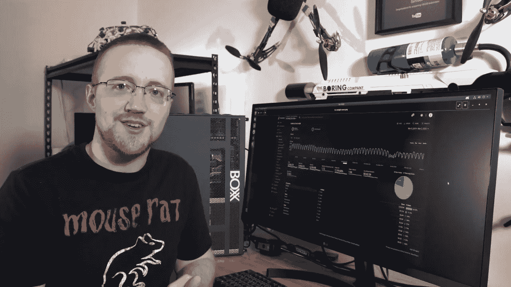
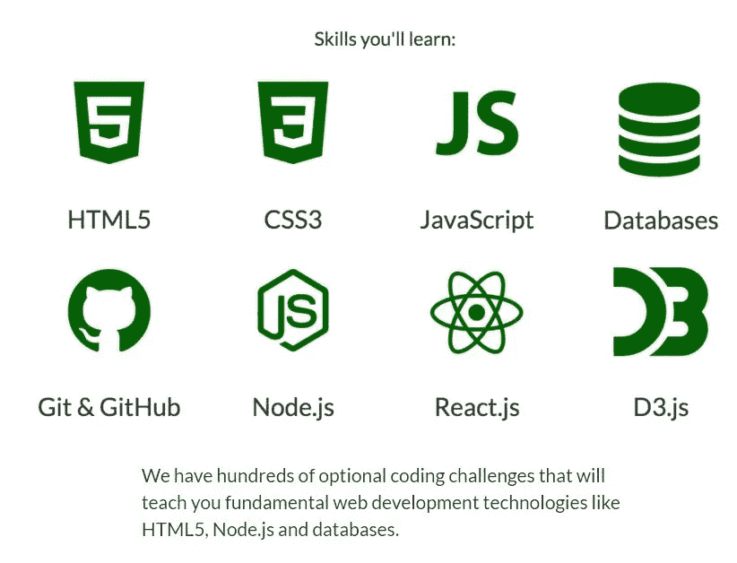

# 数据科学之旅的 6 个最佳 Youtube 频道！

> 原文：<https://medium.com/codex/6-best-youtube-channels-for-your-data-science-journey-6c02f13f8314?source=collection_archive---------7----------------------->

更新:最近开始[我的 Youtube 频道](https://www.youtube.com/channel/UCk6qeLJXdTAqOZuuYG0UfRA)，看一下[这里](https://www.youtube.com/channel/UCk6qeLJXdTAqOZuuYG0UfRA)！

照片由[克里斯蒂安·威迪格](https://unsplash.com/@christianw?utm_source=medium&utm_medium=referral)在 [Unsplash](https://unsplash.com?utm_source=medium&utm_medium=referral) 上拍摄

有一些特殊的渠道对我的数据科学发展有很大的帮助，我相信与你分享它们是很重要的。振作起来。

# [1。数据科学梦想工作](https://www.youtube.com/channel/UCr6_XCxMLXWGguWZi_93n7w)

**64k 用户**

数据科学梦寐以求的工作就是被雇佣。这个频道将教你所有必要的事情，你需要做，以获得聘用，并在你作为一名数据科学家的职业生涯中取得进展。尽管在过去的 9 个月里并不活跃，但还是有很多可以借鉴的经验，比如，如何像联邦调查局特工一样谈判你的薪水，直到面试成功。许多讲座都以白板会议的形式进行，非常容易理解。

# [2。send ex](https://www.youtube.com/user/sentdex)

**102 万用户**

Sentdex 在 Youtube 上拥有超过 100 万的订阅者，这是显而易见的。如果你需要一个关于 Python 和机器学习的教程，那么 Sentdex 很有可能就有。Sentdex 视频非常平易近人，他倾向于深入他的所有教程，而不会用许多不必要的术语迷惑你。

# [3。克里斯·纳伊克](https://www.youtube.com/user/krishnaik06/playlists)

**33.4 万用户**

他不仅涵盖了从云计算到 Python 操作指南，到生产机器学习，到数据结构和算法，以及对数据科学家有用的许多其他主题，他还每周至少发布 3 次视频！他的工作效率是惊人的，他付出的所有努力都值得表扬。

# [4。乔希·斯塔默](https://www.youtube.com/user/joshstarmer)

**45.1 万用户**

如果他的低俗歌曲没有得到你，那么这将是他的优质内容。当谈到发展我对任何机器学习算法的直觉时，乔希·斯塔默是最好的。他教授机器学习的方式非常有趣，这无疑有助于在你的脑海中描绘出一幅生动的图像。

# [5。科里·斯查费](https://www.youtube.com/user/schafer5)

**74 万用户**

Corey 经常为软件开发人员、程序员、工程师以及所有希望学习编程语言和工具的基本概念的人做教程和演练。

如果你用 Python 编程，一定要订阅他的频道。你不会后悔的！

# [6 .免费代码营](https://www.youtube.com/c/Freecodecamp/playlists)

**332 万用户**

freeCodeCamp 几乎就像一个中心网站，提供大量不同的课程，你可以通过这些课程来提高技能。这些课程不仅致力于数据科学和数据分析，还可以学习数学、计算机科学概念、游戏教程等等。

# 结论

成为一名数据科学家是一项非常艰巨的任务，几乎总是要求你去寻找更高级的人，以便让你更上一层楼。如果你正在解决一个你觉得很难的问题，很可能这些渠道中的一个已经以某种方式，形状，或形式，覆盖了你所坚持的任务。也就是说，肯定有更多的 Youtube 频道是出色的，但我没有提到。在评论区链接到他们！

感谢阅读！在 LinkedIn[上与我联系，了解我关于人工智能、数据科学和自由职业的最新帖子。](https://www.linkedin.com/in/geetika-kaushik-20/)