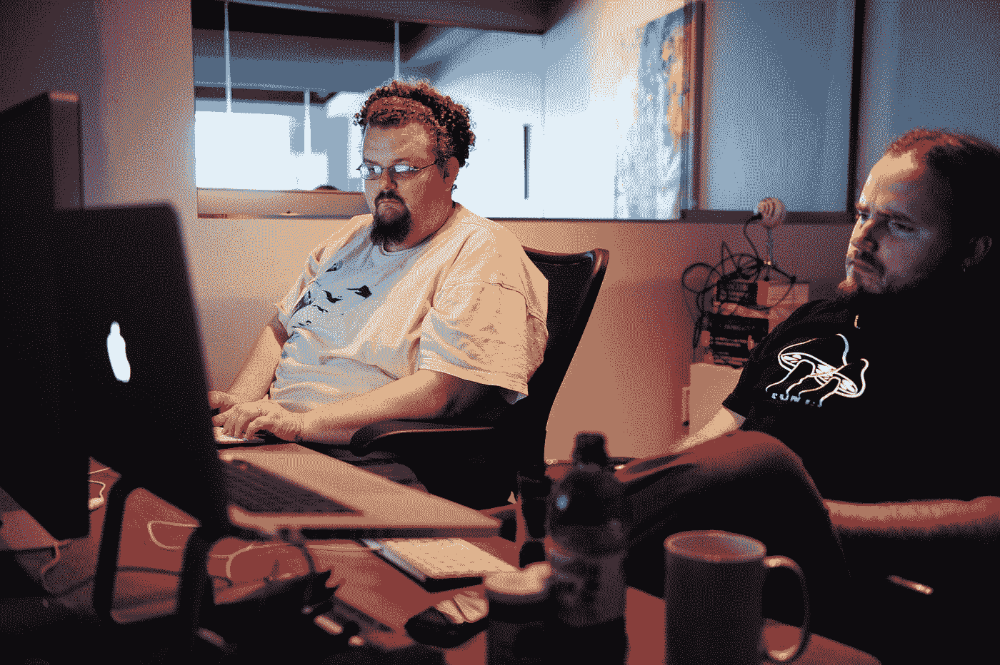

# 程序员会遇到的 6 大难题

> 原文：<https://medium.com/codex/6-biggest-pain-in-the-ass-that-programmers-will-encounter-80ddc7cdf29c?source=collection_archive---------7----------------------->

## 不，不是技术债。

奥比·费尔南德斯在 [Unsplash](https://unsplash.com?utm_source=medium&utm_medium=referral) 上的照片

我总是听说程序员最显著的痛苦是他立刻创建了一个功能良好的程序/应用/系统，没有错误。因为它会隐藏在某个地方，当它出现时，它会全部崩溃，没有修复的可能。但我认为远不止这些，比如: