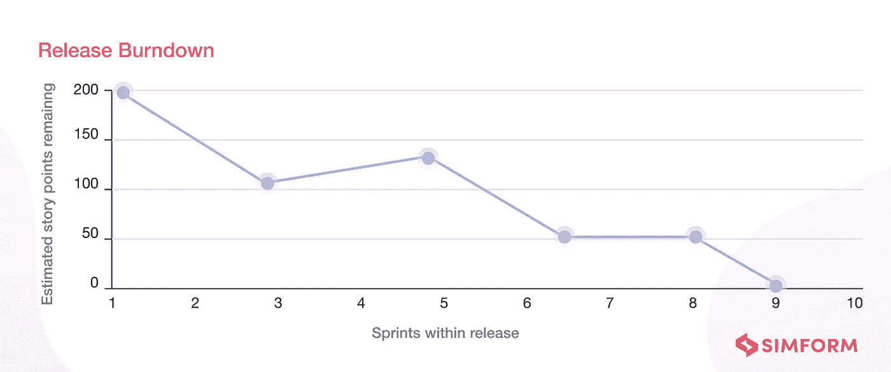

# 软件开发的 6 个关键 KPI

> 原文：<https://medium.com/codex/6-essential-kpis-for-software-development-a10af5eaa7b4?source=collection_archive---------16----------------------->

是时候认真对待软件开发了。无论你的公司是生产产品还是提供服务，你都不能不每天监控和提高你的表现。KPI 是在发生时跟踪进度的好方法。

如果你正在开发软件，下面是一些你应该关注的关键性能指标:

# 特征速度。

特征速度是在给定的时间段内添加到产品中的特征数量。这是对你发展速度的一种衡量，可以用来预测未来的表现。

要开始跟踪特性速度，首先要创建一个在过去几个月或几年中添加的所有特性的列表。然后，计算它们的总权重——例如，如果您的平台上现在有 100 个功能，并且每个功能平均需要 10 个小时来开发(这意味着仅仅写完它们就需要 1000 个小时),那么您将得到 100/1000 = 0.10 个功能速度。

虽然这听起来像简单的数学(确实如此！)，有很多因素会影响你添加新功能的速度:它们的技术性如何；它们是否需要编码改变或数据库更新；这些任务需要什么类型的资源；这些任务需要多少时间；该功能是否需要在部署前进行测试；等等。

# 周期时间和交付时间。

周期时间和交付时间都是重要的指标。周期时间是指单个流程从开始到结束所花费的时间。另一方面，交付周期指的是一个流程从开始到结束全部完成所需的时间，包括流程中最后一步之前的所有步骤。

提前期的计算方法是:将项目总工期(所有任务的总和)除以任务数(即:项目总工期/任务数)。这将给你每项任务的平均交付时间，以天或周为单位，这取决于你想如何精确地衡量你的数字；然而，如果你看的是整个项目而不是单个任务，那么就用“月”来代替，这样就不会和任务持续时间混淆了。

# 释放燃尽

发布燃尽是软件开发人员的一个关键 KPI，它记录了整个发布过程。此外，这个度量可以帮助团队领导指导他们的成员管理最终产品的发布。在 release burndown 图表中，x 轴表示冲刺，而 y 轴表示故事点。

你可以利用一个发布燃尽图来确定你是否按照计划工作。此外，您可以手头上有准确的数据，向利益相关者显示他们何时可以期待发布后的 ROI。同样，您可以更新热情的客户关于延迟或提前发布的信息。

release burndown 图表允许您可视化项目的进度。你将能够看到有多少工作已经完成，因为上周或上个月，有多少工作已经完成，因为项目开始。这些信息有助于对未来的开发工作做出更好的决策，并通过为团队成员提供在项目开发周期中的任何给定时间点他们应该将精力集中在哪里的明确方向来帮助提高生产率

# 上市时间。

上市时间是指产品或服务从最初的想法到交付给客户所需的时间。一个产品或服务在发布前可能需要六个月到三年的开发时间，所以这是你需要密切关注的事情。

了解您的团队和产品经历这一过程需要多长时间非常重要，这样您就可以知道您的工作流程或规划流程是否有改进的空间。上市时间指标将帮助您根据以下因素确定您当前的策略是否合理:

*   竞争对手在做什么？
*   他们有多少钱？

# 估计的准确性。

每个人都知道评估是软件开发中非常重要的一部分，但它不是一门精确的科学。事实上，在很多情况下，评估可能会不准确。如果你的团队不能得到正确的估计，那么他们就不能尽可能高效地工作，这将影响他们的产出质量。

评估的准确性是一个关键指标，它反映了你的团队合作的好坏，以及他们产生结果的效率。例如:如果你有两个经验和知识水平不同的开发人员在同一个项目上工作，那么他们的评估将会根据每个开发人员擅长的项目部分而有所不同。

# 负载测试和性能测试结果。

负载测试是对应用程序上的用户活动的模拟，包括诸如页面视图和用户交互之类的负载模式。它可以通过模拟真实世界的使用情况来测量系统在不同条件下的性能，从而帮助您确定系统的容量。

性能测试基于真实世界的使用场景(例如具有各种元素的网页)来测量应用程序的性能，允许您识别可能影响用户高效执行任务的能力的瓶颈或其他问题。

# 客户对设计和客户支持的反馈。

您还可以通过调查跟踪客户对设计和支持的反馈。这是衡量顾客服务质量的好方法，也是你应该重点改进的地方。

客户满意度、保留率和转换率都是决定软件开发业务有效性的重要 KPI。

# 关注正确的 KPI 以预测和改进绩效。

成功的软件开发团队使用 KPI 来衡量项目和产品的成功。他们还通过查看历史数据来预测未来的表现。这有助于在整个过程中指导决策制定，从定义需求到制定折衷决策。

# 结论

对于软件开发团队来说，关键的要点是跟踪你最重要的 KPI，并确保它们被定期监控。这将帮助您识别瓶颈、提高性能并更准确地预测未来结果。

资源:

 [## Ace 软件开发的关键软件开发度量和 KPI

### 多亏了敏捷方法，测量软件团队整体生产力的重要性大大提高了…

www.simform.com](https://www.simform.com/blog/software-development-metrics/)