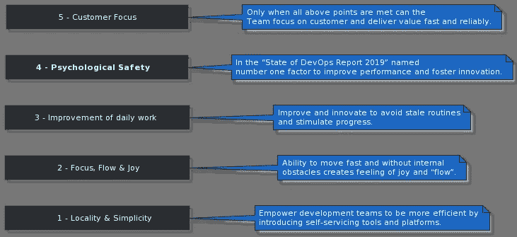
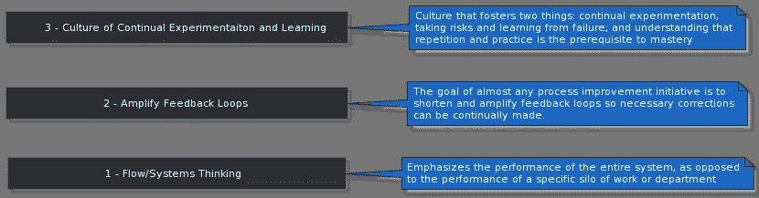
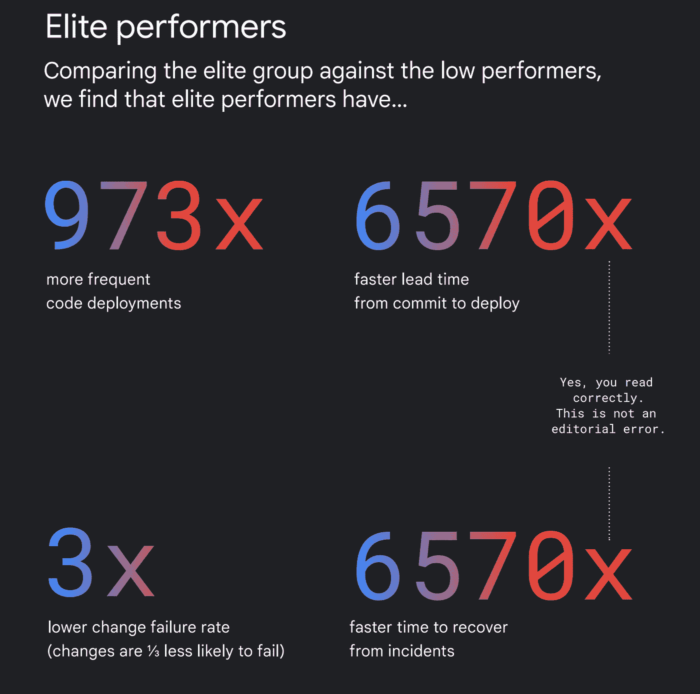

# 提高 DevOps 性能的 6 个关键领域

> 原文：<https://medium.com/codex/6-key-areas-to-improve-your-devops-performance-f4c4226feb25?source=collection_archive---------1----------------------->

查尔斯·德鲁维奥在 [Unsplash](https://unsplash.com?utm_source=medium&utm_medium=referral) 上拍摄的照片

## DevOps 2021 年回顾

## 介绍

我一直着迷于开发运维转型能对组织产生多大的影响。

产生这样的影响具有挑战性，但也是值得的。在这个领域，人类心理学的知识、群体动力学以及对技术的扎实掌握同样重要。

> "你做的比你说的有更大的影响。"
> 
> —斯蒂芬·R·科维

这篇文章是写给那些有兴趣开始或进行 DevOps 转型之旅的人的。

## 基本原则

如果你是 DevOps 的新手，并试图理解所有这些大惊小怪的事情，请记住，这是一个对每个人来说都略有不同的过程。

幸运的是，有几本鼓舞人心的书会给你指明正确的方向:

 [## 加速

### 这本书感觉像是一个混合体:一些基于多项调查的非常好的建议，科学的…

www.goodreads.com](https://www.goodreads.com/book/show/35747076-accelerate?from_search=true&from_srp=true&qid=p0L7mPK71Y&rank=1)  [## 独角兽项目

### “试图让凤凰建造运行起来就像玩塞尔达传说，如果它是由一个虐待狂写的，强迫她…

www.goodreads.com](https://www.goodreads.com/book/show/44333183-the-unicorn-project)  [## 凤凰计划

### 对于一个 IT 人员来说，这真是一件乐事！我终于感受到了这个世界是如何看待我们的。表面上，“嘿，IT 男！”…

www.goodreads.com](https://www.goodreads.com/book/show/17255186-the-phoenix-project)  [## DevOps 手册

### “在高绩效的组织中，团队中的每个人都有一个共同的目标——质量、可用性和安全性…

www.goodreads.com](https://www.goodreads.com/book/show/26083308-the-devops-handbook)  [## 团队拓扑

### 作者将 DevOps 拓扑背后的思想发展成为组织设计的模型。他们建议四个…

www.goodreads.com](https://www.goodreads.com/book/show/44135420-team-topologies?ac=1&from_search=true&qid=QUQaMAW2tZ&rank=1)  [## 抗脆弱

### 心理学家 Gerd Gigerenzer 有一个简单的启发法。千万不要问医生你该怎么做。问他他…

www.goodreads.com](https://www.goodreads.com/book/show/13530973-antifragile?ac=1&from_search=true&qid=ebeid0SNnH&rank=1) 

## 关键概念

在我们继续分析 DORA State of DevOps 2021 报告中的发现之前，让我们确保熟悉基于 Gene Kim 工作的两个重要概念:

**5 DevOps 理想**

[DevOps 的五大理想](https://itrevolution.com/five-ideals-of-devops/)概括了 devo PS 文化蓬勃发展的理想环境和条件。

来自“凤凰计划”的 5 个 DevOps 理想

**3 DevOps 原则**

[DevOps 三大原则](https://itrevolution.com/the-three-ways-principles-underpinning-devops/)是 devo PS 哲学的基石，所有其他原则都源自这些原则。

来自“DevOps 手册”、“凤凰计划”的三种方式

## 2021 年发展状况报告

DORA DevOps 报告每年发布一次(2020 年除外),包括基于对全球 32000 多名专业人士调查的 devo PS 实践的统计分析。

DORA 是 Google Cloud 的一个团队，代表 DevOps 研究和评估。几天前发表的今年的报告特别有趣，因为它总结了 7 年来正在进行的研究。

对于每个对 DevOps 感兴趣的人，我强烈推荐深入研究这份报告。出于本文的目的，我将关注 6 个关键发现，并提供额外的背景来帮助您改进 DevOps 实践。

> #1 表现最好的人在成长，并继续提高标准

资料来源:2021 年发展状况报告

> #2 SRE 和德沃普斯是互补的哲学

SRE(站点可靠性工程)是一个相对年轻的 IT 学科，经常被错误地等同于传统运营。SRE 专注于支持软件可靠运行的产品团队**。**

看看哪些知识是 SRE[学校或 SRE](https://github.com/linkedin/school-of-sre) 学校课程的一部分(LinkedIn 提供)

> #3 越来越多的团队正在利用云，并从中获得了巨大的收益

使用云会自动节省成本的流行观点是错误的。使用云最大的好处就是**弹性！**节约成本是可能的，但通常很棘手，需要专业知识**。**

在 DevOps 转型之旅中，将云视为一个使能器，一个释放您的创造力和学习潜力的东西。不是所有的东西都必须迁移到云中，也绝对不是一次全部迁移。

> #4 安全的软件供应链不仅至关重要，还能提升性能

令人欣慰的是，在最近一波软件链攻击之后，越来越多的公司提供工具和框架来帮助保护应用程序和基础设施以及软件交付管道。知道他们的软件是安全的，团队会感到更有生产力和更安全。

> #5 良好的文档是成功实施 DevOps 功能的基础

这个话题是我个人最讨厌的。我真的很高兴看到它成为了报告的主要发现之一。您可以在我的一篇文章中了解更多关于设计和维护优秀软件文档的信息:

 [## 如何创建和维护好的软件文档

### 介绍

itnext.io](https://itnext.io/how-to-create-and-maintain-good-software-documentation-bc8b4dcd32bf) 

> #6 积极的团队文化可以在充满挑战的环境中缓解倦怠

这是 DevOps 的 5 个理想之一；心理安全。如果你的公司没有提供一个安全的环境来进行实验、学习和犯错，那么也许是时候利用这个好机会，找一个文化能让你成长的地方。

## 其他资源

DORA 的 devo PS state 报告不是唯一可用的报告。如果你对比较不同来源的发现感兴趣，可以看看由 Puppet 出版的[devo PS 报告](https://puppet.com/blog/2021-state-of-devops-report/)。

另一个有趣的资源是 [CNCF 调查](https://www.cncf.io/wp-content/uploads/2020/11/CNCF_Survey_Report_2020.pdf)，该调查讨论了行业中容器化、云原生技术的使用以及[云原生年度报告。](https://www.cncf.io/cncf-annual-report-2020/)

如果您对 Kubernetes 感兴趣，可以从运营角度获得一份单独的详细报告。【2021 年 Kubernetes 和云原生运营报告

## 摘要

在这篇文章中，我们研究了《2021 年多拉州发展报告》的 6 个关键发现，以及它们对你的意义。

DevOps 转型是一项持续的工作，有了 DevOps 报告的状态作为指导，希望不会那么令人生畏。