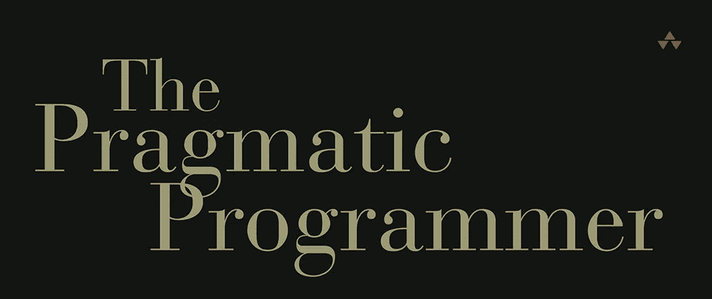

# 从务实的程序员身上学到的 6 个教训

> 原文：<https://medium.com/codex/6-lessons-learned-from-the-pragmatic-programmer-f6b46b1c897c?source=collection_archive---------7----------------------->

[https://RES . cloud inary . com/dz5 PPA CuO/image/upload/v 1457998345/the-practical-programmer-review-min _ tul PRT . png](https://res.cloudinary.com/dz5ppacuo/image/upload/v1457998345/the-pragmatic-programmer-review-min_tulprt.png)

[《实用程序员:你的大师之旅》](https://www.amazon.co.uk/Pragmatic-Programmer-journey-mastery-Anniversary/dp/0135957052/ref=asc_df_0135957052/?tag=googshopuk-21&linkCode=df0&hvadid=411212061311&hvpos=&hvnetw=g&hvrand=12089869051280948776&hvpone=&hvptwo=&hvqmt=&hvdev=c&hvdvcmdl=&hvlocint=&hvlocphy=9045352&hvtargid=pla-826212996228&psc=1&th=1&psc=1&tag=&ref=&adgrpid=90904870924&hvpone=&hvptwo=&hvadid=411212061311&hvpos=&hvnetw=g&hvrand=12089869051280948776&hvqmt=&hvdev=c&hvdvcmdl=&hvlocint=&hvlocphy=9045352&hvtargid=pla-826212996228)作者戴维·托马斯和安德鲁·亨特是我读过的第一本编程书籍。这是一本轻松的读物，里面有很多实用的、技术的和专业的建议，如果你真的从中吸取了一些教训，这些建议将帮助你更好地塑造你的职业生涯。

尽管有技术性和非技术性的建议，我还是要说，这本书非常适合开发你的思维过程和软技能，尤其是在开发方面的软技能。对我来说，我可以说它在我现在看待软件开发的方式上帮助了我很多，我当然希望很多人在这篇文章之后决定阅读全文，因为它物有所值。

1.  **承担责任**

我们都会犯错误，并从中吸取教训，尤其是如果我们是环境不断变化的软件开发人员。所以，如果你犯了错误，不要害怕承担责任，并做出相应的反应来改善并尽力不再犯。

**2。软件熵**

该术语来自物理学，指的是某个系统中的“无序”。在这本书里，你会读到“破窗理论”,该理论指出，未修复的物品被放置很长时间会导致一种被遗弃的感觉。

就代码而言，确保总是修复您在系统中发现的问题，即使它们不是您的问题，在这种情况下，您可以解决问题并与团队沟通，以便让每个人都跟上解决方案的速度。既然发生在你或别人身上，那也可能发生在每个人身上，所以把知识分享给你的团队吧。

**3。写出足够好的软件**

您的代码应该始终遵循坚实的原则，符合标准并满足业务和用户需求。然而，在我们生活的快节奏世界中，今天伟大的软件往往比明天完美的软件更受青睐。也就是说，用户应该参与到讨论中，并且理解发生的权衡，以便更快地启动和运行某些东西。

但最终，作为开发人员，我们应该知道何时停止编码，因为过度修饰和过度细化会导致许多问题。

**4。保持知识更新**

你所拥有的知识和经验是你最大的资产，但由于环境的不断变化，它们也有一个截止日期。保持你的技能与时俱进和多样化将有助于你保持竞争力，所以试着留出一些时间来学习与你相关的新技术。

**5。沟通是关键**

软件开发人员的工作是解决问题。为了做到这一点，开发人员需要完全理解他们试图解决的问题，因此沟通是实现这一目标的关键。

*   精通业务

所以，你开始了一项新任务。确保你通读并理解所有的细节。然后写下你所有的问题，这样你就可以做好准备，能够和你的项目经理讨论这个任务，并整理出问号。

*   做一个好的倾听者

倾听是关键。认真关注经理、产品经理、其他软件开发人员或每个人。在说话之前集中注意力听，以便理解你面前的人想要传达什么。如果你没有在听，而是在脑海中构建一个回答，而其他人在说，那么讨论的意义是什么。

**6。准备好重构**

对于初级开发人员来说，将自己归类到项目惯例中是相当常见的。但是你不应该让现有的代码支配你未来的代码，尤其是当现有的代码并不完全合适的时候。项目中途会发生变化，从事项目工作的人会发生变化，底层的代码也会发生变化，所以不要害怕重构，不要为了维护代码库而付出额外的努力。当然，它可能看起来会让你慢下来，但它可能会在未来很好地防止许多不必要的行为，这可能需要更多的时间来整理。

挑战现有的代码库，并鼓励其他人也挑战它，因为，最终，你想尽你所能创造出最好的软件。