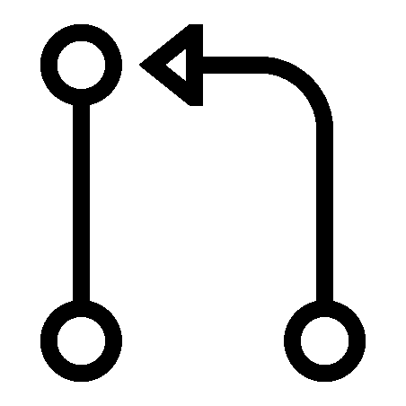

# 自尊的开发人员的 6 个禁忌

> 原文：<https://medium.com/codex/6-no-nos-for-self-respecting-developers-365cdd1658a?source=collection_archive---------11----------------------->

这篇文章旨在揭示大多数开发人员在做他们的工作时观察到的最令人讨厌的实践——轻松地对待它，并用它来提高自己，或者至少在这个过程中笑一笑。

如果你是一名开发人员——即使从最遥远的意义上来说，你也有可能在从事个人项目、黑客马拉松或任何其他类型的编码工作时看到一些不太好的习惯。在我多年的开发经验中——我见过一些最不可思议、最聪明的程序员在做他们的工作——也有机会被他们的经验所指导。

这里有一个汇编，我认为它是任何骄傲的开发者的禁忌，他们希望提升他们的游戏并从长远来看尊重他们自己。

# **在测试任何东西之前贴上一张 PR**

这可能是最明显的禁忌之一。不管是什么应用程序，高质量的开发人员都不应该在本地测试他们的工作之前发布他们的代码来请求 pull(PR——意味着将他们的特定代码合并到主代码库中)。

除非另有说明，公关系统是为了让其他人观察和校对你的工作。校对。不是测试和调试。

如果你在测试和调试方面有问题，一个很好的解决方法是和另一个能帮助你的有能力的朋友联系。

Pull requests (PRs)是为了让其他人检查你的“最终工作”,打破希望其他人发现你的代码错误的习惯是很重要的。

另一种选择是，如果你真的依赖于 PRs，显然可以在 PRs 上使用“工作进行中”的标签，而不是严肃对待那些正在考虑合并的人。例如，你也可以在 Github 或 Gitlab 上将 PR 标记为草稿。这些都是有据可查的实践，我鼓励它们。

# **从不审查别人的代码**

我注意到，真正伟大的开发人员不仅有能力编写经过深思熟虑的直观代码，还能够通过阅读朋友的代码来理解他人的意图。

打个比方——你可能真的很擅长解读自己的情绪，但很少有人是解读他人情绪的专家。

类似地，要真正擅长编码，花时间练习检查别人的代码是很关键的。当你的朋友要求进行全面评估时，花时间培养阅读他们代码的技能。问很多问题，增强你理解代码的能力。

任何开发人员都可以编写代码，强大的开发人员可以阅读代码。

# **让每个细节都成为争论的焦点**

我个人在许多黑客马拉松和个人项目中看到过这种禁忌。他们说编码时，“一切皆有可能”。好吧，如果你要对项目开发中的每一个小点进行争论和辩论，你根本不会取得什么进展。

伟大的开发人员真的很棒，他们能识别编码项目中什么是重要的，以及他们愿意灵活处理的点。团队中的编码通常更强大，这是有原因的——这是因为重要的设计决策或结构选择可以协商并达成一致——但不值得花费痛苦的时间来尝试和捍卫糟糕的变量命名选择——从错误中学习并愿意适应。

# **糟糕的命名选择**

说到糟糕的变量选择(在上面的观点中)，许多新手开发者不太擅长命名变量和其他数据结构。

命名很重要。

多花几秒钟，或者几分钟，想想你给变量或者结构起的名字。你的朋友或项目合作伙伴将来可能会使用你的作品，优秀的开发人员总是致力于考虑他们作品的用户——一个开发伙伴，并尽可能容易地理解他们的意图。

函数中(通常)错误的变量名示例:“value = 238983”

(可能)更高质量的名称示例:“student_id = 238983”

通过在变量名成为遗留代码之前仔细考虑它们，帮助您的工作和团队取得成功。

# **没有更新，只有最终产品**

我从亲身经历中了解到，最好的开发人员不会等待别人来询问他们的进度。他们根据自己的工作进展向他人和周围的人提供最新信息。

这样做的原因有两个:

你首先能够理解开发人员在他们的项目中正在做什么，如果他们遇到困难，你也有可能帮助他们。

其次，通过提供最新信息，你可以在周围创造一种进步和个人发展的文化。

# **不为他人所用**

没有人喜欢不帮助别人或者每次有棘手的问题需要解决时都很忙的开发人员。高质量的开发人员通过宣传他们的帮助能力，使他们自己和他们的才能为他人所用。不仅如此，当联系到他们时，他们会很快做出反应并提供他们的见解。

让你自己为他人所用，不要害怕接受新的挑战。成为一名高质量的开发人员是一个过程——而不是一夜成名。但是相信我；付出额外的努力是值得的。你未来的开发者超级英雄会感谢你的。