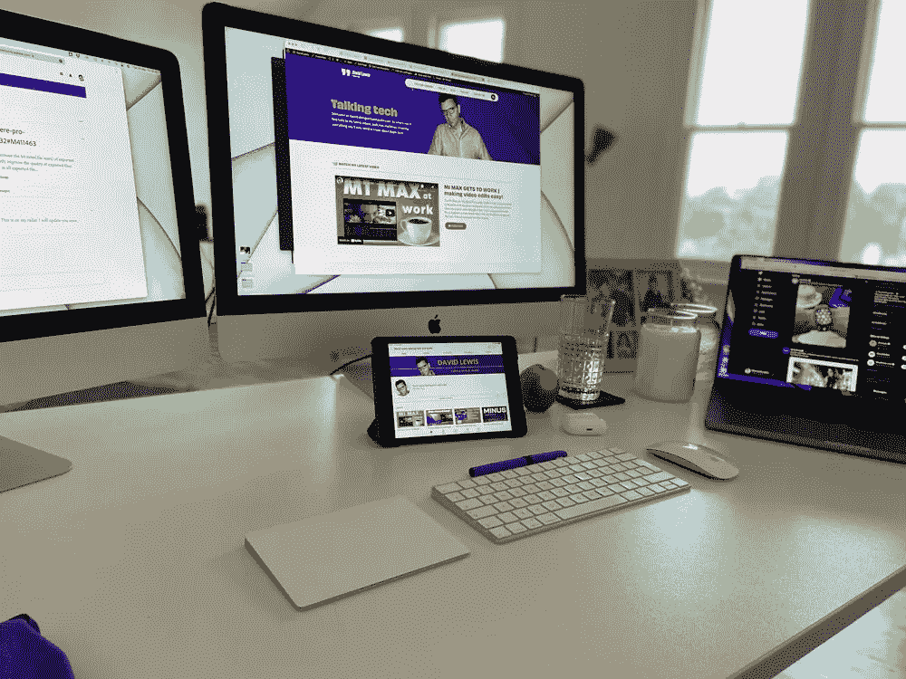
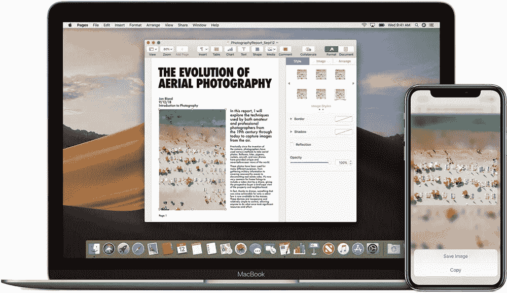
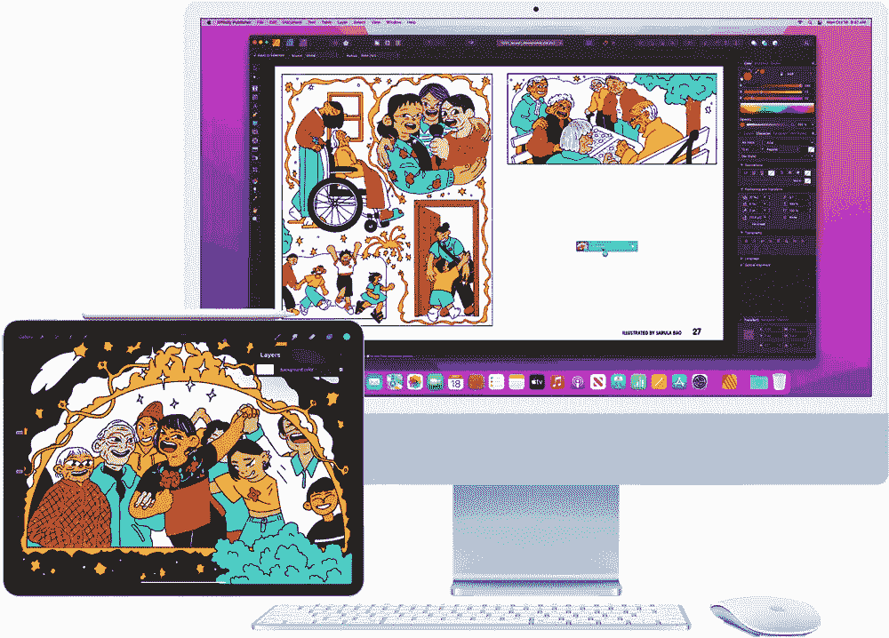
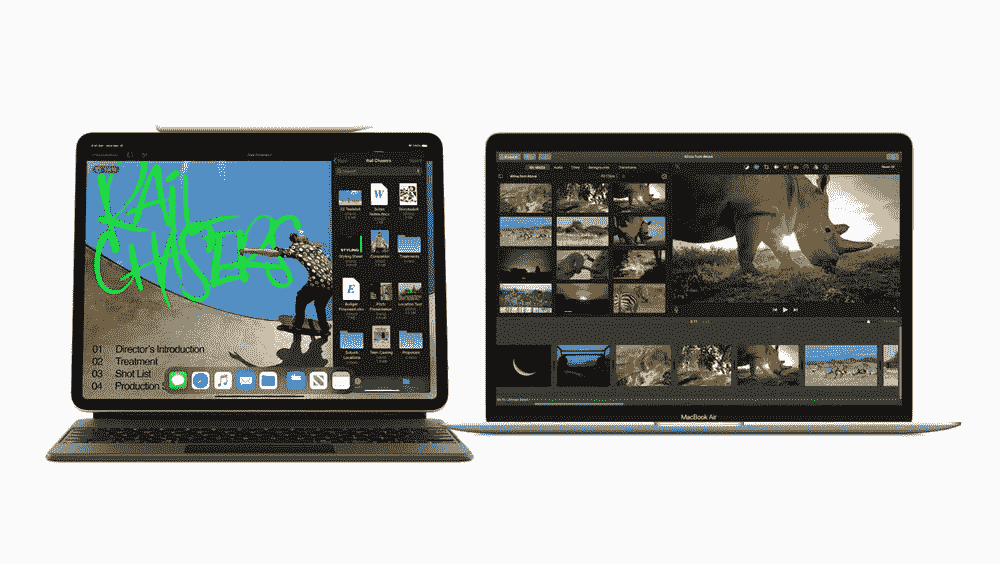
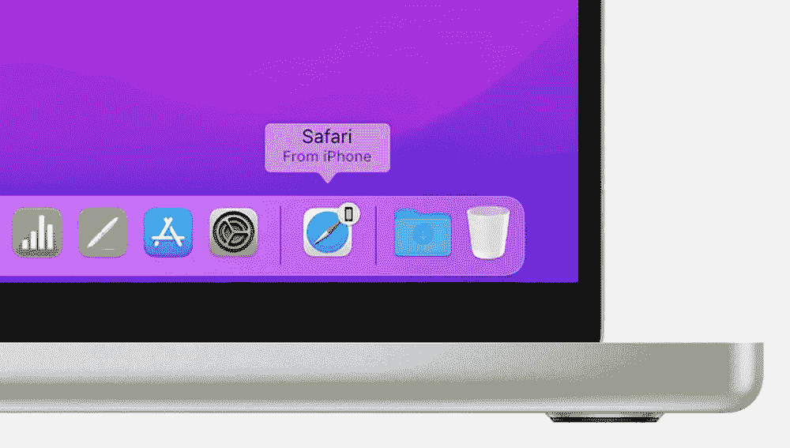
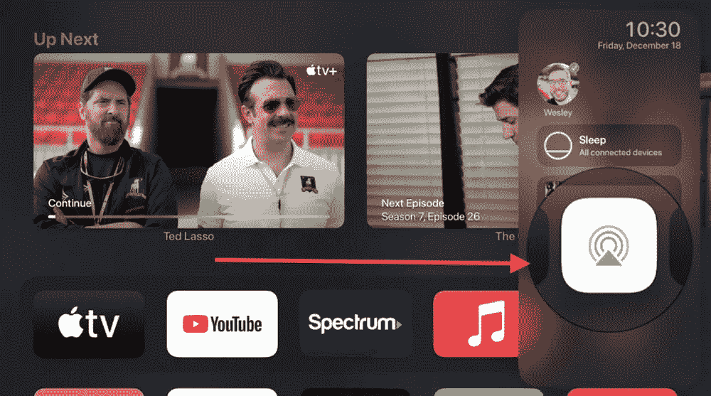

# 证明苹果生态系统伟大的 6 个理由

> 原文：<https://medium.com/codex/6-reasons-that-prove-the-apple-ecosystem-is-great-bf5ee37007f2?source=collection_archive---------7----------------------->

## 我们都听说过生态系统——今天我突然意识到它是多么真实

我和其他人一样感到内疚，因为我说出了“苹果生态系统”这个老生常谈的短语。当你在我的工作中，太容易说漏嘴了。我们都知道它的含义，但今天坐在我的办公室里，我突然意识到它是多么真实。

当我写这篇博客时，我的桌子上有两台 iMacs，一台 iPad Mini，一台 iPhone 和一台 MacBook Pro。除了矫枉过正之外，他们之间工作和交流的互联性和便利性也是值得注意的。这让我开始思考，我最喜欢的 6 个苹果生态系统功能是什么。

## 1.通用剪贴板

我一定是用了四五年 Mac 和 iOS 才学会这个忍者小技巧的。我可能大部分时间都在使用它，它改变了游戏规则。基本上，它可以让你从一台设备上复制任何文本、网址、图像或信息，然后直接粘贴到另一台设备上。只要你用同一个 Apple ID 登录并启用了 Handoff(稍后会有更多介绍)，你就可以开始了。点击了解更多信息[。神奇又超级有用的东西。](https://support.apple.com/en-gb/HT209460)

 [## 让我的 M1·马克斯 MacBook 成为头号创意机器

### 我的 M1 Max MacBook Pro 上必备的五款创意应用

medium.com](/codex/making-my-m1-max-macbook-the-1-creative-machine-aa4483668c63) 

## 2.通用控制

一年前，Craig Federighi(软件工程的 SVP)在 WWDC 揭示了这一点。我们不得不等了一会儿，我一点也不惊讶！我可以想象，在屏幕上看起来如此简单的东西，要变成现实却是一场工程噩梦。在我今天的情况下，我周围有许多苹果设备，现在，由于通用控制，我只需要*一个*键盘和鼠标就可以使用它们。超级，超级方便，一个办公桌整理者！只需一个键盘，您就可以控制最多两台附近的 MAC 或 iOS 设备。我现在正在使用它——在两台 MAC 电脑之间工作。一旦启用(系统首选项>显示>通用显示)，你所要做的就是在屏幕间拖动鼠标。那个“活的”设备将会使用你的键盘等等。不仅如此，你还可以在桌面之间拖拽文件。你甚至可以从 Mac 拖到 iPad(只要你有兼容的文件类型)。产量巨大。如果你的桌面上有不止一台 Mac 或 iOS 设备，那么[万能控制](https://support.apple.com/en-us/HT212757)就是为你准备的。

## 3.边车

这个和通用控制紧密相连。而且，它还能帮你省下一大笔钱！如果你有一台 12.9 英寸的 iPad Pro，你就有了最华丽的面板之一——液态视网膜 XDR，背光，迷你 LED 显示屏。除了作为 Mac 的辅助桌面显示器，还有什么更好的使用方式呢？当然，任何 iPad 都可以工作，但是对于一个更大的，你几乎可以说，你不需要 1500 工作室显示器！你已经买了 iPad，使用 [Sidecar](https://support.apple.com/en-gb/HT210380) 扩展或镜像你的 Mac 桌面。您可以使用手势进行滚动操作，从而充分利用您的体验。检查你的设备是否准备好了[这里](https://support.apple.com/en-gb/HT210380)。

 [## Premiere Pro 和 M1 MacBook Pro 工作流程

### 最新的 M1 MacBook Pro 和 Adobe 的 Premiere Pro 配合得如何？

medium.com](/codex/premiere-pro-and-m1-macbook-pro-workflow-ae62d1be343c) 

## 4.安全代码自动填充

我知道双因素认证是一件好事，真的。但这也是一个适当的屁股痛！当你想做的只是重新登录网站等，然后你被要求提供刚刚通过短信发送给你的代码。Grrrrr！苹果公司的某个天才找到了加速这一过程的方法。只要你使用的是 iOS 12 & macOS Mojave 或更高版本，那么，根据你的通知设置，你很可能不必离开你所在的应用或页面。有了自动填充，你只需将光标悬停在空白文本字段，代码编号就会在那里等着你。只要确保你打开了[短信转发](https://support.apple.com/en-gb/HT210380)，你也可以体验这个魔法。

## 5.手递手传球

苹果生态系统的另一大妙招是[移交](https://support.apple.com/en-gb/HT209455)。虽然不是新的，但它实际上是 iOS8 和 macOS10 版本的一部分，Handoff 是生产力的另一大胜利。我经常用它在 iPad 上浏览网站，然后在 Mac 电脑的桌面上继续工作。你会在 Macs dock 上看到这个图标，表明它知道你在附近的某个地方打开了一个标签页。我喜欢用它的另一个好处是，让我不用再登录网站了。如果我刚刚在一台 Mac 上打开了一个页面，我会使用 Handoff 在另一台设备上继续使用它(例如，如果转移到 MacBook 并离开办公室，这一点特别有用)。

 [## 使用 AirPods Pro 一个月

### AirPods Pro 值得改变吗？

medium.com](/codex/one-month-with-airpods-pro-f1c56da76c89) 

## 6.Airplay 和 Apple TV

如果你最近一直在看我的博客，那么你会知道我是苹果电视及其原创内容的新用户。这周我已经看到了《家》的第二季，我也很兴奋能在这周看到大卫·爱登堡的史前星球。我最近买了苹果 4K 盒子，其中一个我喜欢的功能(有很多)是可以将音频分享到我的 AirPods Pro 上(查看兼容性[这里](https://support.apple.com/en-gb/guide/airpods/dev28f39a9e7/web))。我偶然发现了这个，但现在一直在使用它。按住 Apple TV 遥控器上的电视图标，选择 Airplay 符号，导航到耳机，然后选择您想要使用的耳机。更好的是，如果你真的不想和“另一半”说话，那么只需选择共享音频，你就可以配对第二副耳机。它实际上并不像听起来那么反社会…这是观看沉浸式电视的一种很好的方式。

## 结论

正如我在开始时所说的，生态系统不仅仅是苹果粉丝最喜欢的短语。这是每天都能感受到的真实的东西。苹果致力于提高我们在 MAC 和 iOS 设备上花费的时间的生产率。虽然许多人会争辩说我们为使用苹果的特权付出了过多，但有一点是肯定的，它们以一种无与伦比的方式协同工作。今天，我是一个快乐的小家伙，因为我看到所有这些都在我面前工作。

*我很想知道你最喜欢的苹果生态系统技巧，以及你与苹果合作改善工作流程的方式。*

## 在你走之前

[T5 加入我的幕后邮件列表 ](https://www.talkingtechandaudio.com)

***原载于***[***https://talkingtechandaudio.com***](https://talkingtechandaudio.com/blog/m1-max-macbook/)***2022 年 5 月 24 日***