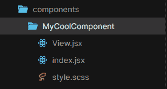

# 相对于传统 CSS 使用 Tailwind 的 6 个理由

> 原文：<https://medium.com/codex/6-reasons-to-use-tailwind-over-traditional-css-7691f2789ffd?source=collection_archive---------11----------------------->


# 1.极小的束尺寸=难以置信的性能

在开发模式下，Tailwind 的输出是相当大的。这是由设计决定的:每个可能的类都是在这个阶段生成的，所以当您想要使用某个东西时，您不需要等待构建过程完成。

然而，一旦 Tailwind CSS 进入生产模式，它将**清除**任何没有被 PurgeCSS 工具使用的类。这是通过在项目文件中搜索类名来实现的，只保留那些被使用的类名。您可以在`purge`数组中配置它将在您的`tailwind.config.js`中搜索的文件路径。

```
// tailwind.config.js
module.exports = {
  purge: [
    './src/components/**/**/*.jsx',
    './src/layout/**/**/*.jsx',
    './src/pages/**/**/*.jsx',
  ],
  theme: {},
  variants: {},
  plugins: [],
}
```

不用尝试就可以很容易地得到一个很小的 CSS 包，这确实有助于提高性能。你很难获得超过 10kb 的包大小，所以使用 Tailwind 的网站往往加载非常快，不需要对 CSS 前端进行太多优化——只要网站的其他部分也得到优化。

你所需要做的就是确保你总是通过它们的全名来引用类，而不是通过使用 JavaScript 来构建名字。

```
// bad
<div className={ 'bg-' + props.isDark ? 'neutral-dark' : 'neutral-light' }>// good
<div className={ props.isDark ? 'bg-neutral-dark' : 'bg-neutral-light' }
```

此外，虽然这在更快的机器上几乎不会被注意到，但是 Tailwind 类的简单性，因为它们不是使用[复杂的选择器](https://csswizardry.com/2011/09/writing-efficient-css-selectors/)构建的，意味着你的浏览器在解析和呈现 CSS 时会更快一些。这有助于提高较慢的电脑和旧手机的性能。作为一个 6 年前我买的时候手机就已经很慢的人，我会尽我所能改进它。

# 2.快速制作原型和构建

使用常规 SCSS，您需要为页面上的每个元素编写自定义类。虽然它可以提供更好的控制，但编写自定义类需要相当多的时间:您必须在 HTML 中添加类，然后在 CSS 中创建它，然后以长格式写出每个属性。然后，您必须等待 CSS 构建完成才能看到结果——此外，如果您需要进行更多的更改，每次都需要重新构建，这可能会占用宝贵的时间并中断您的流程。

Tailwind CSS 去掉了这些额外的步骤，在设计元素时给你一个简单、快捷的开发体验。您看到了想要样式化的元素，使用速记添加了它需要的属性，更改很快就出现了，无需等待 CSS 包。你的注意力可以停留在一个地方，这样你就不会不停地切换到不同的文件，整个过程感觉很简单。

我能理解学习所有的速记可能需要一段时间。有一些很好的工具可以帮助你，主要是[官方文档](https://tailwindcss.com/docs)或 [@nerdcave](https://twitter.com/nerdcave) 的[顺风备忘单](https://nerdcave.com/tailwind-cheat-sheet)。但是说实话，在使用它一周左右之后，你会记住大部分重要的东西。有几个奇怪的问题，比如没有用于`flex-basis`的类，但是总有原因:在这种情况下，你可以用宽度属性比如`w-1/2`来代替它。这只是需要一点点时间，但有可能节省更多的时间。

我在一些有很紧的时间期限的制作网站上使用过 Tailwind，我不得不说，当它开始设计前端时，它确实减轻了很多压力。如果你的最后期限很紧，顺风可以让生活变得轻松一点。

# 3.它自动处理 CSS 变量

Tailwind 生成一个名为`tailwind.config.js`的文件。这个文件包含了你对主题的所有设置，包括颜色、宽度、间距(用于填充、边距和类似属性)、字体等等。您的整个 CSS 包和您使用的所有类都将基于这个文件。

可以为每个属性指定一个名称，这样您就可以引用相关的类。例如:

```
// tailwind.config.jscolors: {
  brand: {
    DEFAULT: '#f0000',   // bg-brand
    primary: '#f0000',   // bg-brand-primary
    secondary: '#f0000'  // bg-brand-secondary
}// other ways to use these colours
.text-brand
.border-brand-secondary
```

您可以随时更改所有这些属性，名称将保持不变，除非您更改它们。因此，Tailwind 将处理你所有的 CSS 变量——它影响你的网站的整体外观。*这个*是你的真实来源——如果一个品牌的颜色改变了，或者你需要到处改变字体，`tailwind.config.js`是你可以这样做的地方。

# 4.消除范围泄漏

人们喜欢 BEM 的一个特点，也是它今天如此流行的原因，是命名系统类被构建来表示组件的结构。在使其易于阅读和理解的同时，开发人员还受益于这种结构的一个副作用:由于布局易于理解，您可以在不使用 CSS 选择器的情况下编写类。

```
// this
.block {
  &__element { ... }
  &__element--modifier { ... }
}// not this
.block {
  & > .element {
    &.modifier { ... }
  }
}
```

CSS 选择器的问题是它们给 CSS 带来了复杂性，组件变得非常依赖于特定的 HTML 结构。由于像`.container`这样的通用 CSS 类可以重复很多次，使用这些名字会导致重叠，改变一个类会影响许多其他类。这是我们使用 BEM 的主要原因之一，因为它使这种结构清晰，并且将每个类平铺到顶级范围，因此没有什么依赖于其他任何东西。没有像这样的 CSS 方法会导致头痛，尽可能保持简单意味着更多的人可以更容易地理解它。

效用第一的 CSS 的工作方式是通过拥抱这个想法:没有任何东西依赖于其他东西。在 Tailwind 中，类是单一用途的，通常只由一两个 CSS 属性组成，除了有意的例外，它们从不相互依赖，比如组悬停功能。您甚至真的不需要考虑范围泄漏，因为除非您自己用自定义 CSS 添加那些选择器，否则在复杂选择器中嵌套类的选项并不是真正内置的。

```
// this is all tailwind classes are
.w-1/2 {
  width: 50%;
}
.mx-auto {
  margin-left: auto;
  margin-right: auto;
}// using hover groups
<div class="group bg-white hover:bg-black">
  <h3 class="text-grey group-hover:text-black group-hover:underline">Title</h3>
  <p class="text-grey group-hover:text-black"
</div>
```

我真正喜欢它的是，它不需要模糊的、过于具体的或通常被抛弃的类名。你不需要命名每一个文本样式，每一个随机的 CSS 形状或花体。同样，如果需要的话，您仍然可以自由地对 HTML 进行注释，但是有时没有必要命名每个只有`display: flex`的类。

**如果我仍然需要使用选择器怎么办？**

当然，有时候选择器可能是最好的选择，比如对 WYSIWYG 块进行样式化，但是通常避免使用选择器有助于维护一个易于阅读和理解的代码库。记住，如果你愿意，你仍然可以在顺风时使用 SCSS。如果您确实需要使用选择器，前缀可以帮助跟踪什么是自定义 CSS，什么不是。我喜欢对所见即所得使用这种方法:

```
// typography.scss.t-wysiwyg {
   & p {
     font-size: 12px;
   }
   & strong {
     @apply font-bold;
   }
}.t-wysiwyg--contact { ... }
```

# 5.如果你需要的话，SCSS 还在

最好记住，你不需要使用顺风 CSS *而不是* SCSS。仍然会有需要创建使用:`before`和`:after`元素的元素的时候，或者需要定制关键帧动画的时候。当这种情况发生时，您可以像以前一样使用 SCSS 或任何其他预处理程序——不需要在两者之间做出选择。

我更喜欢使用顺风来完成所有繁重的工作，对于需要 CSS 功能的元素，我可以切换到 SCSS。这让我可以更快地工作，同时仍然实现高水平的质量、定制和细节。

在长的、描述性的类名上使用简写类的简单性确实让人感觉很自由。不可否认，BEM 或类似方法的类名是有帮助的——你会被告知一个类到底要做什么。至少，理论上是这样。问题是当*每个*元素都需要有一个唯一的类名时，你最终会得到一些模糊的、奇怪的或者完全愚蠢的类。不描述类可能很难适应，但是一旦你很好地理解了语法，就像阅读普通的 CSS 一样，你总是可以用类的描述来注释你的 HTML。

```
<-- Contact Section - 2 column, 1 column on mobile -->
<div class="flex flex-row items-center">
  <-- Map -->
  <div class="w-full tablet:w-1/2">
    
  </div>
  <-- Content -->
  <div class="w-full tablet:w-1/2">
    <h3></h3>
    <p></p>
    <ul></ul>
  </div>
</div>
```

# 6.适用于 JavaScript 框架

应该知道，当在复制和粘贴 HTML 的环境中使用 Tailwind 时，它不会变得干燥，所以如果您正在处理普通的 HTML 文件，不要期望事情会进展顺利。一旦你像这样开始复制和粘贴，你就不再有一个可以改变组件外观的真实来源，因为你的网站样式不再依赖于 CSS 文件。

现代 JavaScript 框架是 Tailwind 的特性真正能够大放异彩的地方。这是因为像 Vue 或 React 这样的框架都是基于创建可重用的组件，以最小化需要编写的 HTML 的数量。这些组件是应用程序的构建块，可以是简单的容器，也可以是由较小组件组成的大型组件。

这些组件存储在它们自己的自定义文件中，这些文件结合了 HTML 和 JS，在 Vue 中，你可以选择将你的 CSS 组合成一个文件。这意味着你的真实来源不再需要被文件类型分开，它们都可以存在于同一个文件中，这个文件处理一个单独的组件。这就是所谓的基于组件的开发，JavaScript 框架张开双臂拥抱它:我们已经看到了 styled-components、CSS-in-JS 和现在的 Tailwind，所有这些都有助于将与组件相关的所有 CSS 包含在该组件中。它们仍然可以被分割成不同的文件，但是如果你想对那个组件进行修改，你将直接进入那个组件的文件夹，而不是三个单独的位置。



我在我的另一篇文章[如何爱上顺风](https://npmrundev.wordpress.com/2021/08/01/learning-to-love-tailwind/)中写了更多关于这个概念的内容。

# 结论

我第一个承认，Tailwind CSS 可能并不是在所有情况下都是正确的选择。它有一些非常棒的功能，速度非常快，文件大小也非常小，但是它需要一种完全不同的思维方式和一套工具来利用这些功能，而不会感到沮丧。

我注意到很多团队，尤其是那些用前端框架构建无头站点的团队，正在采用 Tailwind 和类似的解决方案。我认为我们仍处于这种方法的早期，还有很多问题需要解决，但潜力是巨大的。我很期待看到它的未来走向。