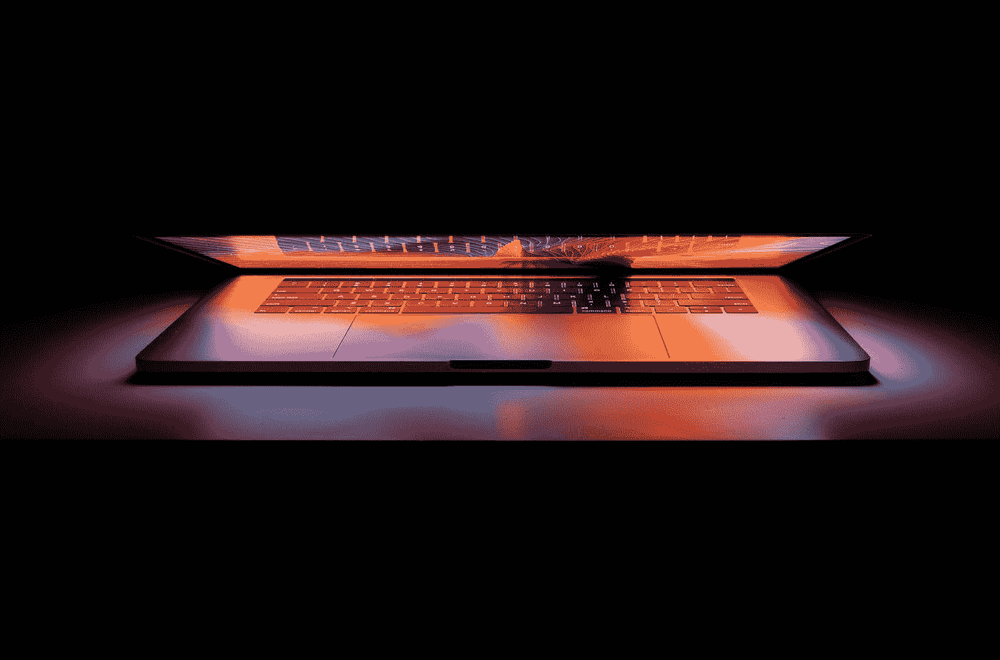

# 你应该买 Mac 的 6 个理由，以及你不应该买的 5 个理由

> 原文：<https://medium.com/codex/6-reasons-you-should-buy-a-mac-and-5-reasons-you-shouldnt-1cf20d78719?source=collection_archive---------0----------------------->

[天一马](https://unsplash.com/@tma?utm_source=medium&utm_medium=referral)在 [Unsplash](https://unsplash.com?utm_source=medium&utm_medium=referral) 上拍照

如果你正在寻找一台新电脑，而你又不是住在石头底下，你最有可能寻找的是两样东西中的一个:Mac 或 PC。也许你已经下定决心了。或者也许你想被说服，把钱花在 Mac 上更好。

作为一个拥有、使用并且*喜欢*MacBook Pro 和 Windows 电脑并且在工作中使用这两款电脑的人…