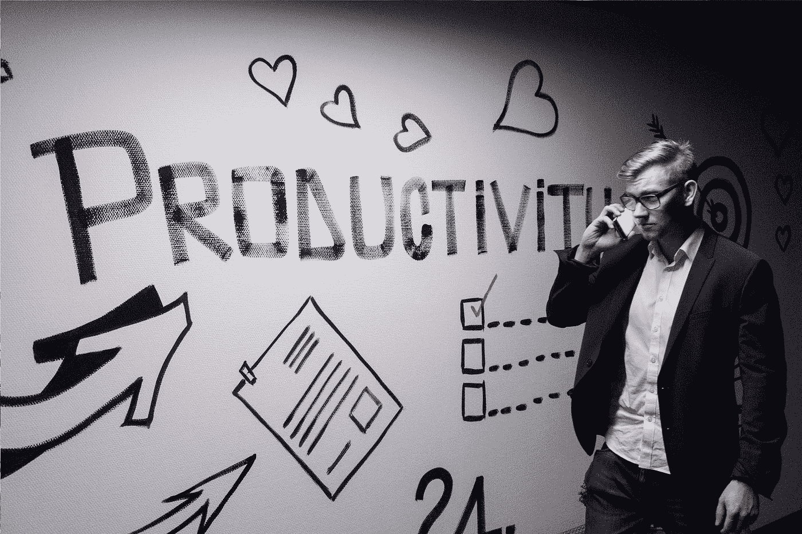
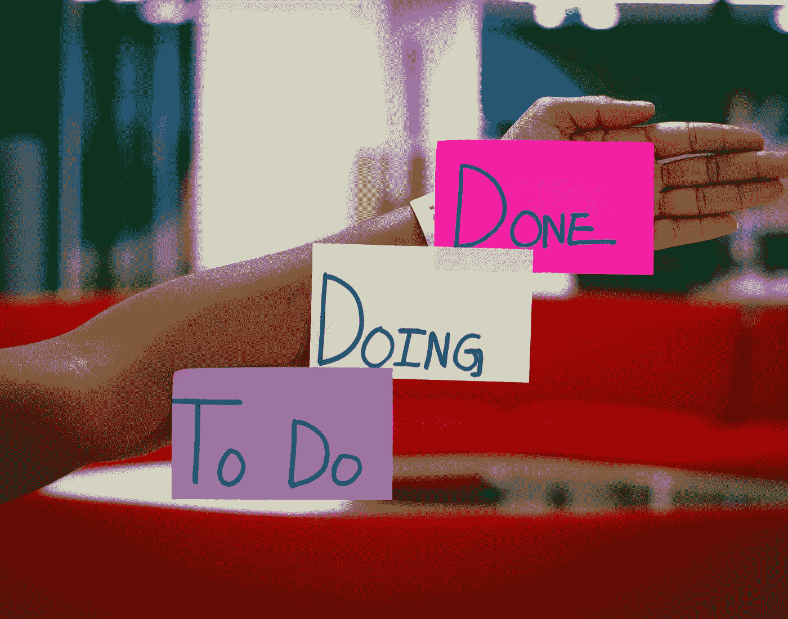

# 在家工作时提高工作效率的 6 种简单方法

> 原文：<https://medium.com/codex/6-simple-ways-to-boost-productivity-whilst-working-from-home-f0cdf59c023b?source=collection_archive---------9----------------------->

## 根据我作为一名在家工作的自由应用开发者和内容创作者的经验。

安德里亚斯·克拉森在 [Unsplash](https://unsplash.com?utm_source=medium&utm_medium=referral) 上拍摄的照片

随着最近人们生活的转变，在家工作变得越来越普遍，对一些人来说，这是完美的，有在自己的空间工作的自由，不需要通勤上班。然而，对其他人来说，这是一个越来越大的问题。许多人发现在家舒适地工作是一件困难的事情，因此对他们的工作效率产生了负面影响。这种工作效率的降低会导致压力的增加，感觉工作落后，或者无法将工作和家庭生活分开。

下面的建议是我作为一名自由应用开发者在家工作时保持高效的一些方法。

## 拥有舒适的工作空间

拥有一个整洁舒适的工作空间是至关重要的。如果你习惯在办公室环境中工作，这可能是一场斗争，因为这意味着试图为你建立一个良好的工作空间，与你用来放松的区域分开。

一旦建立了一个合适的工作空间，下一步就是要确保它能舒适地长时间工作。如果你在工作时感到不舒服，你的注意力会集中在你有多不舒服，而不是你有什么工作。

同样，如果你的工作场所杂乱无章，那么与保持一切井井有条相比，寻找可能需要的物品或设备会浪费时间。

照片由[伊登·康斯坦丁诺](https://unsplash.com/@edenconstantin0?utm_source=medium&utm_medium=referral)在 [Unsplash](https://unsplash.com?utm_source=medium&utm_medium=referral) 拍摄

## 把大任务分解成小任务

将较大的任务分解成较小的任务并完成它们有很多好处。首先，它使你的工作更容易管理。管理你的工作量可以让你计划出哪些任务是最重要的，并对它们进行优先排序。其次，在清任务时提供成就感。如果你花了几个小时在一项复杂的任务上，这会让你感到非常沮丧，因为你会觉得自己没有取得任何进展。然而，如果你在这个复杂的任务中勾掉了较小的工作，你知道你正在朝着完成它前进。

我用来管理我的所有任务并保持一切井然有序的一个很好的工具是 [Trello](https://trello.com/) ，这是一个免费的工作管理应用程序，允许你根据需要移动和重新安排任务。

## 出去散步

呼吸新鲜空气和做点运动对清理大脑来说是完美的，特别是如果你一直在做一项任务，但却没有取得任何进展。当我在代码库中发现一个我似乎无法解决的 bug 时，我经常会遇到这种情况。

通常你会发现，一旦你出去散了一会儿步，然后回到你正在处理的同一个问题上，解决方案会来得更快，或者你会找到一个解决问题的新角度。

照片由[努贝尔森·费尔南德斯](https://unsplash.com/@nublson?utm_source=medium&utm_medium=referral)在 [Unsplash](https://unsplash.com?utm_source=medium&utm_medium=referral) 上拍摄

## 尽量减少外界干扰

工作中不断的分心会严重影响你的表现。有时候这是没办法的，无论是和你的伴侣一起工作还是照看孩子。

尽管如此，一些分散注意力的事情是可以避免的，比如检查你的手机或者让电视在背景中播放。每次你分心都会让你脱离工作流程，这可能需要一段时间才能重新开始。很容易地把你的手机从附近拿走或者不检查它，除非它是一部工作电话并且你需要它在你身上，或者关掉电视。

## 短暂休息

类似于在外面散步。休息一会儿，喝杯热饮或者读几页书可以大大提高你的整体效率。目标是完全停止思考你正在做的工作。然后以全新的视角回到它。

休息时间可以分散在一天中，也可以像番茄工作法一样有组织地进行，这有助于人们长时间保持专注。番茄工作法是持续工作 25 分钟，只专注于手头的工作，然后休息 5 分钟。然后在休息更长时间之前，再重复三个番茄工作法。这项技术是一种行之有效的方法，可以让你在整个工作时间保持高度专注，同时还能防止你精疲力竭。

照片由 [C D-X](https://unsplash.com/@cdx2?utm_source=medium&utm_medium=referral) 在 [Unsplash](https://unsplash.com?utm_source=medium&utm_medium=referral) 上拍摄

## 听轻松的高保真音乐

压力和过度思考会严重降低你集中注意力或解决问题的能力，进而对你的整体生产力产生负面影响。为了帮助克服这一点，听不含任何歌词的轻松音乐是保持平静和放松的一个很好的方法。我经常发现包含高保真音乐的大型播放列表最适合我。音乐服务或 YouTube 上有很多这样的播放列表。

## 摘要

在家工作有它的挑战，但也有它的好处。关键是找到平衡，尽量减少你在家工作的生活方式可能带来的负面影响。对一些人来说，这是暂时的，直到他们可以回到办公室，对另一些人来说，这是一种选择，例如，如果你是一名自由职业者。无论哪种方式，找到提高生产力的最佳解决方案都会让你的生活方式变得更加轻松。