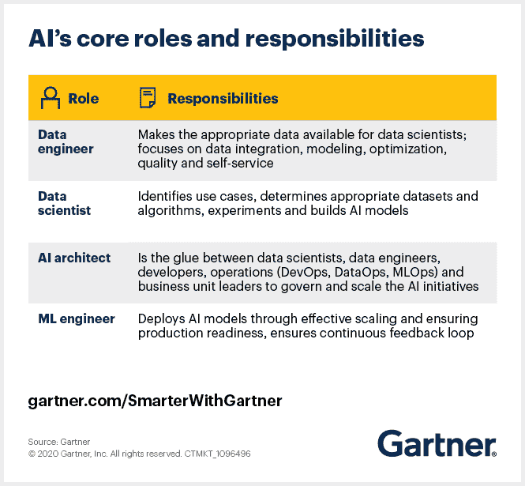

# 带你的公司进入人工智能时代的 6 个步骤。

> 原文：<https://medium.com/codex/6-steps-to-take-your-company-to-the-era-of-artificial-intelligence-322496f5e379?source=collection_archive---------17----------------------->

我们正在经历第二次工业革命，企业需要立即行动起来。即使成千上万的公司都在使用 AI，但许多公司并没有加入进来，许多机会没有得到利用。

优步、沃尔玛、苹果、谷歌、脸书和通用电气都使用人工智能，但这些都是财大气粗的大公司。如果你拥有一家小得多的企业，你能做些什么来利用技术，以避免落后？

在这篇文章中，我将向你展示让你的公司登上这项技术之舟的 6 个步骤。

## **1。运行试点项目以获得动力**

你的项目必须是可行的，许多公司在 AI 中开始他们的项目，试图使用超出经济能力或根本不存在的技术。明确你创造价值的目标。

无论人工智能团队是外部的还是内部的(他们几乎没有业务能力),让他们与一个有业务能力的团队合作，并构建人工智能解决方案来展示牵引力。

## **2。创建内部人工智能团队**

虽然与外部公司和人工智能专家合作可以帮助你赢得最初的时刻，但从长远来看，你可以与自己的工作团队一起在公司内部执行项目，这将更有效率。

找到正确的资源，以及它们如何作为人工智能团队的一部分一起工作，成为人工智能项目成功的关键。两个新的角色正在补充人工智能团队:人工智能架构师和 ML 工程师。

人工智能架构师专注于人工智能引入的变革性架构工作。他们的主要职责是协调生产中模型的部署和管理，并在人工智能的各个学科(如自然语言处理或图像识别)中提供关于 ML 和深度学习模型适用性的输入。

其他重要角色包括数据工程师、数据科学家和 ML 工程师。

## **3。提供广泛的人工智能培训**

目前没有一家公司有足够的内部人工智能人才，虽然媒体报道说人工智能的高薪被高估了，但实际上人工智能人才很难找到。幸运的是，网上有很多资料和课程。

*   MOOCS
*   油管（国外视频网站）
*   电子书

你的人力资源主管是关键，他必须足够聪明，能够建立确保你的员工完成学习的流程。

最后，值得咨询一下专家，他会让你为你的新团队制定一个个性化的学习计划。

## **4。开发人工智能战略**

人工智能战略将指导你的公司创造价值，一旦你的人工智能团队开始看到他们最初项目的成功，并对人工智能有了更深入的理解，他们将能够确定人工智能可以产生更多价值的新领域。重视并把你的资源集中在这些领域。

## **5。发展内部和外部交流。**

人工智能将极大地影响你的业务，因为它影响关键利益相关者，所以必须实施沟通计划以确保一致性。我们可以提及的目标受众包括:投资者、政府、客户、人力资源，当然还有公司内部员工。

## **6。向已经在使用人工智能的其他企业学习**

许多公司看到同行在做什么就会眩晕。你不必害怕别人的成功。而是把它当做支撑我们学习成长的敲门砖。如果其他公司，尽管是竞争对手，已经实现了人工智能，我们应该看看他们做了什么，复制他们做得对的地方，同时避免他们的错误。

无论我们喜欢与否，人工智能肯定会存在。我个人认为我们没什么好怕的。前进的最佳方式是意识到并适应我们周围的新技术，包括人工智能。

这种未来的人工智能有可能彻底改变公司与客户互动、相互竞争以及在市场中发展的方式。

资源:

*   https:// [landing.ai](http://landing.ai)
*   [https://www . Gartner . com/smarterwithgartner/how-to-staff-your-ai-team/](https://www.gartner.com/smarterwithgartner/how-to-staff-your-ai-team/)
*   https://www . we aremarketing . com/blog/when-how-and-why-to-incorporate-the-artificial-intelligence-in-your-company . html