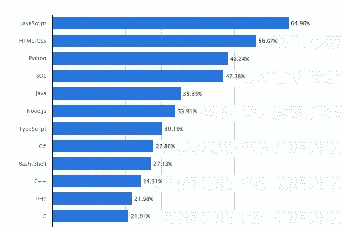
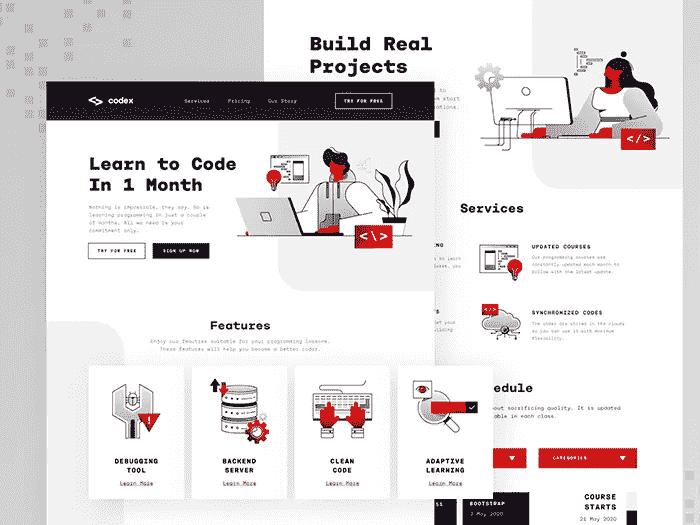

# 2022 年开始学习 C#语言的 6 大理由

> 原文：<https://medium.com/codex/6-strong-reasons-to-start-learning-c-language-in-2022-1fb0b4f9bd00?source=collection_archive---------16----------------------->

坦纳·韦门特插图

应用程序和软件开发已经成为最受欢迎的工作领域之一。根据美国劳工统计局的数据，受雇开发人员的数量将逐渐增加，并在 2030 年达到 22.2%。因此，软件开发是一个非常值得你关注的有益领域。

如果你是一个想在这个领域成长的开发者，那么你需要选择一种编程语言来使用。有几十个。但是，很少有语言能让你的作品达到一个新的高度。

在本文中，我们将详细讨论 c#——世界上十大流行语言之一。

2021 年最受欢迎的编程语言列表

# 什么是 C#语言？

微软在 2002 年发布了这种编程语言。它最初是为 Windows 构建的，后来适应了 Linux 和 macOS。随着时间的推移，C#已经成为开源代码，现在它运行在[上。NET](https://dotnet.microsoft.com/en-us/learn/dotnet/what-is-dotnet) 跨平台。微软从 C 语言中获取了原始语法，因此这两种语言的名称和结构是相似的。

C#语言的应用领域非常广泛。它可用于创建:

*   在 IDE Xamarin 的帮助下，Android 和 iOS 的移动应用程序都可以使用；
*   桌面应用程序。Skype、Powerpoint，甚至 Adobe 的产品都在 C#上运行；
*   抗病毒和保护软件。对于 C++编程语言和 Java，C#是这些应用程序的基础。它与 Windows 操作系统紧密相连，所以如果有东西在吞噬你的内存，你会注意到漏洞；
*   [网络应用&服务](https://shakuro.com/blog/outsourcing-in-c-why-choose-this-language-for-your-product)。后端和前端开发人员都根据自己的需求使用 C#。这非常方便，因为你可以直接在浏览器中运行这种编码语言；
*   电子游戏。C#因为 Unity 引擎而在游戏开发者中新潮；
*   机器学习。它一直是大型企业的首选投资。借助[ML.NET](https://dotnet.microsoft.com/en-us/apps/machinelearning-ai/ml-dotnet)平台，C#是编写 AI 的完美选择；
*   VR 应用。感谢 Unity，人们也使用 C#开发虚拟现实应用程序；

应用领域大是一大优势。它允许你在不同的领域创建项目，而不需要专业的再培训。

下面，你会发现用 C#编程值得你花时间的六个坚实的理由。

# 1.对 C#程序员的渴望

许多公司使用 C#开发移动和桌面应用程序。因此这种编程语言非常流行。尽管越来越多的人转向开发人员这一职业，但对这些专家的需求并没有下降，他们的工资也没有下降。根据最新统计，C#程序员仍然拥有世界上[最高工资](https://www.statista.com/statistics/1127190/programming-languages-associated-highest-salaries-worldwide)比率之一。

C#开发人员的工资是最高的

招聘人员寻找 C#开发人员的另一个原因是机器学习技术越来越受欢迎。凭借其算法，ML 提升了业务收入和业务范围。世界上至少 95%的[领先公司](https://learn.g2.com/machine-learning-statistics)都有正在进行的机器学习项目。大多数需要用 C#编程来为人工智能编写智能大脑。

此外，在疫情期间，企业已经将注意力转移到网络世界。这些公司也渴望程序员，因为他们需要为产品开发移动和网络应用程序，更不用说银行和医疗部门的网络安全了。

# 2.低学习曲线

与其他编程语言不同，C#相对容易掌握。如果已经有了一些编码知识，几个月就可以学会 C#编程了。

2002 年，微软努力为在所有可用平台上开发软件创建一个通用代码。他们的目标是一种结构清晰、语法易读、实用性高的语言。

微软团队将 C 语言作为他们创作的基础。然后他们从其他语言如 Delphi、Java 和 Smalltalk 中引入可行的解决方案。与此同时，该团队尽最大努力消除 C 结构带来的所有不良影响。

> 编程不在于你知道什么；而是你能想出什么。
> 
> 克里斯·派恩

因此，C#有特定的语法。它提高了整体可读性，因此开发人员可以快速理解代码并做出必要的改进。此外，它被设计成一种高级语言，这意味着 C#可以自动做很多事情。在用 C++和 Java 编程时，你需要手动准备部分代码。

高可读性使 C#成为大型开发团队的绝佳选择。对于这种类型的团队合作，有时您需要将代码从一个开发人员传递给另一个开发人员。

的主要优势。NET 平台和 C#的区别在于它提供了自动的内存管理和清理。它还允许开发人员不必担心代码运行的设备配置。

由于特定的语法类型和大量的改进，C#是初学者的首选。

Samuel Oktavianus 的编程课程概念

一旦你掌握了 C#，你将有更容易的时间学习其他后端语言，例如，C，C++或 Java。原因是 C#有类似的结构。这意味着您或您的开发团队可以快速提高他们的技能(双关语)并创建新的、更高级的项目。

# 3.友好社区

C#语言拥有世界上最大的社区之一。大约有[620 万](https://adtmag.com/articles/2018/09/24/developer-economics-survey.aspx)开发人员在他们的项目中使用 C#。

如果你遇到无法解决的问题，你很可能会在网上找到解决方案。的。NET 平台提供了详细的 C#编程教程和针对特定情况的建议、代码格式化模板等。

或者，在[堆栈溢出](https://stackoverflow.com/)上有数百个解决方案。借助任何 C# IDE 的固有功能，您可以在处理项目时浏览大多数库的源代码并阅读它们。 [GitHub](https://github.com/dotnet/csharplang) 也有一个很棒的 C#社区。有很多线索，你可以找到答案和兄弟的武器。

除了这两个平台，您还可以在本地论坛上找到更多信息和常见问题。 [C#角](https://www.c-sharpcorner.com/)是 C#和。NET 开发人员。人们贴出各种事件、播客、初学者 C#编程视频，以及帮助其他开发人员的附加模块。

# 4.快速处理

起初，C#被设计成微软的一部分。NET 框架。2021 年，。NET 和。NET 核心框架结合成一个单一的、设计良好的。NET 6 版本，已经成为 C#开发的通用平台。这是软件编程最快的解决方案之一。

随着时间的推移，C#语言获得了许多优化性能和消除内存泄漏的特性。尖端的微软平台和显著的改进使 C#成为一种快速工作的语言。

# 5.不断发展

C#是世界上发展最快的语言之一。这一切都要感谢微软和社区的不懈支持。

微软团队开发 C#已经超过 20 年了。他们总是试图根据人们的反馈和建议添加新功能。该团队有一个 GitHub 页面，每个人都可以在这里表达他们对当前 C#状态的看法，并阅读公共更新和发行说明。

> 复制粘贴实际上是程序员为程序员编写的。
> 
> -r/Reddit 上的程序员幽默

另一个鼓励开发的东西是开源代码，可以很容易地根据当前的需求进行修改。然而，微软很好地照顾了它的创作，并努力保持 C#的简单和灵活。

在微软团队的监督下，C#编程语言将在未来的许多年里蓬勃发展。

# 6.面向对象和组件

基于特定的计算模型，有几种编程范例或代码编写方式:过程式的、函数式的和面向对象的——每一种都适合特定的需求。

C#是一种面向对象和面向组件的语言。由于构造直接支持这一概念，C#是创建和使用软件组件的完美语言。

来自 Reddit 的关于编程的迷因

当开发人员使用 C#进行[面向对象编程](https://shakuro.com/blog/a-non-developers-guide-to-object-oriented-programming)时，他们通过将数据与行为联系起来的对象来组织代码。这种模式的优点是容易排除故障:如果出现问题，您知道在哪里修复它。此外，继承特性允许您更有效地重用代码。

# 结论

正如你所看到的，花时间学习 C#是一个漫长但精确的尝试。T2 的 C#软件开发人员 T3 需求量很大，而这种编程语言非常灵活、通用，对初学者也很友好。除此之外，它还有一个由微软支持的强大社区，这个社区密切关注它的“孩子”，并感谢用户的反馈。

你可以在各种项目中使用 C#:桌面和移动应用、网络安全、web 开发、VR 和视频游戏等。如果你是一个企业主，现在你知道为你的项目考虑什么编程语言。

[如果你有一个等待实施的想法，请联系我们的团队](https://shakuro.com/#contact-form)。我们的开发团队将尽最大努力让它成为现实。