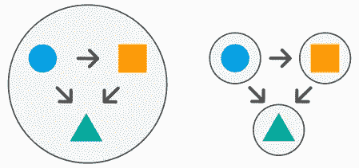

# 分布式整体结构的 6 个症状

> 原文：<https://medium.com/codex/6-symptoms-of-a-distributed-monolith-78a097320ebb?source=collection_archive---------0----------------------->

当一个组织的结构和它的代码被分离，但仍然紧密耦合时，分布式整体结构就出现了。这成为一个问题，因为系统的规模增加了，但是它的所有部分都需要一起管理，这降低了任何变化的速度并增加了风险。

当你在处理一个分布式的整体结构时，能够识别是很重要的，但是我们怎么做呢？让我们…