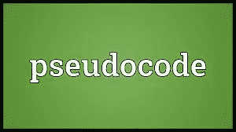

# 一个初学程序员应该做的 6 件事来写更干净的代码。

> 原文：<https://medium.com/codex/6-things-a-beginner-programmer-should-do-to-write-cleaner-code-6d690b413bfa?source=collection_archive---------5----------------------->

## [法典](http://medium.com/codex)

## 作者 Marquise Piton | Awesome Inc .网站开发训练营的一名学生。

照片由[克里斯里德](https://unsplash.com/@cdr6934?utm_source=medium&utm_medium=referral)在 [Unsplash](https://unsplash.com?utm_source=medium&utm_medium=referral) 上拍摄

你还记得你第一次学习如何写代码吗，或者也许你这辈子都没写过代码？您可能对使用语法感到困惑，试图理解关键字“this”，或者在考虑如何自己构建一个程序时获得一丝满足感。那是我，但后来我开始问这个问题，“我怎样才能写出更干净的代码”？！我知道我的函数是一个不工作的未检查的 if-condition。我研究并阅读了一些书籍，提出了程序员应该做的 6 件事来写出更好的代码。

**定义问题。**

在键入任何代码之前，我甚至要说在编写/绘制任何伪代码之前，确保您知道需要解决的主要问题。客户想要什么？他们希望应用程序做什么，或者主要目标是什么？这些是在采取任何行动之前需要问的问题。确保你和客户意见一致，并向你自己、团队或客户重申这个问题。然后把问题写出来，就像电影海报上的标题一样，这样你就可以回头再来看。始终坚持解决问题。

**想象然后画。**

我认为画出应用程序的样子是个好主意。这是我个人的偏好，我发现用一种 [**面向对象**](https://www.educative.io/blog/object-oriented-programming) 的方式思考并在编写伪代码之前考虑我可能想要使用的不同数据结构或对象是很有帮助的。客户或设计师可能已经给了你他们想要的应用程序界面的草图。完美！角色扮演一下。例如，把你自己想象成用户，想象你点击了一个按钮。你或客户(如果有合同的话)希望这个按钮为用户做什么？你希望他们有什么样的体验？一旦你有了一个脑海中的图像或图画，你就可以开始写伪代码了！

写伪代码，然后…多写一些。

如果你决定忽略我之前写的两段，这一段是最重要的。为什么？！嗯，我发现编写好的代码、函数、类等很有挑战性。，没有先计划好。完全有可能在没有计划好需要做什么的情况下编写一些机智的代码，但是这种行为不是最佳实践。 [*Ngunyi Macharia*](/@ngunyimacharia) 有一篇很棒的文章， [*《如何写伪代码:初学者指南》，*](https://blog.usejournal.com/how-to-write-pseudocode-a-beginners-guide-29956242698) 关于如何写伪代码，他讲得更详细。写出你希望 app 做的事情(定义问题)，一步一步的过一遍你希望用户体验到的东西，写出你解决问题可能需要的数据结构和对象的类型，用*英文*写出代码。

一旦你完成了“伪装”，伪一些，通过“假设”例如，如果你遵循 MVC 框架，你的函数和类是否遵循标准。不要害怕花时间伪装一段时间。

**考虑 D.R.Y .而不是 W.E.T！**

D.R.Y 代表“不要重复自己”W.E.T 代表“我们喜欢打字”D.R.Y 是你想做的，W.E.T 是你不想做的。检查您的代码！你是否正在编写类似的代码行，可以使用 FOR 循环进行迭代？你正在写不必要的代码行吗？什么类型的内置函数可以用一行代码而不是多行代码完成相同的输出。回到你的伪代码，重写。总是检查你的代码，并对你的代码进行注释。这里有一篇更详细的文章。

[**D . r . y vs . W . e . t**](https://searchsoftwarequality.techtarget.com/answer/Which-programming-practices-alleviate-code-redundancy)

让别人阅读你的代码。

我总是发现别人在阅读我的代码，就像他们打开我的日记/日志来了解我脑子里在想什么，这有点不舒服。你可能需要几个小时甚至几天的时间来让一个函数或者一行代码工作，然后从你的同事那里听到你应该重新格式化你的代码。哦！这听起来从来都不好听，但是代码审查可以导致编写更高效的代码。不要害怕让你的同行检查你的代码；如果你是结对编程，你可能不得不在工作中这样做，并确保你给他们留下描述性的注释，让他们知道你的程序或函数在做什么。

从例子中学习

浏览互联网。更有可能的是，你构建的问题或应用程序，别人已经写好了。将您的代码与他们的代码进行比较，看看有何不同和相似之处。阅读关于良好设计模式或如何编写干净代码的书籍。与高级开发人员交谈，询问他们在编写代码时所犯的错误。我相信他们会很乐意分享他们的经历。

**结论**

这些并不是硬性的规则，但是这 6 个实践是我发现写更干净的代码的实用方法。一些实践可能需要时间来掌握，就我个人而言，我每天都在学习如何成为一名更好的程序员。花点时间想想你在编码时的一些坏习惯，然后设定一个可以强化好习惯的标准列表。编码快乐！

**这里有一些必读:**

*   [设计模式:可复用面向对象软件的元素](https://www.amazon.com/Design-Patterns-Elements-Reusable-Object-Oriented/dp/0201633612/ref=sr_1_1?crid=3SC9J5GWPER45&dchild=1&keywords=design+patterns+elements+of+reusable+object-oriented+software&qid=1616607067&s=books&sprefix=design%2Cstripbooks%2C198&sr=1-1)
*   [务实的程序员](https://www.amazon.com/Pragmatic-Programmer-journey-mastery-Anniversary-ebook/dp/B07VRS84D1/ref=sr_1_1?crid=42NI9VSQ2O3E&dchild=1&keywords=pragmatic+programmer&qid=1616607043&s=books&sprefix=pragmatic%2Cstripbooks%2C186&sr=1-1)
*   [算法](https://www.amazon.com/Algorithms-Sanjoy-Dasgupta/dp/0073523402/ref=sr_1_1?crid=265AXK7FAMTQ8&dchild=1&keywords=algorithms+sanjoy+dasgupta&qid=1616607010&s=books&sprefix=Algorithms+sanjoy%2Cstripbooks%2C166&sr=1-1)
*   [干净的代码:敏捷软件技术手册](https://www.amazon.com/Clean-Code-Handbook-Software-Craftsmanship-dp-0132350882/dp/0132350882/ref=mt_other?_encoding=UTF8&me=&qid=1616606882)

**寻找一个*棒极了的*训练营来帮助你编码:**

*   [Awesome 公司](https://www.awesomeinc.org/bootcamp)

**社交媒体:**

*   领英
*   [推特](https://twitter.com/marquisepiton)
*   [Instagram](https://www.instagram.com/sirquisepiton/)