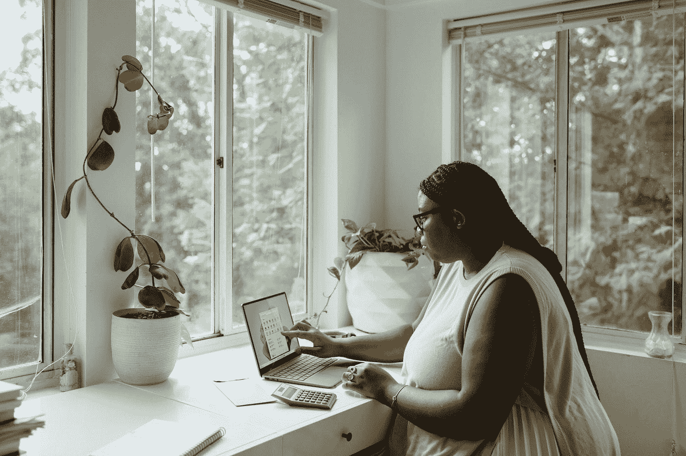

# 如何应对在家办公的 6 个技巧

> 原文：<https://medium.com/codex/6-tips-of-how-to-cope-with-home-office-3da57c998498?source=collection_archive---------21----------------------->

  C   ovid19，封锁使得工作场所比我们预想的更具挑战性。虽然对一些人来说，在家办公有它的好处，但对另一些人来说，它对健康和工作生活平衡有一些令人生畏的影响。到现在为止，我们大多数人都认为事情会回到原来的样子。但是看起来家庭办公室或者至少混合工作已经存在了

在这篇文章中，我将分享 6 个即使在家工作也能保持健康的小贴士。

由[上的](https://unsplash.com?utm_source=medium&utm_medium=referral)[窗口](https://unsplash.com/@windows?utm_source=medium&utm_medium=referral)拍照