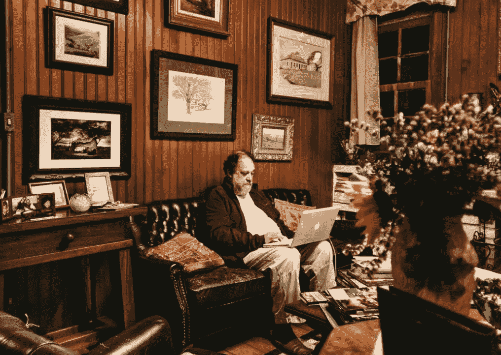

# 远程工作将永远扰乱工作场所的 6 种方式

> 原文：<https://medium.com/codex/6-ways-remote-work-will-disrupt-the-workplace-forever-631d722a2b66?source=collection_archive---------9----------------------->

毫无疑问，新冠肺炎通过采用远程办公让整个世界的经济经受了考验。虽然一些行业自然而然地融入了远程工作的变化——如科技行业或客户支持行业，但工作场所的其他领域不得不适应或受到影响，可以说，接受远程工作是他们在疫情世界中继续发挥作用的最后选择。

我相信，一旦这个疫情安定下来，很可能会像我们在 2019 年左右经历的那样，重新开始工作。然而，我也确信远程工作的经历将永远改变工作环境，以及对未来各类员工的规范和期望。这些是我对所有行业和部门的未来工作场所的想法。

# **尝试后的结果——高度驱动的团队**

尽管在疫情之前，所有团队都需要绩效结果，但工作场所可能会发生转变，更加关注单个团队的整体结果，而不是评估他们的内部流程和文化。

在过去，随着远程工作的出现和影响，任何给定工作场所的大多数团队都坚持在公司会议和总结上展示进展和经验的期望——我可以预计团队成员将在幕后完成更多工作。进入 pod 区域并获得团队进展的即席更新的日子将一去不复返。我认为更有可能的是，团队会因为他们的整体成果而出名和被评估——他们交付的项目，以及他们解决的问题。

这也可能意味着各种组织中的团队将更倾向于发展他们自己的亚文化，并且不同团队中的个人经历可能非常不同——基于团队中人和背景的积累。

# **倦怠将是一大威胁**

与上述观点相关——就像向绩效和结果驱动的团队转变一样，个人贡献者可能会更少地被评估他们为完成任务所付出的努力，而更多地被评估他们的实际结果。

远程工作——一个大的新发现是，人们可以在最适合自己的时间工作。事实上——这是优化工作条件的一种形式——所以我相信，在大流行后，许多人会倾向于更加努力地工作*以获得更高质量的结果。*

虽然过去的努力值得庆祝，但在一个日益全球化的世界，尤其是后疫情时代，结果将更加重要，因此随着人们努力工作，倦怠将继续增长，成为对生产力的威胁。

这可能意味着避免精疲力尽的努力将会增加——社交活动、静修和津贴。毕竟——高质量的工作应该带来高质量的回报，所以在概率的情况下，精疲力竭和放松之间的战斗将继续向前推进。

# **异步任务可能是常态**

在远程工作时，毫无疑问，大多数任务都是以异步方式处理的。这背后的主要动机通常是团队成员分散在全球各地。后疫情时代，在某种程度上有可能继续全球化的劳动力，为了促进这种情况，需要以异步方式促进任务。

一种可能的情况是，在会议室一起完成基本任务的日子将一去不复返。我们已经适应了能够利用技术的力量将我们的大部分任务分成可以单独处理的部分，在许多情况下，这种方法会产生更高质量的结果。

这是一个“如果它没坏，就不要修理它”的例子。异步工作在某些情况下是很棒的——现在它已经在我们在家工作的经历中显露出来，只要适用，它很可能会继续流行下去。

# **工作时微健身增加**

虽然大多数健身房和健身中心已经关门，但远程工作的一个大趋势是经常散步和在白天做快速活动，让你的血液循环。

这些活动对身心都有好处——不管有没有疫情，我想大多数人都同意这一点。

我们可以期待个人和组织在后疫情时代的工作场所帮助促进这些“微健身”活动。

# **高质量的笔记将受到高度重视**

随着向异步任务和潜在的灵活时间的转移，做笔记对于团队来说将是最重要的，以便在期望和之间的一切方面都保持一致。

做高质量笔记的技能将受到高度重视，并且能够向团队成员简要介绍新的想法、概念或计划将变得更加重要。

# **郊区大混乱**

随着疫情期间远程工作的转变，许多人已经直接看到了住在郊区相对于住在市中心可以节省的成本。事实上——虽然在后疫情时代，居住在密集的城市中心非常受欢迎，但在当今时代，似乎很多人更喜欢更大的空间和开阔的区域，而不是工作和放松。

后疫情时代，很可能很多人会更喜欢住在郊区，所以我们可能会看到通勤时间再次增加。这可能会被“弹性”工作时间表所否定，即个人每周有几天去办公室——尽管通勤时间更长。尽管如此，我估计任何组织的劳动力平均来说都会更加分散。