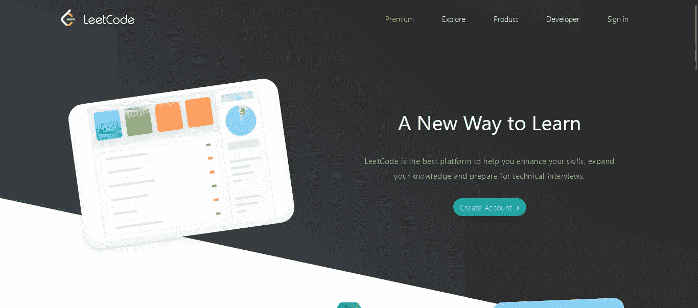

# 6 个提高数据结构和算法(DSA)的网站

> 原文：<https://medium.com/codex/6-websites-to-get-better-at-data-structures-and-algorithms-dsa-e3f61763a482?source=collection_archive---------7----------------------->

## 提高数据结构和算法的程序员指南

在 [Unsplash](https://unsplash.com/s/photos/coding-girl?utm_source=unsplash&utm_medium=referral&utm_content=creditCopyText) 上拍摄的 [ThisisEngineering RAEng](https://unsplash.com/@thisisengineering?utm_source=unsplash&utm_medium=referral&utm_content=creditCopyText)

成为一名优秀程序员的秘诀是，你应该擅长数据结构&算法以及使用代码解决问题。有时你的工作需要你使用数据结构来解决问题。

在现实世界中设计或构建应用程序时，能够快速想到解决方案并编写算法会非常有帮助。

下面我总结了几个网站，可以帮助你从零开始学习数据结构和算法。

# 1.黑客银行

HackerRank.com

[HackerRank](https://www.hackerrank.com/) 是一个让你开始解决编码问题的好网站。如果你是一个初学者，并且很好地掌握了一门编程语言，你可以从在 HackerRank 上解决问题开始。

问题分为简单、中等和困难，便于您按难度排序和解决问题。你也可以选择你想解决的问题，无论是数组，字符串，动态编程，图形，位操作，贪婪等。

除此之外，你还可以练习特定语言的曲目。对于想在学习语言后尝试 DSA 的初学者来说，HackerRank 是一个很好的网站。

# 2.极客论坛

GeeksForGeeks.com

GeeksForGeeks 或 GFG 肯定会成为第一个在你的谷歌搜索中弹出来学习任何与科技相关的东西的网站。这是一个很好的资源，有很好的教程和对任何主题或算法的解释。

GFG 有一个专门的练习平台，人们可以通过按公司名称和难度分类来练习问题。对于每个问题，你都有专门的教程，以防你无法解决问题或需要帮助。

此外，如果你准备参加全球任何一家科技公司的面试，你会发现有一个关于 GFG 面试经历的部分非常有用。总而言之，这是一个很好的网站，可以让你开始练习，提高编码、系统设计和几乎所有科技方面的技能。

# 3.Leetcode

Leetcode.com

Leetcode 是编码面试的圣杯。如果你坚持用 Leetcode 进行编码面试，它一定会带来巨大的回报。

对于初学者来说，Leetcode 与之前的两个网站相比可能有点难。所以我的建议是从解决 HackerRank 上的问题开始，一旦你认为你准备好迎接挑战，就从 Leetcode Easy 开始。慢慢由易到中，再由中到难。

不要直接跳到难题上，你肯定会很难理解，最终会放弃。Leetcode 也有一个很好的解决方案和面试经验部分的论坛。

除此之外，他们还有两周一次(周六)和每周一次(周日)的编码挑战，你可以参与其中，与全球各地的人竞争。

# 4.厨师长

CodeChef.com

CodeChef 是一个很好的平台，可以让你在 DSA 和竞争性编程方面做得更好。他们有优秀的教程和论坛来学习& get 擅长编程。

除此之外，他们还有一个练习区，你可以根据提交的数量和难度来解决问题。每个用户都有一个星级，他们可以通过参加比赛(编码挑战)并在比赛中表现良好来增加星级。

我个人对 CodeChef 的使用非常有限，但我强烈建议任何刚开始编程的人使用它。很好地掌握竞争性编程可以走很长的路。

# 5.代码力

CodeForces.com

[Codeforces](https://codeforces.com/) ，就像 CodeChef 大多用于竞技编程。Codeforces 有一个活跃的程序员社区，有很棒的论坛。

它有一个 **ProblemSet** 部分，你可以在那里解决之前比赛中被问到的问题，并根据难度和提交数量进行分类。

一旦你有信心，你就可以开始在 Codeforces 上进行竞赛。竞赛分为不同的组别:第一组、第二组、第三组和第四组，第一组最难，第四组最容易。

因此，基本上每个用户都有一个评级，根据他们的评级，一个人可以参加特定的比赛。一旦你开始表现良好，你的评分提高，你就可以参加低级别的比赛。

我很少使用 Codeforces。但是在网上，你可以找到关于如何使用 Codeforces 和如何开始举办比赛的指导。

# 6.代码战争

CodeWars.com

与上面的网站不同， [Codewars](https://www.codewars.com/) 有点不同。在《代码战争》中，一切都被游戏化了，而且有趣多了。CodeWars 包含编码挑战，称为形，每次你解决一个形，你赢得排名和荣誉。

Codewars 的开发者社区相对于其他社区来说有点小，但是仍然很有帮助。CodeWars 是我开始编码之旅的第一个编程平台。

于是，我从 [Codecademy](https://www.codecademy.com/) 学习 JavaScript 和 Python，开始做 Codewars。如果你是初学者，CodeWars 是一个很好的入门平台。此外，如果你使用一些非常规语言(如 Go、JS)，你也可以发现专门为这些语言设计的问题。

伙计们，我希望一旦你对任何编程语言有了基本的了解，你就知道该从哪个编程网站开始了。现在开始磨吧！