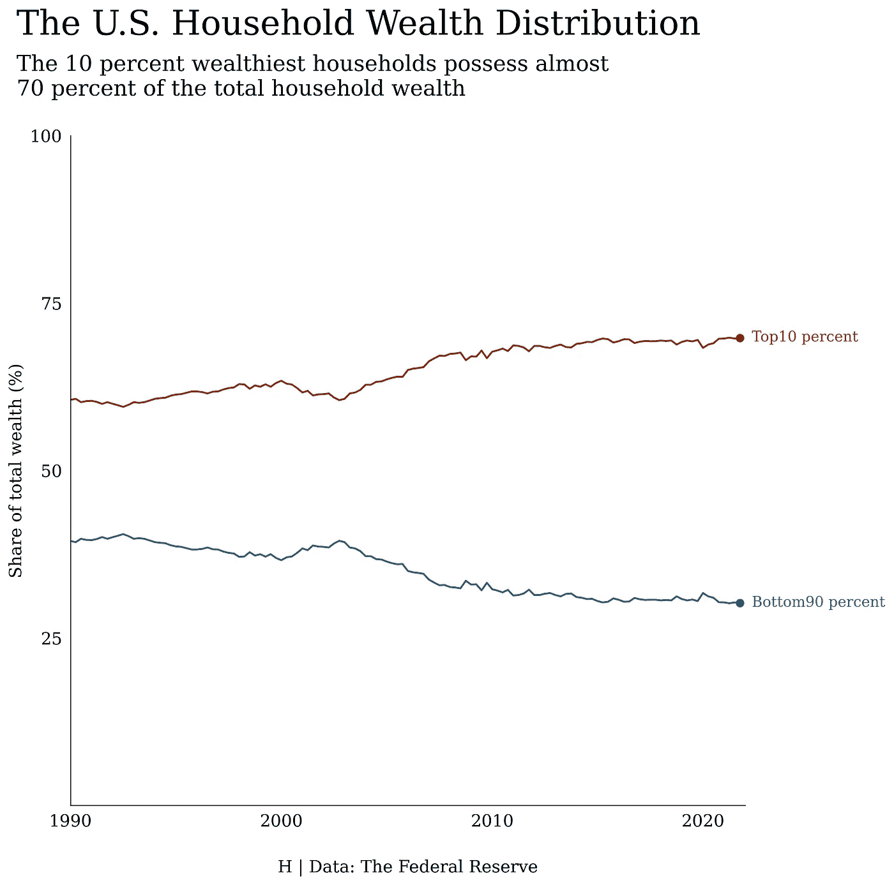
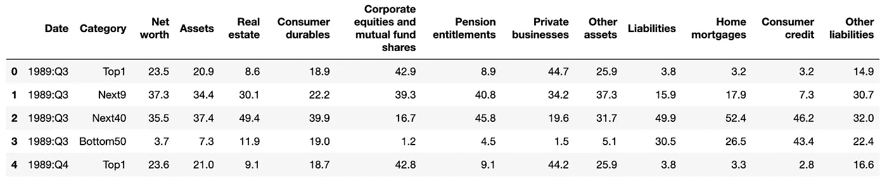
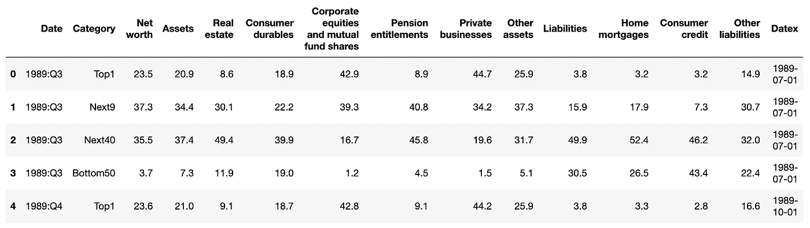
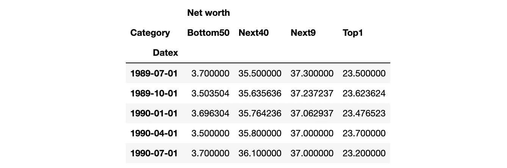
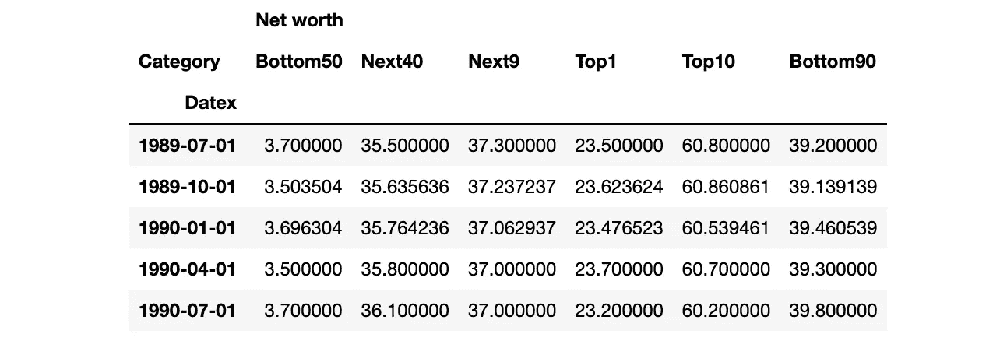

# 数据可视化|花了我一整天的 61 行代码

> 原文：<https://medium.com/codex/61-lines-of-code-that-took-me-entire-day-8b256605789a?source=collection_archive---------19----------------------->

你好。这是我第一个使用 Matplotlib 用 Python 制作可视化的项目。这个可视化是基于 [Gilbert Fontana 的美国财富分布可视化](https://github.com/gilbertfontana/DataVisualization/tree/main/Wealth)。在这个项目中，我主要是尽可能地模仿他的视觉化。

最终输出:



美国家庭财富分配

# 导入库

首先，导入所需的库:用于数据操作的 Pandas、用于处理日期的 datetime 和用于绘制图表的 Matploblib。

```
import pandas as pd
import datetime
import matplotlib.pyplot as plt
import matplotlib.dates as mdates
%matplotlib inline
```

# 数据操作

阅读 csv 文件。

```
df = pd.read_csv('dfa-networth-shares.csv')
df.head()
```



dfa-networth-shares.csv

将 Date 转换为 datetime，并分配给新列 Datex。

```
df['Datex'] = pd.to_datetime(df['Date'].str.replace(':', '-'))
df.head()
```



将日期转换为日期时间

按类别和日期对数据进行分组，并将净值转换为百分比。

```
df = df[['Net worth', 'Category', 'Datex']].groupby(['Datex', 'Category']).sum().unstack()
df = df.apply(lambda x: x/x.sum() * 100, axis=1)
df.head()
```



将数据分组

计算每个季度的前 10%和后 90%。

```
df.loc[:, ('Net worth', 'Top10')] = df['Net worth']['Top1'] + df['Net worth']['Next9']
df.loc[:, ('Net worth', 'Bottom90')] = df['Net worth']['Next40'] + df['Net worth']['Bottom50']
df.head()
```



计算前 10 名和后 90 名的数据

堆叠数据帧并重置索引。

```
df = df.stack()
df = df.reset_index()
df.head()
```


接下来，只提取 Top10 和 Bottom90 类别，因为我们只需要这两个类别。

```
plt_df = df[(df['Category'] == 'Top10') | (df['Category'] == 'Bottom90')]
plt_df.head()
```


# 形象化

首先，将绘图的字体设置为 Serif，使用`.subplots()`创建一个绘图，并定义线条的颜色。

```
plt.rcParams["font.family"] = "serif"fig, ax = plt.subplots(figsize=(10, 10), facecolor='white', dpi=300)COLORS = {
    'Top10': '#912d00', 
    'Bottom90': '#006595'
}
```

然后，删除轴的刻度，设置轴的范围，设置刻度标签。

```
ax.tick_params(axis='y', left=False)
plt.ylim(0, 100)
plt.yticks([25, 50, 75, 100], fontsize=14)
plt.ylabel('Share of total wealth (%)', fontsize=14)ax.tick_params(axis='x', bottom=False)
plt.xlim(datetime.date(1990,1,1), datetime.date(2022,1,1))
plt.xticks([datetime.date(i,1,1) for i in range(1990, 2021, 10)], fontsize=14)
date_form = mdates.DateFormatter('%Y')
ax.xaxis.set_major_formatter(date_form)
```

并关闭绘图的顶部和右边框。

```
ax.spines['top'].set_visible(False)
ax.spines['right'].set_visible(False)
```

最后，绘制图表！`ax.plot(year, worth, c=v)`用定义的颜色绘制线条。`ax.plot(year.iloc[-1], worth.iloc[-1], 'o', c=v`在线的末端画点。并且`ax.annotate`在行尾添加文本。

```
for k, v in COLORS.items():
    year = plt_df.loc[(plt_df['Category'] == k), 'Datex']
    worth = plt_df.loc[(plt_df['Category'] == k), 'Net worth']
    ax.plot(year, worth, c=v)
    ax.plot(year.iloc[-1], worth.iloc[-1], 'o', c=v)
    ax.annotate(k + ' percent', 
                xy=(year.iloc[-1], worth.iloc[-1]),
                xytext=(10, -3), 
                textcoords='offset points',
                c=v, 
                fontsize=12)
```

添加标题和引用数据源也很重要！

```
plt.title('The U.S. Household Wealth Distribution', 
             fontsize=28, 
             loc='left', 
             x=-0.08, y=1.14)ax.text(s='The 10 percent wealthiest households possess almost \n70 percent of the total household wealth', 
        x=-.08, y=1.06, 
        fontsize=18, 
        transform=ax.transAxes)ax.text(s='H | Data: The Federal Reserve', 
        x=0.5, y=-0.1,
        horizontalalignment='center',
        fontsize=14, 
        transform=ax.transAxes)
```

并且，保存图表！

```
fig.savefig('wealth', bbox_inches='tight')
```

[源代码](https://github.com/hckkiu/data-viz/tree/main/wealth)